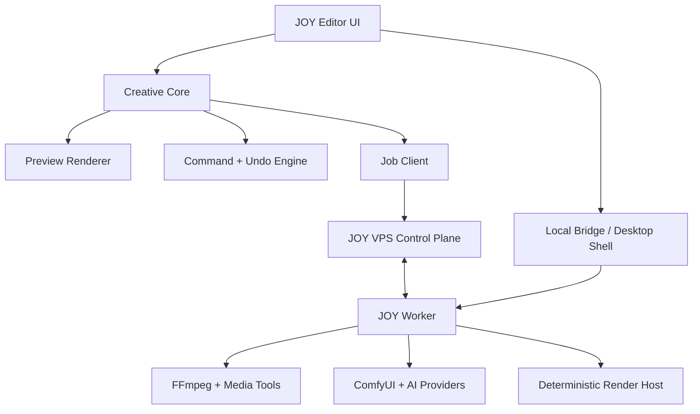
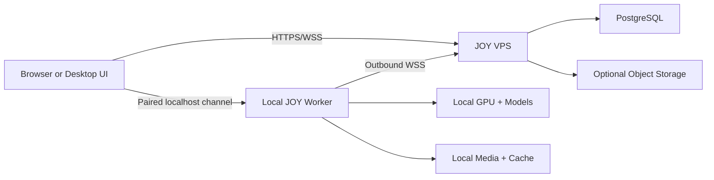
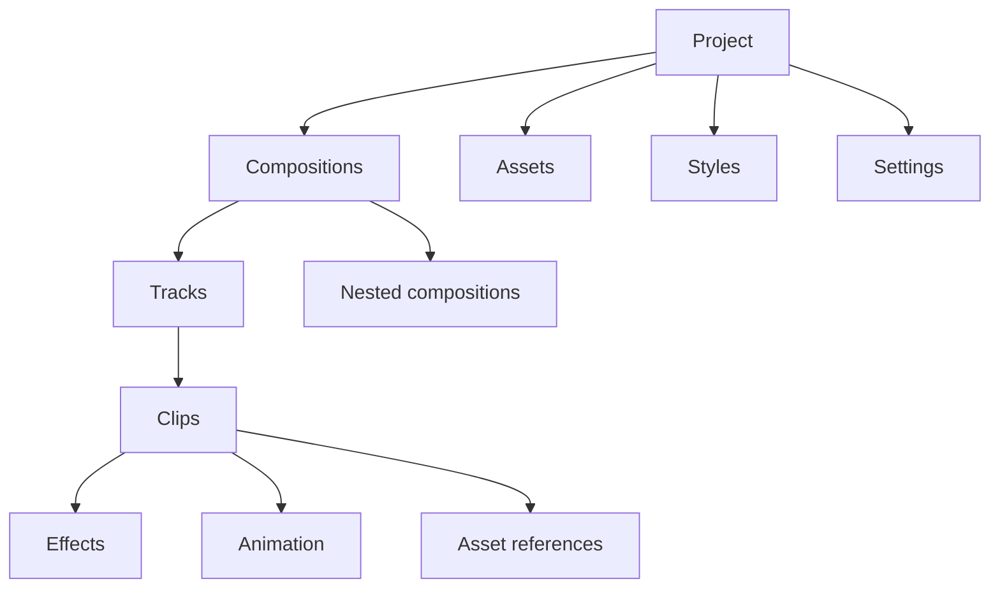
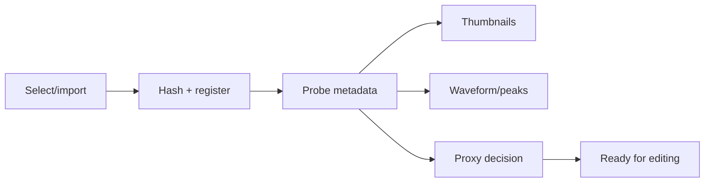
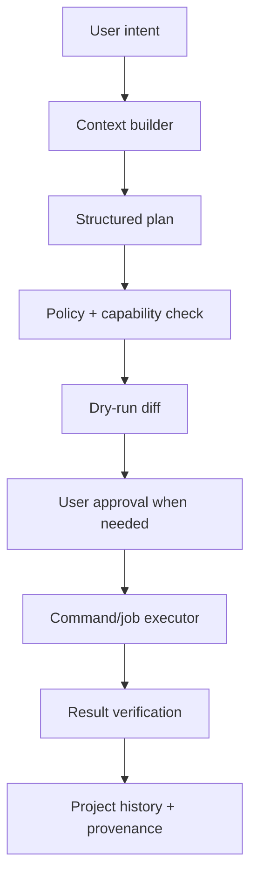
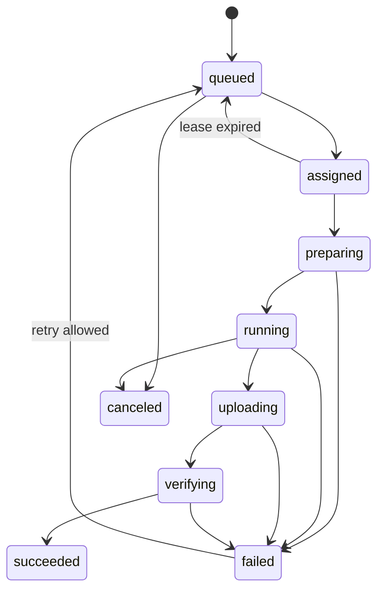

# JOY Media Platform

## Master Product, Architecture, and Delivery Plan

**Document status:** Architecture baseline and implementation handoff  
**Version:** 1.1  
**Date:** 2026-07-19  
**Execution companion:** [`ORCHESTRATION.md`](ORCHESTRATION.md) — the partitioned, session-runnable work plan derived from this document. Agents implement parts from there; this file stays the architecture contract.  
**Working name:** JOY Media  
**Product category:** Local-first creative operating system for content production  
**Primary deployment model:** Browser/desktop editor + lightweight JOY VPS control plane + one or more local/GPU workers  
**Primary audience:** Product owner, software architects, coding agents, frontend/backend engineers, media engineers, AI engineers, plugin authors, and future contributors

> **v1.1 changelog (2026-07-19):** corrected §27.2 VPS CPU facts against live measurement (AVX/AVX2/SSE4.2 are now present); clarified clip duration rule (§10.5); added missing failure transitions to the job lifecycle (§26.5); clarified provider-backed job naming (§26.7); scoped §5.1 against §38.1; recorded the §26.12 Windows-first default against open question §48-Q1; linked the execution orchestration companion.

### Navigation

- **Vision and boundaries:** Sections 0–5
- **System and deployment architecture:** Sections 6–10
- **Creative core and modules:** Sections 11–20
- **Providers, agents, automation, plugins, templates, Worker, and VPS:** Sections 21–28
- **Security, performance, quality, UX, compatibility, and operations:** Sections 29–35
- **Delivery roadmap, build order, risks, acceptance, and handoff:** Sections 36–50
- **Reference material:** Appendices A–E

---

## 0. How to Use This Document

This file is the source-of-truth blueprint for JOY Media. It is deliberately more detailed than a normal roadmap because the project crosses several difficult domains at once:

- non-linear video editing;
- image compositing;
- motion graphics;
- HTML/CSS/React scenes;
- audio processing and speech synthesis;
- subtitles and transcription;
- local and remote AI providers;
- agent-driven editing;
- deterministic automation;
- plugins and templates;
- distributed rendering between a browser, a VPS, and a powerful local computer.

Use it in five ways:

1. **Product filter:** A feature should support the product principles and a named user workflow before it enters the roadmap.
2. **Architecture contract:** Core invariants in this document should not be changed casually. Record intentional changes as Architecture Decision Records (ADRs).
3. **Agent handoff:** Coding agents should implement one bounded milestone at a time and satisfy its exit criteria.
4. **Scope defense:** “Photoshop-like,” “After Effects-like,” and “CapCut-like” describe interaction goals, not permission to copy every feature at once.
5. **Test source:** Acceptance criteria, performance budgets, security rules, and deterministic-render requirements should become automated tests.

Sections marked **MUST** are architectural requirements. Sections marked **SHOULD** are strong defaults that may be revised through an ADR. Sections marked **LATER** are intentionally excluded from the first production releases.

---

## 1. Executive Definition

JOY Media is not merely a video editor. It is a **creative operating system** in which video, images, text, subtitles, motion graphics, HTML/CSS components, audio, AI generation, templates, and automation share one project model and one reversible command system.

The core promise is:

> A creator can build content manually, ask an agent to transform it, run repeatable automations, or install new creative capabilities—and every result remains visible, editable, reproducible, and under the creator’s control.

The editor is one surface of the platform. Other surfaces can later include:

- a batch-content workspace;
- a template builder;
- an asset and brand library;
- an automation dashboard;
- an AI generation studio;
- a review and approval screen;
- a lightweight mobile companion;
- a plugin and template marketplace.

### 1.1 The product in one sentence

**JOY Media combines professional timeline editing, HTML-native motion design, local-first AI, and editable agent automation through one unified creative document.**

### 1.2 What makes it meaningfully different

JOY Media is differentiated by the combination—not by any single feature:

1. **HTML scenes are first-class timeline objects.** A deterministic HTML/CSS/JS or React scene can behave like a clip, accept variables, animate, nest, and render on a worker.
2. **AI is provider-independent.** The project requests capabilities such as `speech.transcribe` or `video.generate`; model-specific adapters decide how to fulfill them.
3. **The agent uses the same commands as the human.** It cannot secretly bypass the editor or produce an uneditable flattened result unless the user explicitly requests one.
4. **Heavy work is remote from the VPS.** A local PC or GPU server performs decoding, proxy generation, AI inference, waveform extraction, and final rendering.
5. **Automation is durable and inspectable.** Repeatable recipes are separate from free-form agent conversation and support versioning, approvals, retries, and audit logs.
6. **Properties are universal.** A schema-driven Inspector edits videos, images, subtitles, generated assets, motion objects, and plugin objects consistently.
7. **Local-first remains possible.** Creators can keep source media and sensitive AI jobs on their own machine while the VPS coordinates lightweight metadata and jobs.

---

## 2. Corrections and Architectural Debugging of the Original Plan

The original plan has a strong product direction, but several assumptions would create expensive rewrites if implemented literally. The following corrections are part of the baseline.

### 2.1 PixiJS is a preview/compositing adapter, not the entire media engine

PixiJS is well suited to an interactive 2D scene graph and GPU-accelerated preview. It should power much of the canvas experience, selection overlays, transforms, masks, sprites, graphics, and effects. It must not become the project model, timeline model, media decoder, final export engine, or plugin API.

**Correct boundary:**

```text
Project Document -> Evaluation Engine -> Render IR -> Render Adapter
                                             |-> Pixi preview
                                             |-> headless deterministic compositor
                                             |-> FFmpeg fast path
```

This boundary keeps the project portable if a future renderer, native module, WebGPU compositor, or server renderer is added.

### 2.2 Preview rendering and final rendering are different workloads

The preview must favor low latency and graceful degradation. The final render must favor deterministic output, full resolution, exact timing, correct audio, and retryability.

Trying to make one code path do both perfectly from the first release will slow development and still produce mismatches. Instead:

- share the same document evaluator, timing model, property system, assets, and Render IR;
- use different execution adapters where appropriate;
- maintain golden-frame and golden-audio tests to limit visual drift;
- report unsupported preview effects honestly rather than pretending they match.

### 2.3 HTML scenes require a deterministic runtime and a security sandbox

“HTML + CSS + JS + React component” cannot mean unrestricted website code running inside the main application.

An HTML scene MUST:

- run in a sandboxed frame/process;
- receive time from JOY, not from uncontrolled wall-clock APIs;
- use seeded randomness when reproducibility matters;
- declare assets and fonts;
- have network access disabled by default;
- expose typed inputs/variables;
- clean up timers, WebGL contexts, and event listeners;
- render at a declared viewport and device-pixel ratio;
- declare whether it supports transparent output;
- pass a deterministic export validation before marketplace publication.

### 2.4 The browser needs a local bridge for professional file workflows

A web page cannot safely assume unrestricted paths to large local files. File handles can lose permission, browser storage is quota-managed, and copying hundreds of gigabytes through a VPS would defeat the lightweight architecture.

Therefore JOY Media supports three modes:

| Mode             | Intended use                                     | File and compute path                                                                               |
| ---------------- | ------------------------------------------------ | --------------------------------------------------------------------------------------------------- |
| Desktop mode     | Recommended professional experience              | Same React UI inside a desktop shell with direct, permission-scoped local access and bundled Worker |
| Browser + Worker | Remote UI from JOY VPS                           | Browser communicates with a paired local bridge; large media stays local whenever possible          |
| Browser-only     | Review, light editing, templates, small projects | Browser storage and uploaded assets; restricted codecs and heavy features                           |

The project model is shared across all three modes. Capabilities are detected, never assumed.

### 2.5 “Unlimited tracks” is a document promise, not a performance claim

JOY should not impose an arbitrary small track count, but every machine has limits. The correct promise is:

> The document format supports an unbounded logical number of tracks; the UI virtualizes them, and performance depends on active visible/evaluated content.

The application must display resource warnings and proxy suggestions instead of silently failing.

### 2.6 A Photoshop-like image module begins as non-destructive compositing

Full raster painting, advanced selections, healing, content-aware fill, CMYK prepress, and Photoshop-compatible filters would be a separate multi-year product.

Initial scope:

- layers and groups;
- transforms;
- crop and masks;
- opacity and common blend modes;
- stroke, shadow, blur, color controls;
- text and shapes;
- adjustment/effect layers;
- nested compositions as Smart Object equivalents;
- imported PSD flattening or partial parsing only if a reliable importer exists.

Brush engines and pixel-level retouching are **LATER** and should not block the core creative platform.

### 2.7 Captions belong to the engine, while transcription providers remain replaceable

The subtitle data model, timeline track, style system, word timing, line breaking, safe areas, animations, and renderer are core. Whisper or any other speech model is an adapter behind the speech provider interface.

This preserves captions even when models change.

### 2.8 Plugin interfaces must exist early; public arbitrary-code plugins must arrive later

Core modules need internal extension points from the start so they do not become hardcoded. A public marketplace, unsigned native code, dependency resolution, billing, moderation, and compatibility guarantees should wait until the contracts stabilize.

### 2.9 The agent must use transactional editor commands

Agent output is not a magic rendered video. The agent proposes and executes command batches through the same command bus as the UI. Each batch has:

- a human-readable plan;
- preconditions;
- permissions and estimated cost;
- a command list;
- generated asset provenance;
- a before/after diff;
- one-step rollback when possible;
- an audit record.

### 2.10 Automation is not the same thing as an AI agent

JOY needs both:

- **Agent:** understands an open-ended instruction and proposes actions.
- **Workflow:** executes a versioned graph of known steps with predictable inputs, retries, approvals, and outputs.

The agent may create or configure a workflow, but production automation should not depend on an unconstrained conversation every time.

### 2.11 The JOY VPS is a control plane, not a media workstation

The VPS should handle authentication, project metadata, command synchronization, job coordination, provider configuration, audit records, small previews, and optional object storage. It should not decode hours of footage, run ComfyUI, synthesize voices, or render 4K timelines.

### 2.12 Model names are adapters, not architecture

ComfyUI, Whisper, Fish Speech, F5-TTS, Kokoro, Chatterbox, ElevenLabs, and future tools can all be useful. None should leak model-specific fields across the core document. Provider adapters translate between JOY capability contracts and model-specific APIs.

### 2.13 Generated content needs provenance

Every generated asset should remember, subject to privacy settings:

- provider and adapter version;
- model identifier/version;
- prompt and negative prompt;
- seed when available;
- workflow/graph identifier;
- input asset hashes;
- generation parameters;
- license or policy notes;
- creation time and user;
- whether the asset has been edited since generation.

### 2.14 Voice cloning requires explicit consent controls

Voice enrollment, cloning, and sharing must include identity/consent records, visible labeling in the project, restricted permissions, deletion, and provider-specific policy checks. This is a product requirement, not an optional legal note.

---

## 3. Product North Star

### 3.1 Primary creator workflow

A creator opens JOY Media, imports local footage, chooses a vertical reel template, generates a transcript locally, edits the transcript and footage together, adds animated captions, inserts an HTML product-card scene, asks the agent to improve pacing, reviews every proposed cut, generates two B-roll shots through a selected provider, replaces the music, exports locally through the JOY Worker, and saves the reusable structure as a brand template.

At no point should the creator need to understand which machine ran Whisper, where FFmpeg is installed, whether a remote or local image model was selected, or how an agent command maps to a timeline mutation.

### 3.2 Secondary workflows

#### Manual professional editing

- Import footage and organize bins.
- Build nested sequences.
- Perform trim, split, ripple, slip, and roll edits.
- Mix audio and create captions.
- Add motion graphics and export multiple aspect ratios.

#### Brand content automation

- Provide a long video, brand kit, target platforms, and tone.
- Detect candidate highlights.
- Produce reviewable draft reels.
- Apply approved subtitle styles and safe zones.
- Queue local renders and publish-ready outputs.

#### HTML motion design

- Build or install an HTML scene.
- Expose variables such as title, price, image, accent color, and animation speed.
- Drop it onto the timeline.
- Bind values manually, from a template, from CSV/JSON, or from an automation.

#### Local AI studio

- Register the capabilities of the local Worker.
- Discover installed models/workflows.
- Generate, upscale, remove backgrounds, transcribe, isolate voice, or synthesize speech without uploading source media.

#### Team review

- Open a proxy preview remotely.
- Add time-coded comments and approvals.
- Send change requests back into the project without downloading source footage.

### 3.3 Target users

1. **Owner-creator:** Produces content personally and values speed, control, reusable brand presets, and local AI.
2. **Designer/editor:** Expects timeline precision, property control, keyboard shortcuts, graph editing, masks, and reliable exports.
3. **Operator/manager:** Uses templates and automations without touching every low-level control.
4. **Developer/plugin author:** Extends panels, providers, effects, scenes, importers, exporters, and workflows.
5. **Reviewer:** Needs low-bandwidth previews, comments, version comparison, and approval controls.

---

## 4. Product Principles and Non-Negotiable Invariants

### 4.1 Editable by default

AI and automation should create ordinary clips, keyframes, captions, effects, assets, and settings. Flattening is an explicit optimization or export step.

### 4.2 One document, many surfaces

Timeline, canvas, Inspector, captions editor, audio mixer, and agent chat are different views over the same project document. They must not maintain conflicting independent versions of creative state.

### 4.3 Commands are the mutation boundary

All durable changes—human, agent, plugin, import, automation, or migration—go through validated commands or controlled migrations. UI components do not mutate the project store directly.

### 4.4 Time uses integer units and rational frame rates

No durable timeline data is stored as floating-point seconds. Use integer microseconds (`timeUs`) and rational frame-rate metadata such as `{ num: 30000, den: 1001 }`.

### 4.5 Assets are content-addressed

An asset has a stable logical ID and one or more physical locations. Deduplication and cache validation use cryptographic content hashes. A local path or temporary URL is never the asset’s identity.

### 4.6 Preview may degrade; export may not lie

The preview can lower resolution, skip expensive effects, or use proxies to stay interactive. The UI must indicate degraded preview state. Final export either meets the requested specification or fails with a precise explanation.

### 4.7 Local-first is a supported mode, not a marketing phrase

A project can keep source media, generated assets, model inputs, and final renders local. Server sync should be optional by project/policy, with clear consequences for remote review and recovery.

### 4.8 Capabilities are discovered

The UI asks the runtime what it can do. It does not assume every browser, Worker, GPU, codec, provider, or plugin is available.

### 4.9 Security boundaries follow execution power

Panels, HTML scenes, render effects, provider adapters, native Worker plugins, and server plugins have different risk levels and therefore different sandboxes and permissions.

### 4.10 Schemas are versioned

Project files, commands, jobs, provider manifests, plugins, templates, and render IR all carry explicit versions and migration rules.

### 4.11 Failures are resumable

Long-running generation, proxy, upload, transcription, and render jobs have durable states, progress, logs, cancellation, heartbeats, retries, and idempotency keys.

### 4.12 Accessibility and keyboard control are foundational

The workspace must be navigable by keyboard, support remappable shortcuts, expose focus state, and avoid canvas-only controls for operations that need accessible alternatives.

---

## 5. Scope and Explicit Non-Goals

### 5.1 First production objective

The first production objective is not feature parity with Premiere, After Effects, Photoshop, CapCut, or DaVinci Resolve.

It is a coherent vertical slice proving that JOY’s architecture works:

1. import local video/image/audio;
2. arrange clips on a multi-track timeline;
3. edit core transform and timing properties through the Inspector;
4. add and style a caption track;
5. add one parameterized HTML scene;
6. generate proxies/waveforms through a local Worker;
7. execute one local transcription provider;
8. ask the agent for a reversible edit plan;
9. render a deterministic 1080p output through the Worker;
10. reopen the project and reproduce the output.

> **Scope note (v1.1):** this ten-item slice is the _architecture-proof_ objective and spans roadmap Phases 0–6 (item 7 lands in Phase 3, item 5 in Phase 4, item 8 in Phase 6). The smaller _first-release_ must-have set is §38.1, which deliberately excludes the agent. Do not read this list as the Phase 2 exit bar.

### 5.2 Non-goals for early releases

- full 3D scene authoring;
- full Photoshop brush and retouch engine;
- full DAW/MIDI production;
- unrestricted expressions or arbitrary native plugins;
- real-time multi-user co-editing;
- mobile-first professional editing;
- cloud GPU orchestration marketplace;
- direct social-platform publishing before export reliability;
- complete PSD, AEP, PRPROJ, or Resolve project compatibility;
- every codec on every browser without Worker assistance;
- automatic creation without review for high-impact or paid actions.

### 5.3 Product boundaries

JOY Media may integrate with existing JOY authentication and navigation later, but it SHOULD begin as an isolated service and repository boundary. Sharing an identity provider is safer than sharing tables, runtime state, or deployment lifecycles with unrelated JOY services.

---

## 6. High-Level System Architecture



### 6.1 Runtime responsibilities

| Runtime                    | Owns                                                                                                       | Must avoid                                                                  |
| -------------------------- | ---------------------------------------------------------------------------------------------------------- | --------------------------------------------------------------------------- |
| Editor UI                  | Workspace, timeline interaction, Inspector, preview controls, command dispatch, job monitoring             | Direct database writes, model-specific logic, trusted arbitrary plugin code |
| Creative Core              | Project schema, evaluation, commands, undo, property schemas, render IR, validation                        | React components, network calls, filesystem paths, provider SDK internals   |
| Local Bridge/Desktop Shell | Permission-scoped filesystem access, local asset streaming, Worker discovery/pairing                       | Becoming the project source of truth                                        |
| JOY VPS                    | Auth, metadata sync, project snapshots/commands, coordination, audit, small previews, marketplace metadata | Heavy inference, frame rendering, large-media relay by default              |
| JOY Worker                 | Asset analysis, proxies, waveforms, decoding, FFmpeg, deterministic export, local AI, provider execution   | Editing project state without a validated job/command result                |
| Provider adapter           | Translate a JOY capability request to one model/service                                                    | Exposing provider-specific state across the core schema                     |
| Plugin sandbox             | Execute granted extension capabilities                                                                     | Unapproved filesystem, secrets, network, process, or project access         |

### 6.2 Control plane versus data plane

- **Control plane:** small messages—commands, manifests, capability reports, job metadata, progress, logs, permissions, comments, and audit records.
- **Data plane:** large bytes—source footage, proxies, frames, audio stems, model weights, generated assets, and final exports.

The VPS coordinates the control plane. The data plane should use the shortest permitted route: local disk, local bridge, direct object storage, or an explicitly configured peer transfer. Large bytes should not bounce through the API process.

### 6.3 Recommended deployment topology



The Worker initiates outbound connections so the user does not need to expose a local port to the public internet. A localhost bridge may accept only authenticated, origin-restricted connections from the editor.

---

## 7. Deployment Modes and Capability Profiles

### 7.1 Desktop mode — preferred

The same React application runs inside a desktop shell, recommended as Tauri or an equivalent thin native host. The shell supplies:

- durable filesystem permissions;
- local file paths without uploading through the VPS;
- secure secret storage;
- Worker lifecycle management;
- system tray and notifications;
- bundled or discoverable FFmpeg/ffprobe;
- signed updates;
- local protocol/deep links;
- crash recovery integration.

The desktop shell must remain thin. Creative logic stays in shared TypeScript packages.

### 7.2 Browser + paired Worker

The UI is served from the JOY VPS. The user pairs a Worker using a short-lived code or QR code. The browser can:

- discover the Worker through the VPS;
- open an authenticated localhost connection when available;
- stream selected local `File` objects directly to the Worker in chunks;
- request local pickers through the bridge;
- submit jobs via the VPS if direct local communication is unavailable;
- receive proxy/previews without exposing the entire source asset.

Security requirements:

- strict allowed-origin list;
- pairing token bound to user, device, and expiry;
- device key created during pairing;
- replay protection and nonce validation;
- no unauthenticated local HTTP endpoints;
- local API does not accept arbitrary executable paths or shell fragments.

### 7.3 Browser-only mode

Browser-only mode is useful for reviews, small edits, template configuration, and demonstrations. It uses:

- browser file handles where supported;
- IndexedDB for structured local state;
- OPFS for cache/proxies where supported;
- WebCodecs when available;
- Web Audio for preview;
- server uploads only when the user chooses sync or cloud processing.

It must expose a capability report and disable unsupported workflows cleanly.

### 7.4 Headless/automation mode

A CLI or Worker can load a project/template, bind variables, execute a workflow, and export without opening the editor. It uses the same schemas and command/job contracts.

Example:

```bash
joy-media render project.joy.json \
  --composition main \
  --preset social-1080x1920 \
  --output ./exports/reel.mp4
```

The exact CLI syntax may change, but headless operation is an architectural requirement because automation and worker rendering depend on it.

---

## 8. Recommended Technology Baseline

Versions should be pinned and updated intentionally; do not hardcode “latest” into production builds.

### 8.1 Frontend and workspace

| Concern            | Default                               | Notes                                                          |
| ------------------ | ------------------------------------- | -------------------------------------------------------------- |
| Language           | TypeScript, strict mode               | Shared schemas and contracts across UI, API, and Worker client |
| UI                 | React                                 | Keep domain engine independent of React                        |
| Build              | Vite                                  | Fast dev loop and library builds                               |
| Docking workspace  | Dockview                              | Persist layout separately from creative project state          |
| Preview scene      | PixiJS                                | Adapter behind JOY render interfaces                           |
| UI state           | Small dedicated store such as Zustand | Ephemeral selection/layout/tool state only                     |
| Server state       | TanStack Query or equivalent          | Jobs, providers, remote assets, comments                       |
| Schema validation  | Zod or equivalent                     | Runtime validation at every trust boundary                     |
| Tests              | Vitest + Playwright                   | Unit/contract plus end-to-end                                  |
| Package management | pnpm workspaces                       | Monorepo and strict dependency boundaries                      |

Do not put the entire project document into React component state. Do not let a server-state library become the timeline engine.

### 8.2 Media and rendering

| Concern                 | Default                                             | Fallback/extension                            |
| ----------------------- | --------------------------------------------------- | --------------------------------------------- |
| Interactive 2D preview  | PixiJS renderer                                     | Canvas fallback where supported               |
| Browser decode          | HTML media elements first, WebCodecs optimized path | Worker-generated proxies                      |
| Browser background work | Web Workers / OffscreenCanvas where validated       | Main-thread reduced-quality preview           |
| Audio preview           | Web Audio                                           | Pre-rendered preview stems for complex chains |
| Final encode/mux/filter | Native FFmpeg on Worker                             | Provider-specific encoder later               |
| Metadata/probe          | ffprobe                                             | Browser analysis for small files              |
| HTML export             | Pinned headless Chromium render host                | Scene-specific raster cache                   |
| Waveforms               | Worker analysis to compact peak files               | Browser analysis for small audio              |

### 8.3 Backend/control plane

| Concern          | Default                                                                                                | Reason                                                               |
| ---------------- | ------------------------------------------------------------------------------------------------------ | -------------------------------------------------------------------- |
| API              | TypeScript service using the project’s maintained HTTP framework; Fastify is a good greenfield default | Low overhead and shared types                                        |
| Database         | PostgreSQL                                                                                             | Durable metadata, commands, jobs, audit, comments                    |
| Job coordination | PostgreSQL-backed queue initially                                                                      | Keeps the VPS simple; add a dedicated broker only with measured need |
| Real-time        | WebSocket with resumable event cursor                                                                  | Worker heartbeats, job progress, command sync                        |
| Large objects    | Local volume for prototype; S3-compatible object storage for durable scale                             | Never store large blobs in PostgreSQL                                |
| Reverse proxy    | Existing JOY proxy or Caddy/Nginx                                                                      | TLS, routing, compression, limits                                    |

### 8.4 Worker and desktop packaging

Build protocol-first so implementation can evolve:

- **MVP Worker:** TypeScript/Node daemon for rapid development and shared schemas.
- **Desktop distribution:** Tauri shell or equivalent thin native package.
- **Later hardening:** Move performance/security-sensitive host functions to Rust without changing the Worker protocol.
- **Heavy tools:** Run FFmpeg, ffprobe, ComfyUI, Python model servers, and other engines as explicitly configured child processes or HTTP adapters.

Never build arbitrary shell command strings from project/plugin/agent input. Use typed argument arrays and allowlisted executables.

### 8.5 Dependency policy

Every dependency entering the creative core needs review for:

- license compatibility;
- maintenance activity;
- browser/desktop support;
- bundle and memory cost;
- deterministic behavior;
- security history;
- ability to pin versions;
- whether data formats are open enough to migrate away.

Model repositories and weights require a separate license/policy record from the application dependency that calls them.

---

## 9. Monorepo and Package Boundaries

Recommended initial structure:

```text
joy-media/
├─ apps/
│  ├─ editor-web/             # React/Vite application
│  ├─ desktop/                # Thin desktop shell
│  ├─ api/                    # JOY VPS control plane
│  ├─ worker/                 # Local/GPU worker daemon
│  ├─ render-host/            # Deterministic headless render page/runtime
│  └─ docs/                   # Developer and SDK documentation site
├─ packages/
│  ├─ project-schema/         # Versioned creative document and migrations
│  ├─ commands/               # Commands, validation, inversion, transactions
│  ├─ evaluator/              # Time-based document evaluation
│  ├─ render-ir/              # Renderer-independent scene description
│  ├─ renderer-pixi/          # Interactive preview adapter
│  ├─ renderer-headless/      # Deterministic export adapter
│  ├─ timeline-engine/        # Editing semantics and interval indexing
│  ├─ property-system/        # Inspector schemas and property bindings
│  ├─ media-core/             # Asset metadata, proxies, codecs, conform rules
│  ├─ audio-core/             # Audio graph model and preview contracts
│  ├─ captions-core/          # Subtitle document, layout, templates, animation
│  ├─ motion-core/            # Keyframes, curves, parenting, interpolation
│  ├─ html-scene-runtime/     # Sandboxed scene SDK and deterministic clock
│  ├─ provider-sdk/           # AI/media capability contracts
│  ├─ plugin-sdk/             # Versioned plugin API and manifest types
│  ├─ agent-tools/            # Safe editor tools generated from commands
│  ├─ workflow-engine/        # Deterministic automation graphs
│  ├─ job-protocol/           # VPS/Worker jobs, events, progress, capabilities
│  ├─ ui-kit/                 # JOY visual language and accessible primitives
│  └─ test-fixtures/          # Golden projects, assets, plugin/provider fixtures
├─ plugins/
│  └─ first-party/            # Built-in features exercising public-like APIs
├─ templates/
│  └─ first-party/
├─ tooling/
│  ├─ schema-codegen/
│  ├─ golden-render/
│  ├─ benchmark/
│  └─ release/
├─ docs/
│  ├─ adr/
│  ├─ architecture/
│  ├─ product/
│  └─ security/
└─ pnpm-workspace.yaml
```

### 9.1 Dependency direction

The dependency graph MUST point inward:

```text
UI / API / Worker / Plugins
           ↓
Commands / Timeline / Providers / Workflow
           ↓
Project Schema / Property Schema / Render IR
           ↓
Small shared primitives
```

Core packages must not import from `apps/*`. The project schema must not import PixiJS, React, Dockview, FFmpeg wrappers, database clients, or provider implementations.

### 9.2 Built-ins should exercise extension contracts

Where practical, first-party caption templates, transitions, providers, exporters, and panels should use the same contract as third-party extensions. Privileged built-ins can exist, but every privilege must be explicit so the public SDK does not accidentally promise unsafe power.

---

## 10. Creative Project Model

### 10.1 Aggregate structure



### 10.2 Project document outline

```ts
interface JoyProject {
  schemaVersion: number;
  id: ProjectId;
  title: string;
  createdAt: string;
  updatedAt: string;
  settings: ProjectSettings;
  compositions: Record<CompositionId, Composition>;
  assets: Record<AssetId, AssetRecord>;
  styles: ProjectStyleRegistry;
  variables: Record<VariableId, ProjectVariable>;
  markers: Marker[];
  pluginData: Record<PluginNamespace, VersionedPluginData>;
  provenance?: ProjectProvenance;
}

interface Composition {
  id: CompositionId;
  name: string;
  width: number;
  height: number;
  pixelAspectRatio: Rational;
  frameRate: Rational;
  durationUs: number;
  background: ColorValue;
  tracks: Track[];
  audio: CompositionAudioSettings;
  color: ColorPipelineSettings;
  safeAreas?: SafeAreaSet;
}

interface Track {
  id: TrackId;
  kind: 'video' | 'audio' | 'caption' | 'object' | 'control';
  name: string;
  order: number;
  enabled: boolean;
  locked: boolean;
  muted?: boolean;
  solo?: boolean;
  clips: Clip[];
  metadata?: Record<string, JsonValue>;
}
```

These examples communicate shape, not a frozen API. Exact schemas must be validated and generated from one authoritative definition.

### 10.3 Clip types

The initial core should understand:

| Clip type     | Purpose                                                                           |
| ------------- | --------------------------------------------------------------------------------- |
| `video`       | Time-ranged video asset with source in/out, transforms, effects, and linked audio |
| `audio`       | Audio asset, source range, gain/pan/effects/fades                                 |
| `image`       | Still image with duration, transform, masks, and effects                          |
| `text`        | Rich text object using a defined text-layout model                                |
| `shape`       | Vector primitives and paths                                                       |
| `caption`     | Reference to structured subtitle segments/style/animation                         |
| `html-scene`  | Sandboxed parameterized web scene                                                 |
| `composition` | Nested composition/smart-object reference                                         |
| `adjustment`  | Applies effects to content below within a defined scope                           |
| `generator`   | Deterministic procedural or plugin-provided visual/audio source                   |
| `control`     | Null/controller object, camera, or non-rendering automation control               |

Plugin-defined objects use namespaced type IDs such as `com.example.waveform@1` and must declare serialization, property, preview, export, and fallback behavior.

### 10.4 Stable identity

- Use collision-resistant, sortable IDs such as UUIDv7/ULID for entities.
- IDs never encode array position, track number, local path, provider, or filename.
- Reordering does not recreate IDs.
- Copy/paste creates new IDs and records source provenance when useful.
- Imported external IDs live in metadata; they do not replace JOY IDs.

### 10.5 Time model

JOY uses integer microseconds for durable media time:

```ts
type TimeUs = number;

interface TimeRange {
  startUs: TimeUs;
  durationUs: TimeUs;
}

interface Rational {
  num: number;
  den: number;
}
```

Rules:

- `startUs >= 0` unless a specifically designed pre-roll domain permits otherwise.
- Clips require `durationUs > 0`; zero-duration entities are markers, never clips. (`durationUs >= 0` remains valid only for non-clip ranges such as markers and empty selections.)
- Frame snapping converts using the composition’s rational frame rate.
- Audio sample calculations use the asset/sample rate and explicit rounding rules.
- UI may display seconds/timecode, but it never writes floats into the document.
- Drop-frame timecode is a display/conversion policy, not a different internal time base.
- Variable-frame-rate assets are conformed through timestamp maps, proxies, or explicit decode logic.

### 10.6 Spatial model

Define one consistent coordinate system:

- composition origin at top-left for document storage;
- positive X right, positive Y down;
- position measured in composition pixels;
- rotation in degrees in UI, normalized internal representation documented;
- scale stored as independent X/Y ratios;
- anchor/pivot explicit;
- transforms compose in a documented order;
- pixel aspect ratio handled at composition/export boundary;
- nested compositions declare fit/crop behavior rather than guessing.

### 10.7 Color model

Early releases may target SDR sRGB/Rec.709, but the schema must not assume all media is sRGB forever.

Store:

- source color metadata;
- working/output color space;
- transfer function;
- alpha mode;
- bit-depth intent;
- tone-map policy when needed.

If color management is incomplete, label the limitation and add reference renders. Do not silently reinterpret HDR footage.

### 10.8 Project variables

Variables power templates, HTML scenes, Inspector controls, batch generation, and agent workflows.

Supported initial types:

- string and rich text;
- number with min/max/step/unit;
- boolean;
- color;
- enum;
- image/video/audio asset reference;
- date/duration;
- font/style reference;
- structured JSON only through a declared schema.

Variables may bind to properties but must not create circular evaluation graphs. Dependency cycles fail validation with a useful path.

---

## 11. Command, Transaction, Undo, and History System

The command system is the most important internal API in JOY Media. It is the common language used by toolbar actions, keyboard shortcuts, drag interactions, menu items, plugins, importers, migrations, automation, and AI agents.

### 11.1 Command envelope

```ts
interface JoyCommand<TPayload = unknown> {
  commandVersion: number;
  commandId: CommandId;
  type: string;
  projectId: ProjectId;
  actor: ActorRef;
  issuedAt: string;
  baseRevision?: number;
  idempotencyKey?: string;
  payload: TPayload;
  metadata?: {
    source: 'ui' | 'shortcut' | 'agent' | 'workflow' | 'plugin' | 'import' | 'migration';
    label?: string;
    correlationId?: string;
    agentRunId?: string;
    workflowRunId?: string;
    pluginId?: string;
  };
}
```

Each command handler defines:

- schema validation;
- authorization;
- semantic preconditions;
- deterministic apply behavior;
- affected entity IDs;
- inverse command or restoration patch;
- conflict policy;
- audit description;
- optional coalescing behavior;
- tests.

### 11.2 Command examples

```text
project.createComposition
timeline.insertClip
timeline.moveClips
timeline.trimClipStart
timeline.trimClipEnd
timeline.rippleDelete
timeline.splitClips
timeline.setTrackOrder
property.setValue
property.setKeyframe
property.removeKeyframe
caption.replaceTranscriptRange
caption.applyStyle
asset.register
asset.relinkLocation
effect.add
effect.reorder
composition.nestSelection
htmlScene.bindVariable
```

Commands should express user intent, not low-level store patches. `timeline.trimClipEnd` is safer and more auditable than “replace object at JSON path.”

### 11.3 Transactions

A transaction is an atomic ordered group of commands.

```ts
interface CommandTransaction {
  transactionId: string;
  label: string;
  commands: JoyCommand[];
  policy: {
    atomic: true;
    rollbackOnFailure: true;
  };
}
```

Examples:

- Dragging three selected clips is one undo step.
- “Nest selection” creates a composition, inserts selected objects, removes originals, and creates the nested clip as one transaction.
- An agent’s “tighten the intro” plan may contain ten commands but should be reviewable and reversible as one named action, with the option to expand its details.

### 11.4 Interactive command sessions

Dragging a property at 60 pointer events per second must not create 60 durable history entries.

Use a session lifecycle:

```text
beginInteraction -> preview transient values -> commit one command -> endInteraction
                                      \-> cancel and restore
```

Rules:

- transient preview state is never synced as durable project history;
- the final command records the original and committed value;
- numeric scrubbing and keyframe dragging may coalesce within a bounded window;
- a crash during an interaction restores the last durable state.

### 11.5 Undo/redo

Undo/redo is user-scoped in single-user/local mode. Future collaboration needs a more careful selective-undo design.

Requirements:

- reversible commands must restore semantic state, not rely on array indices that may have changed;
- generated assets are not immediately deleted on undo; they become unreferenced and are garbage-collected by policy;
- external side effects such as paid generation cannot be undone, but inserting the result into a project can be;
- the UI distinguishes “undo edit” from “cancel remote job”;
- command history can explain what will be undone;
- migrations are not ordinary user undo entries.

### 11.6 Conflict handling

For early single-editor use, optimistic revision checks are sufficient. If a command targets a stale revision:

1. determine whether the touched entities changed;
2. rebase safe intent-based commands;
3. reject unsafe commands with a structured conflict;
4. never silently overwrite another durable change;
5. keep the local work recoverable as a branch/recovery snapshot.

Real-time collaborative editing is **LATER**. Do not prematurely force every media operation into a generic CRDT. If collaboration is added, use CRDTs only where their semantics fit and keep timeline-specific conflict rules explicit.

### 11.7 Command-to-agent tool generation

Agent tools should be derived from safe command definitions plus higher-level composites. A tool declares:

- name and natural-language description;
- typed inputs;
- scope and permissions;
- preconditions;
- estimated side effects/cost;
- preview/dry-run behavior;
- whether confirmation is required;
- returned entity IDs and diff summary.

This prevents the agent API from drifting away from the editor.

---

## 12. Project Persistence, Autosave, Recovery, and Migration

### 12.1 Storage layers

JOY should use layered persistence:

1. **In-memory evaluated state:** optimized for immediate editing.
2. **Local durable log:** command batches and checkpoints in IndexedDB/desktop storage.
3. **Local project package:** portable manifest plus optional media or references.
4. **Server sync:** project metadata, revision log/snapshots, permissions, and optional assets.
5. **Backups:** versioned database and object backups outside the primary VPS disk.

### 12.2 Snapshot plus command-log strategy

- Persist validated command batches incrementally.
- Write periodic compact snapshots.
- On open, load the latest valid snapshot and replay later commands.
- Verify checksums and schema versions.
- If replay fails, stop at the last valid revision and offer a recovery report.
- Compact old logs only after a verified snapshot and retention window.

This provides useful history and crash recovery without replaying the entire life of a large project forever.

### 12.3 Autosave behavior

The UI exposes four clear states:

```text
Saved locally
Syncing
Saved locally, server unavailable
Save error — recovery copy available
```

Autosave MUST:

- never block pointer interaction on network latency;
- flush after meaningful command transactions;
- flush before controlled application shutdown;
- maintain a write-ahead recovery record;
- protect against two tabs editing the same local project unknowingly;
- report quota/disk failures early;
- preserve unsynced local changes across login/session expiry.

### 12.4 Portable project package

Define a documented package format, for example:

```text
MyProject.joyproject/
├─ project.json
├─ manifest.json
├─ assets/          # optional embedded media
├─ proxies/         # optional and safely regenerable
├─ fonts/           # only redistributable/project-licensed fonts
├─ plugins.lock
├─ providers.lock   # capability requirements, never secrets
├─ thumbnails/
└─ provenance/
```

The exact container can later become a ZIP-based single file, but the logical format should stay inspectable and migratable.

### 12.5 Schema migration

Each schema version has:

- an input validator;
- a pure migration to the next version;
- fixtures from real older projects;
- forward-only production migration;
- a backup of the pre-migration project;
- a human-readable migration report for lossy conversions;
- plugin-data migration hooks within strict time/resource limits.

Never ask every component to understand every historical schema. Migrate at the boundary, then operate on the current model.

### 12.6 Recovery scenarios to test

- browser closes during a trim interaction;
- Worker disappears during proxy generation;
- VPS is unreachable for several hours;
- disk becomes full during autosave;
- project references a moved source file;
- plugin used by a project is missing;
- project schema is newer than the editor;
- a command log entry is truncated;
- object storage contains a partial upload;
- two devices resume from the same base revision;
- a font or model version is unavailable;
- HTML scene fails to compile after an engine update.

---

## 13. Asset System and Media Pipeline

### 13.1 Asset identity versus asset location

```ts
interface AssetRecord {
  id: AssetId;
  kind: 'video' | 'audio' | 'image' | 'font' | 'document' | 'model-output' | 'other';
  displayName: string;
  contentHash?: string;
  byteLength?: number;
  media?: MediaDescriptor;
  locations: AssetLocation[];
  derivatives: AssetDerivative[];
  provenance?: AssetProvenance;
  availability: AssetAvailability;
}

type AssetLocation =
  | { kind: 'worker-file'; workerId: string; opaquePathId: string }
  | { kind: 'desktop-file'; permissionRef: string }
  | { kind: 'browser-handle'; handleRef: string }
  | { kind: 'opfs'; key: string }
  | { kind: 'object-store'; objectKey: string; region?: string }
  | { kind: 'remote-url'; urlRef: string; policy: 'linked' | 'cached' };
```

The creative document references `AssetId`. Only trusted runtime adapters resolve a physical location. Server clients should not receive raw local paths.

### 13.2 Ingest pipeline



The pipeline is resumable. Importing an asset should register it immediately and show independent derivative progress rather than blocking until every proxy is finished.

### 13.3 Media descriptor

Capture at least:

- container and codec;
- duration and timestamp start;
- frame rate and whether variable;
- width, height, rotation/orientation;
- pixel aspect ratio;
- audio channels, layout, sample rate, bit depth;
- color primaries, transfer, matrix, range, HDR metadata when present;
- alpha presence/mode;
- embedded timecode;
- stream selection;
- creation metadata subject to privacy rules.

### 13.4 Proxy strategy

Proxy profiles should be project- or machine-selectable:

- 360p/540p/720p editing proxy;
- intra-frame/mezzanine proxy when fast scrubbing matters;
- low-bandwidth review proxy;
- audio-only proxy/decoded cache;
- image pyramid/thumbnail tiles for huge stills;
- HTML-scene frame cache for expensive deterministic regions.

Every proxy records:

- source asset hash;
- profile ID and version;
- exact time mapping;
- codec and dimensions;
- generator version;
- completion/checksum;
- local/remote locations.

Changing a source invalidates derivatives by hash, not by filename or modification date alone.

### 13.5 Relinking

Relink candidates are scored by:

1. exact content hash;
2. partial/fingerprint match for very large media;
3. size + duration + stream metadata;
4. filename/path hints.

Only an exact hash can be silently accepted. Fuzzy matches require user confirmation and a visible warning.

### 13.6 Asset library

The Asset Library is broader than the active project bin. It may contain:

- project assets;
- reusable brand assets;
- shared team assets;
- generated assets;
- templates and presets;
- stock/provider search results;
- local folders watched by a Worker;
- favorite music/SFX;
- fonts with usage/license metadata.

Search fields include tags, media type, dimensions, duration, people/speaker labels when permitted, transcript text, generation provenance, project usage, and local availability.

### 13.7 Garbage collection

Assets become “unreferenced,” not immediately deleted. Garbage collection must consider:

- undo/history retention;
- snapshots and versions;
- other projects;
- templates/workflows;
- pinned/favorite assets;
- active jobs;
- legal/consent deletion requests;
- local cache versus authoritative copy.

The UI shows how much space can be recovered and what will remain recoverable.

---

## 14. Evaluation Engine and Render Intermediate Representation

### 14.1 Evaluation engine responsibility

At a requested time `t`, the evaluator resolves the project into a renderer-independent description of visible/audible state.

It handles:

- active clips and track ordering;
- source time mapping;
- nested compositions;
- property values and keyframe interpolation;
- parenting and transforms;
- masks and effect parameters;
- captions active at `t`;
- variables and safe expressions;
- transitions and overlaps;
- asset availability;
- deterministic procedural values.

It does not call PixiJS, DOM APIs, FFmpeg, provider APIs, or the database.

### 14.2 Render IR

The Render IR is an ephemeral, versioned scene description, not the saved project file.

```ts
interface RenderFrameIR {
  version: number;
  compositionId: CompositionId;
  timeUs: TimeUs;
  viewport: { width: number; height: number; dpr: number };
  color: EvaluatedColorPipeline;
  nodes: RenderNode[];
  audioWindow?: EvaluatedAudioWindow;
  diagnostics: RenderDiagnostic[];
}

type RenderNode =
  | SpriteNode
  | VideoFrameNode
  | TextNode
  | ShapeNode
  | HtmlSurfaceNode
  | GroupNode
  | AdjustmentNode
  | PluginRenderNode;
```

The IR should be compact enough for local evaluation but explicit enough for golden tests and alternate renderers.

### 14.3 Dependency graph

Properties and expressions form a directed graph. Evaluation must:

- topologically order dependencies;
- memoize unchanged subgraphs;
- detect cycles;
- invalidate only affected nodes after a command;
- distinguish time-dependent from time-invariant values;
- cache nested composition results by time and input variables;
- expose diagnostic paths for failures.

### 14.4 Deterministic context

Every evaluation/render job receives:

```ts
interface DeterministicContext {
  projectRevision: number;
  renderEngineVersion: string;
  timeUs: number;
  frameIndex: number;
  frameRate: Rational;
  seed: string;
  locale: string;
  timeZone: string;
  fontManifestHash: string;
  pluginLockHash: string;
}
```

Wall-clock time, machine locale, uncontrolled network data, and unseeded randomness cannot affect a deterministic export.

---

## 15. Preview Rendering Architecture

### 15.1 Preview goals

- play 1080p proxy timelines smoothly on the target desktop;
- respond to direct manipulation within one animation frame when possible;
- prioritize the playhead region;
- recover from missing/slow frames without corrupting state;
- display clear quality state: Full, Half, Quarter, Proxy, or Effects Bypassed;
- preserve audio/video sync more strongly than visual frame completeness;
- avoid UI freezes during decode, waveform, thumbnail, and cache work.

### 15.2 Pixi adapter

The Pixi adapter maps Render IR nodes to a retained preview scene graph. It should:

- reuse scene objects by stable evaluated node IDs;
- avoid recreating textures on every frame;
- use render groups/caches only when measured;
- separate content from editor overlays;
- release GPU resources deterministically;
- handle context loss and restoration;
- expose render diagnostics and timings;
- support a test mode with fixed renderer settings.

Selection boxes, guides, handles, snapping indicators, safe areas, and hover overlays are editor UI state and must never appear in exports.

### 15.3 Video decode tiers

1. **Tier A:** Worker-generated editing proxies using browser-friendly codecs.
2. **Tier B:** WebCodecs demux/decode path for frame-accurate access where supported.
3. **Tier C:** HTML media element path for simple playback/scrubbing.
4. **Tier D:** Remote/Worker frame service for unsupported sources.

The capability matrix chooses a tier per asset. Do not make the entire editor depend on one browser codec path.

### 15.4 Scheduling

During playback:

- audio clock is the preferred master when audio is active;
- request frames ahead within a bounded buffer;
- decode near the playhead and cancel stale requests after large seeks;
- skip late visual frames rather than accumulating latency;
- isolate asset decode state from composition evaluation;
- collect dropped-frame, decode-latency, and render-latency metrics.

During scrubbing:

- prioritize the newest pointer position;
- cancel superseded requests;
- use nearest cached frame while exact frame loads;
- optionally mute/scrub audio according to user preference;
- never enqueue an unbounded frame backlog.

### 15.5 Preview quality governor

The governor observes frame time, GPU memory warnings, decode queues, and playback drops. It may:

- lower resolution;
- switch to proxies;
- bypass selected expensive effects;
- lower motion-blur samples;
- reduce HTML-scene update rate;
- pause nonessential thumbnails/waveforms;
- warn that final output remains unaffected.

All automatic degradation is visible and reversible.

---

## 16. Deterministic Final Rendering and Export

### 16.1 Correctness-first render path

The first reliable export path should favor correctness over speed:

1. freeze a project revision and dependency lock;
2. resolve every asset, font, plugin, provider output, and HTML bundle;
3. validate the composition and export preset;
4. evaluate frames at exact rational-frame timestamps;
5. render visual frames in the pinned render host;
6. render/mix audio offline;
7. stream frames/audio into FFmpeg;
8. encode and mux to the target container;
9. validate output with ffprobe and sanity checks;
10. write checksum, logs, and render manifest atomically.

Partial files use a temporary name and become final only after validation.

### 16.2 Hybrid optimization later

Once correctness is proven, classify render regions:

- **FFmpeg fast path:** simple cuts, scale/crop, fades, supported color conversions, audio filters.
- **Compositor path:** motion graphics, masks, custom effects, text, HTML scenes, plugin render nodes.
- **Cached path:** unchanged nested compositions, static regions, expensive HTML scenes.

Optimization must produce output within defined visual/audio tolerance against the reference path.

### 16.3 Render manifest

Each export records:

```ts
interface RenderManifest {
  jobId: string;
  projectId: string;
  projectRevision: number;
  compositionId: string;
  range: TimeRange;
  presetId: string;
  engineVersion: string;
  workerCapabilitiesHash: string;
  sourceAssetHashes: string[];
  fontManifestHash: string;
  pluginLockHash: string;
  htmlBundleHashes: string[];
  outputHash?: string;
  startedAt: string;
  completedAt?: string;
  diagnostics: RenderDiagnostic[];
}
```

### 16.4 Export presets

Presets are versioned data, not hardcoded buttons. Include:

- container;
- video codec/profile/level;
- rate-control mode and quality/bitrate;
- resolution and aspect policy;
- frame rate policy;
- pixel format and color metadata;
- audio codec/sample rate/channels/loudness target;
- metadata and chapter behavior;
- filename template;
- platform validation rules;
- hardware acceleration preference with deterministic fallback.

Built-in examples:

- vertical social 1080 × 1920;
- square social 1080 × 1080;
- landscape social 1920 × 1080;
- high-quality mezzanine/master;
- transparent motion asset where supported;
- audio-only master;
- review proxy with burned-in optional timecode.

### 16.5 Export validation

Minimum checks:

- file exists and has nonzero size;
- container opens;
- expected streams present;
- duration within tolerance;
- dimensions, frame rate, sample rate, and codec match preset;
- first/middle/last frame decode;
- audio peak/loudness diagnostics available;
- no unresolved missing-asset placeholders unless explicitly allowed;
- output hash and render manifest written;
- canceled/failed outputs remain clearly marked and are not mistaken for finals.

### 16.6 Render parity testing

Maintain a suite of small golden projects covering:

- transform interpolation;
- nested compositions;
- blend modes and masks;
- text and font fallback;
- animated captions;
- HTML transparency and deterministic time;
- variable frame-rate conform;
- audio fades and sync;
- common transitions;
- color conversion;
- plugin fallback behavior.

Compare selected frames perceptually and compare audio waveforms/metrics within documented tolerances.

---

## 17. Workspace Manager and Docking UI

### 17.1 Default workspace

Recommended panels:

- Project/Asset Library;
- Source Monitor;
- Program/Composition Monitor;
- Timeline;
- Property Inspector;
- Effects/Presets;
- Captions/Transcript;
- Audio Mixer;
- Agent/Automation;
- Jobs/Exports;
- History;
- Console/Diagnostics for developer mode.

Dockview manages layout, tabs, groups, floating panels, and saved workspaces. Workspace layout is user preference, not part of the creative document.

### 17.2 Workspace presets

- Edit;
- Motion;
- Captions;
- Audio;
- HTML Scene;
- AI Studio;
- Review;
- Automation;
- Custom user workspaces.

The active selection and playhead are shared across panels. Each panel declares what selection types it understands.

### 17.3 Layout persistence

Persist:

- panel IDs and component versions;
- docking/floating positions;
- sizes and visibility;
- per-panel UI preferences;
- monitor assignment where safe;
- last known valid fallback.

Do not persist nonserializable component instances. Missing plugin panels become recoverable placeholders, not a broken entire layout.

### 17.4 Command palette and shortcuts

Every major action should be command-palette discoverable. Shortcuts are data-driven and support:

- remapping;
- conflicts and context;
- preset maps inspired by common editors;
- keyboard-layout differences;
- searchable descriptions;
- plugin registrations within namespaces;
- export/import of user keymaps.

### 17.5 Responsive policy

Professional editing is desktop-first. Smaller layouts should remain usable for review and simple operations, but the product must not damage the desktop experience to pretend every feature is phone-friendly.

On narrow screens:

- switch docking panels to a focused single-panel stack;
- keep play/pause, comments, captions review, and job status available;
- avoid tiny timeline handles;
- label unsupported creation workflows clearly.

---

## 18. Universal Property Inspector

The Inspector is the heart of JOY Media. It is generated from property schemas rather than one custom form per object type.

### 18.1 Property descriptor

```ts
interface PropertyDescriptor<T = unknown> {
  id: string;
  label: string;
  group: string;
  type:
    | 'number'
    | 'boolean'
    | 'string'
    | 'color'
    | 'enum'
    | 'asset'
    | 'vector2'
    | 'gradient'
    | 'custom';
  defaultValue: T;
  constraints?: {
    min?: number;
    max?: number;
    step?: number;
    unit?: string;
    enumValues?: Array<{ value: string; label: string }>;
  };
  animatable: boolean;
  expressionCapable?: boolean;
  multiEditPolicy: 'shared' | 'relative' | 'unsupported';
  visibility?: PropertyVisibilityRule;
  editor?: InspectorEditorRef;
  renderImpact: 'none' | 'layout' | 'paint' | 'decode' | 'audio' | 'full';
}
```

### 18.2 Core groups

- Transform: position, anchor, scale, rotation, skew, crop;
- Layout: width, height, fit, constraints, alignment;
- Appearance: opacity, fill, stroke, radius, gradient;
- Effects: shadow, blur, blend mode, glass/refraction later;
- Typography: font, weight, size, line height, tracking, direction, alignment;
- Animation: keyframes, easing, duration, delay, motion blur;
- Media: source range, speed, reverse, freeze, proxy status;
- Audio: gain, pan, channel mapping, effects, fades;
- Caption: style, segmentation, highlight, line breaking, safe region;
- HTML Scene: declared variables, viewport, transparency, runtime permissions;
- AI: provider choice, model preset, prompt inputs, provenance, regenerate variant;
- Advanced: color management, caching, render quality, plugin namespace.

### 18.3 Multi-selection editing

The Inspector must show:

- a shared value when equal;
- a mixed-value state when different;
- relative transform edits where supported;
- disabled fields with a reason when types are incompatible;
- one transaction for the whole selection;
- affected-object count before expensive operations.

### 18.4 Keyframe integration

Animatable properties expose:

- add/remove keyframe;
- previous/next keyframe;
- animated/static indicator;
- current evaluated value versus underlying keyframe value;
- interpolation type;
- link to the graph editor;
- warning when an expression or binding controls the value.

### 18.5 Plugin Inspector controls

Plugins may use standard descriptor types without UI code. Custom editors run in a restricted UI sandbox and communicate through typed property messages. A missing custom editor falls back to a generic JSON/schema editor only in developer mode, never silently exposing unsafe data to end users.

---

## 19. Timeline Engine

### 19.1 Responsibilities

The timeline engine owns editing semantics, not drawing. It provides:

- tracks and lanes;
- clip interval queries;
- selections and ranges;
- snapping;
- trim, slip, slide, roll, ripple, split, lift, extract;
- linked/grouped clips;
- transitions and overlaps;
- markers and regions;
- nested compositions;
- keyframe lanes;
- caption segments;
- track targeting, locking, mute, solo;
- edit validation and command generation;
- virtualization models for large projects.

### 19.2 Timeline view performance

Use viewport virtualization:

- render only visible tracks, clips, waveforms, thumbnails, and keyframes;
- use spatial/interval indexes for active objects;
- simplify thumbnails and waveforms when zoomed out;
- cache geometry separately from React rendering;
- keep drag feedback in a fast transient layer;
- avoid one React component per audio sample/keyframe point;
- measure projects with thousands of clips and keyframes.

### 19.3 Edit modes

Initial modes:

- selection;
- blade/split;
- trim;
- hand/pan;
- zoom;
- range selection;
- text/caption edit where contextually appropriate.

Advanced trim tools can share primitives rather than becoming disconnected implementations.

### 19.4 Snapping

Snap targets:

- playhead;
- clip start/end;
- markers;
- selection boundaries;
- keyframes;
- composition start/end;
- caption word/segment boundaries;
- frame boundaries;
- user guides.

Snapping uses pixel-distance thresholds converted through timeline scale. The UI shows the active snap target. Holding a modifier temporarily disables/enables snapping according to the configured shortcut map.

### 19.5 Linked media

Video and source audio may be linked while remaining separate clips. Operations declare whether they respect:

- link selection;
- sync lock;
- track lock;
- ripple scope;
- target tracks.

Out-of-sync linked clips display a time offset and provide an explicit resync action.

### 19.6 Nested compositions

Nested compositions are the common primitive behind:

- precomps;
- compound clips;
- Smart Object-like reuse;
- reusable motion graphics;
- template instances.

Define:

- source composition reference;
- instance variables/overrides;
- time remapping;
- loop/freeze policy;
- audio inclusion;
- cache strategy;
- recursion detection.

### 19.7 Markers and metadata

Markers can belong to the project, composition, clip, asset, or transcript. They support:

- name, color, description;
- point or range;
- tags;
- chapter/export flag;
- automation trigger eligibility;
- speaker/topic metadata;
- comments/review links.

---

## 20. Creative Modules

### 20.1 Video editing module

#### Foundation

- multi-track video and audio;
- source/program monitors;
- precise source in/out;
- insert/overwrite;
- split and trim;
- ripple delete;
- clip speed and freeze frame;
- transform/crop/fit;
- opacity and basic transitions;
- linked audio;
- proxies;
- markers;
- nested compositions;
- export range.

#### Professional editing stage

- slip, slide, roll edits;
- J/L cuts;
- track targeting and sync locks;
- multicam **LATER**;
- stabilization through provider/effect adapter;
- optical flow/time interpolation through Worker;
- scene detection;
- reframing helpers;
- review versions and comparison.

#### Acceptance examples

- A user can trim one clip without moving following clips.
- Ripple trim moves only eligible unlocked tracks according to explicit scope.
- Slip changes source in/out while preserving timeline range.
- A nested composition updates every instance unless an override is instance-specific.
- Relinking a source preserves edit decisions.

### 20.2 Image/compositing module

#### Initial capabilities

- image, text, shape, and group layers;
- reorder, hide, lock, solo/isolate;
- transform, crop, fit, and alignment;
- opacity and common blend modes;
- clipping and alpha/luma masks;
- stroke, shadow, blur, color adjustment;
- nondestructive effect stack;
- adjustment layers scoped to layers below;
- nested composition as Smart Object equivalent;
- export still frame/sequence.

#### Later capabilities

- vector pen/path editing;
- advanced selections;
- brush/raster paint engine;
- healing/clone tools;
- content-aware operations;
- sophisticated RAW development;
- CMYK/print workflows;
- deep PSD round-trip.

#### Design rule

Every nondestructive image operation should also work on a video frame, nested composition, or HTML-scene output when technically meaningful. Avoid creating separate incompatible effect systems for stills and video.

### 20.3 Motion graphics module

#### Initial motion system

- animatable universal properties;
- hold, linear, Bezier, and eased interpolation;
- spatial and temporal interpolation;
- keyframe copy/paste and value scaling;
- graph editor;
- parenting;
- null/controller objects;
- motion presets;
- motion blur with quality levels;
- per-character/word/line text animation presets;
- markers and protected intro/outro regions for templates.

#### Later motion system

- safe expressions;
- cameras and 2.5D layers;
- lights;
- 3D transforms;
- shape morphing;
- advanced procedural systems;
- physics/simulation plugins.

#### Expression policy

Expressions are **LATER** because they affect determinism, security, dependency cycles, performance, and compatibility. When introduced:

- use a restricted expression language or sandboxed evaluator;
- prohibit direct DOM, network, filesystem, process, and wall-clock access;
- provide seeded random and JOY time APIs;
- impose instruction/time limits;
- expose dependency references explicitly;
- cache pure results;
- display evaluation errors per property.

### 20.4 HTML Scene module

HTML Scene is a first-class creative object, not an iframe pasted over the editor.

#### Package shape

```text
product-card.joyscene/
├─ scene.json
├─ src/
│  ├─ index.tsx
│  └─ styles.css
├─ public/
├─ schema.json
├─ preview.png
├─ license.txt
└─ lock.json
```

#### Example manifest

```json
{
  "formatVersion": 1,
  "id": "joy.firstparty.product-card",
  "version": "1.0.0",
  "runtime": "joy-html-scene-1",
  "entry": "dist/index.js",
  "viewport": { "width": 1080, "height": 1920 },
  "transparent": true,
  "durationUs": 5000000,
  "permissions": { "network": [], "storage": "none" },
  "variablesSchema": "schema.json",
  "determinism": { "seededRandom": true, "wallClock": false }
}
```

#### Runtime API

```ts
interface JoySceneContext<TVariables> {
  timeUs: number;
  durationUs: number;
  progress: number;
  frameIndex: number;
  frameRate: Rational;
  seed: string;
  variables: TVariables;
  assets: JoySceneAssetResolver;
  fonts: JoySceneFontResolver;
  audio?: ReadonlyAudioAnalysis;
  locale: string;
}
```

The runtime controls `requestAnimationFrame`, timers, and time APIs during export. Scenes update when JOY advances time.

#### Preview architecture

- run each unique scene bundle in a sandboxed iframe or isolated process;
- send time and variable updates through a typed message protocol;
- composite its surface into the preview using a controlled capture path;
- suspend offscreen/inactive instances;
- pool identical scene runtimes when safe;
- display compile/runtime errors as diagnostic placeholders.

#### Export architecture

- compile and hash the bundle before render;
- launch a pinned headless Chromium/runtime;
- disable network unless declared and captured/frozen;
- set exact viewport, DPR, fonts, locale, timezone, and seed;
- advance time one frame at a time;
- capture with alpha when supported;
- cache deterministic identical frames/regions;
- fail on unresolved external assets instead of silently showing empty content.

#### React component support

React is an authoring option, not a required runtime contract. A compiled scene bundle talks to the JOY Scene Runtime. This permits future vanilla, Vue, Svelte, Canvas, or WebGL scene authors without changing the timeline object.

#### Editor mode

Later, an integrated scene editor may offer:

- code editor;
- visual variable panel;
- live preview;
- device/aspect presets;
- console and performance panel;
- asset/font browser;
- snapshot tests;
- publish validation.

It should be a module using the same scene package format, not a separate incompatible website builder.

### 20.5 Caption system

Captions are structured language data before they are graphics.

#### Data hierarchy

```text
Caption Track
└─ Caption Document
   ├─ Speakers
   ├─ Segments
   │  └─ Words/Tokens with timing and confidence
   ├─ Style reference
   ├─ Animation reference
   └─ Language/direction metadata
```

#### Core caption model

```ts
interface CaptionWord {
  id: string;
  text: string;
  startUs: number;
  endUs: number;
  confidence?: number;
  speakerId?: string;
  tags?: string[];
}

interface CaptionSegment {
  id: string;
  startUs: number;
  endUs: number;
  wordIds: string[];
  textOverride?: string;
  speakerId?: string;
  styleOverride?: Partial<CaptionStyle>;
  positionOverride?: CaptionPosition;
}
```

#### Core features

- manual subtitle creation and editing;
- SRT, WebVTT, and appropriate interchange import/export;
- word-level timing;
- speaker labels;
- multilingual text and RTL support;
- safe-area-aware layout;
- automatic line breaking with preview;
- karaoke/current-word highlighting;
- keyword emphasis;
- text/word/line animation;
- reusable subtitle templates;
- linked transcript and timeline selection;
- search/replace and spelling review;
- confidence warnings;
- burned-in and sidecar export.

#### AI/provider features

- transcription;
- word alignment;
- diarization/speaker detection;
- punctuation and casing;
- translation;
- shortening/rephrasing;
- hook/title suggestions;
- keyword identification;
- emoji suggestions/insertion;
- profanity or sensitive-term policy;
- transcript-based clip selection.

AI edits must preserve source text and timing history so the user can compare/revert.

#### Caption template model

A template defines:

- typography;
- maximum lines/characters and responsive sizing;
- safe-zone/alignment rules;
- background/stroke/shadow;
- inactive, active-word, keyword, and speaker styles;
- entrance/exit/per-word animation;
- segmentation policy;
- minimum/maximum segment duration;
- locale and RTL behavior;
- fallback fonts;
- preview thumbnail and compatibility version.

“TikTok style” or “CapCut style” should become descriptive JOY presets, not trademark-dependent internal architecture.

### 20.6 Audio Studio module

#### Core audio graph

```text
Audio Clips -> Clip Effects -> Track Bus -> Track Effects -> Submix -> Master -> Export
```

#### Initial features

- audio tracks and clip waveforms;
- gain, pan, mute, solo;
- fades and crossfades;
- channel mapping;
- meters and clipping indicators;
- basic EQ, compressor, limiter, gate, and loudness normalization;
- voice-over recording where browser/desktop permissions allow;
- sync with video;
- audio-only export;
- preview render for effects not supported in real time.

#### Provider-driven features

- noise removal;
- voice isolation;
- stem/background separation;
- speech synthesis;
- voice cloning with consent controls;
- music generation;
- sound-effect generation;
- speech enhancement;
- automatic ducking suggestions;
- translation/dubbing and alignment.

#### Preview versus final audio

Web Audio may provide interactive preview, but final audio should be rendered offline through a versioned effect graph on the Worker. If an effect has no real-time preview, JOY can create a cached preview stem and label it.

#### Loudness and monitoring

Provide:

- peak and true-peak diagnostics where available;
- integrated/short-term loudness analysis;
- target presets for delivery formats;
- mono compatibility check;
- silence/clipping detection;
- clear distinction between analysis, automatic gain suggestion, and applied processing.

Do not change audio destructively without a visible command and before/after option.

---

## 21. AI and Media Provider System

### 21.1 Provider principle

The core asks for a capability, not a brand or model:

```text
speech.transcribe
speech.align
speech.diarize
speech.synthesize
voice.clone
audio.denoise
audio.separate
music.generate
image.generate
image.edit
image.removeBackground
image.upscale
video.generate
video.animate
video.interpolate
video.removeBackground
llm.complete
embedding.create
vision.analyze
```

A provider adapter declares which capabilities and variants it supports.

### 21.2 Provider manifest

```ts
interface ProviderManifest {
  protocolVersion: number;
  id: string;
  displayName: string;
  adapterVersion: string;
  execution: 'worker-local' | 'remote-api' | 'server' | 'browser';
  capabilities: CapabilityDeclaration[];
  configurationSchema: JsonSchema;
  secretFields: string[];
  healthCheck?: ProviderHealthSpec;
  privacy: {
    dataLeavesDevice: boolean | 'depends';
    retentionDisclosure?: string;
  };
}

interface CapabilityDeclaration {
  id: CapabilityId;
  inputSchema: JsonSchema;
  outputSchema: JsonSchema;
  models?: ModelDescriptor[];
  supportsStreaming?: boolean;
  supportsCancel?: boolean;
  supportsSeed?: boolean;
  estimatedResources?: ResourceEstimateRule;
  pricing?: PricingDescriptor;
  policyFlags?: string[];
}
```

### 21.3 Capability request

```ts
interface CapabilityRequest<TInput = unknown> {
  requestVersion: number;
  capability: CapabilityId;
  input: TInput;
  constraints: {
    executionPreference?: Array<'local' | 'remote'>;
    maxCost?: Money;
    maxDurationMs?: number;
    requiredPrivacy?: 'local-only' | 'no-training' | 'any-approved';
    requiredFormats?: string[];
    preferredWorkerId?: string;
    modelAllowlist?: string[];
  };
  output: AssetOutputSpec;
  idempotencyKey: string;
}
```

The resolver selects a configured provider or asks the user when choices materially differ.

### 21.4 Provider resolution

Rank eligible providers using explicit user/project policy:

- local-only/privacy requirement;
- capability and input compatibility;
- model allow/deny lists;
- device/Worker availability;
- expected VRAM/RAM/disk;
- latency;
- monetary cost;
- quality preset;
- language support;
- commercial-use/license policy;
- health and recent failure rate.

Do not let a hidden ranking silently send private media to a remote API.

### 21.5 ComfyUI adapter

ComfyUI should be treated as a workflow execution provider, not as the JOY project model.

The adapter maps a JOY capability request to a versioned workflow template:

```text
JOY request
  -> validate capability input
  -> choose workflow template
  -> bind named workflow inputs
  -> upload/reference input assets locally
  -> queue ComfyUI prompt
  -> stream progress/previews
  -> collect outputs
  -> hash/register assets
  -> return normalized JOY result
```

Workflow templates need:

- stable ID and version;
- expected custom nodes/models;
- typed named inputs and outputs;
- model/license notes;
- resource estimates;
- seed behavior;
- validation sample;
- installation help;
- exact raw workflow stored for debugging but hidden from normal creative state.

### 21.6 Speech and TTS adapters

Whisper-family transcription engines, local TTS systems such as Fish Speech/F5-TTS/Kokoro/Chatterbox, and remote services such as ElevenLabs can be added as independent adapters.

Normalize results to JOY concepts:

- audio asset input;
- language/voice reference;
- text/segments;
- word timing;
- speaker labels;
- generated audio asset;
- phoneme/alignment metadata when available;
- model/provider provenance;
- consent/policy record when cloning.

Provider-specific controls may appear in an Advanced panel but should not be required by the core caption/audio data model.

### 21.7 Secrets

- API keys never enter the project document.
- Browser clients receive scoped provider handles, not raw server secrets.
- Worker-local secrets use OS/desktop secure storage when available.
- Server secrets are encrypted at rest with key rotation policy.
- Plugin access to a provider is mediated; plugins cannot enumerate arbitrary secrets.
- Logs redact tokens, prompts marked private, and signed URLs.

### 21.8 Provider lifecycle

States:

```text
Unconfigured -> Configured -> Healthy -> Degraded -> Offline/Unauthorized
```

Expose:

- last health check;
- adapter/model versions;
- capabilities;
- local versus remote indicator;
- estimated cost/resources;
- active jobs;
- installation/configuration actions;
- diagnostic logs safe for the user to share.

### 21.9 Result contract

A provider does not mutate a project. It returns normalized outputs:

```ts
interface CapabilityResult {
  requestId: string;
  status: 'succeeded' | 'partial' | 'failed' | 'canceled';
  outputs: GeneratedOutput[];
  provenance: GenerationProvenance;
  usage?: ProviderUsage;
  diagnostics: Diagnostic[];
}
```

A separate command transaction inserts accepted results into the project. This makes generation retryable without duplicating timeline mutations.

### 21.10 Provider testing kit

The SDK should provide:

- manifest/schema validator;
- mock asset server;
- cancellation and timeout tests;
- large-file tests;
- progress event validation;
- secret-redaction tests;
- golden normalized outputs;
- offline/reconnect simulations;
- resource-limit tests;
- provenance completeness report.

---

## 22. Agent System

### 22.1 Product promise

The user can describe creative intent—“Make this feel like an Apple commercial”—and JOY translates it into an inspectable, editable plan built from ordinary editor capabilities.

The agent assists the creator; it does not own an invisible parallel editor.

### 22.2 Agent architecture



### 22.3 Context builder

The context builder supplies only relevant information:

- selected objects;
- active composition and playhead/range;
- concise timeline topology;
- transcript/caption excerpt;
- project settings and brand kit;
- available commands/tools;
- providers/Workers and capabilities;
- user preferences and constraints;
- recent relevant history;
- asset summaries/thumbnails through safe references;
- export target.

Do not dump the entire raw project or every asset into every prompt. Use structured retrieval and bounded summaries.

### 22.4 Plan format

```ts
interface AgentEditPlan {
  planVersion: number;
  goal: string;
  assumptions: string[];
  steps: AgentPlanStep[];
  estimated: {
    commandCount: number;
    generationJobs: number;
    cost?: MoneyRange;
    workerTime?: DurationRange;
  };
  risks: string[];
  requiredApprovals: ApprovalRequest[];
}

interface AgentPlanStep {
  id: string;
  description: string;
  mode: 'command' | 'job' | 'analysis' | 'decision';
  tool: string;
  arguments: JsonValue;
  dependsOn: string[];
  expectedChange: string;
}
```

### 22.5 Semantic selection tools

The agent needs safe query tools before edit tools:

- find clip by ID/name/source;
- find active clips in a time range;
- search transcript;
- get silence/music/speech regions;
- inspect selected properties;
- find markers/tags;
- identify missing assets;
- find faces/subjects only through an approved analysis provider;
- get brand/template constraints;
- estimate render/generation impact.

Queries return stable IDs so later actions do not rely on ambiguous phrases such as “the second clip.”

### 22.6 Approval policy

Require explicit confirmation before:

- paid generation above the user’s auto-approval limit;
- uploading local/private media to a remote provider;
- voice cloning/enrollment;
- replacing or deleting a large range of edited work;
- publishing/exporting to an external destination;
- installing code-bearing plugins/models;
- changing project-wide color/frame-rate settings;
- executing a plan with unresolved assumptions;
- overwriting an existing final output.

Routine reversible edits can be auto-applied if the user enables that preference.

### 22.7 Dry-run and diff

Before execution, the command engine can simulate a transaction on a copy/current snapshot and report:

- clips created/deleted/moved/trimmed;
- duration change;
- affected tracks/time ranges;
- keyframes/effects/captions added;
- new jobs and remote data transfers;
- expected costs;
- warnings and unresolved assets;
- rollback availability.

For a large plan, provide a temporary preview branch so the user can A/B it against the original.

### 22.8 Execution

- Resolve tool arguments to stable entity IDs.
- Re-check preconditions immediately before each step.
- Use idempotency keys for jobs.
- Group reversible editor commands into named transactions.
- Separate external job completion from insertion commands.
- Stop on policy/precondition failures.
- Allow safe independent steps to continue only when the plan declares that policy.
- Record every tool call and normalized result.

### 22.9 Verification

An agent run is not “successful” merely because APIs returned 200.

Verify:

- expected entities exist;
- timeline has no invalid overlaps/gaps according to the operation;
- generated assets decode;
- captions remain within bounds and timing rules;
- audio is not clipped unexpectedly;
- no required asset/provider is missing;
- optional short preview render succeeds;
- user intent checks are summarized honestly.

Subjective quality remains for human review. The agent may say “I applied these changes,” not “this is perfect.”

### 22.10 Agent memory and preferences

Separate:

- project facts;
- reusable brand settings;
- explicit user preferences;
- temporary conversation context;
- inferred suggestions.

Only explicit or clearly confirmed durable preferences should automatically affect future edits. Every stored preference must be viewable/editable.

### 22.11 Example agent execution

User instruction:

> Make the first 20 seconds feel like a premium minimal product commercial. Keep the spoken message, use our warm orange brand color, and do not upload footage.

Possible plan:

1. Analyze pacing and silence locally.
2. Suggest four ripple trims that preserve every spoken phrase.
3. Add restrained scale keyframes to two static shots.
4. Reduce background-music gain under speech.
5. Apply the approved minimal caption template using the brand orange only for keywords.
6. Insert a local HTML title scene with the product name variable.
7. Normalize dialogue locally.
8. Render a 10-second proxy comparison locally.

The plan constraint `dataLeavesDevice = false` filters out remote providers automatically.

### 22.12 Agent evaluation suite

Create fixed projects and prompts that test:

- correct entity selection;
- no editing outside requested range;
- preservation of dialogue;
- command schema validity;
- correct approval requests;
- no remote transfer under local-only policy;
- rollback;
- idempotent retry;
- caption/layout validation;
- cost-limit compliance;
- honest failure when a capability is unavailable.

Track plan validity, execution success, user-accepted change rate, unintended-change rate, rollback rate, and cost accuracy.

---

## 23. Workflow and Automation Engine

### 23.1 Why a workflow engine is required

Repeatable content production needs deterministic orchestration, not only natural-language planning. A workflow is a versioned directed graph of typed nodes.

### 23.2 Workflow node categories

- input: project, composition, asset, folder, URL, text, JSON/CSV row;
- analysis: transcript, silence, scenes, loudness, vision tags;
- transform: crop, resize, trim, reframe, caption, style, mix;
- generation: image, video, speech, music, title/hook;
- decision: typed conditions and user approval;
- editor: execute command transaction or create a branch;
- render: preview/final export;
- output: local folder, object store, review link, metadata file;
- control: parallel, map, retry, delay, rate limit, checkpoint.

### 23.3 Workflow definition

```ts
interface JoyWorkflow {
  formatVersion: number;
  id: string;
  version: string;
  name: string;
  inputs: JsonSchema;
  outputs: JsonSchema;
  nodes: WorkflowNode[];
  edges: WorkflowEdge[];
  permissions: WorkflowPermission[];
  policy: {
    concurrency: number;
    failure: 'stop' | 'continue-independent' | 'manual';
    defaultRetry: RetryPolicy;
  };
}
```

### 23.4 Automation examples

#### Long video to draft reels

1. Transcribe locally.
2. Detect topic/hook candidates.
3. Ask the user to approve candidates.
4. Create a branch/composition per candidate.
5. Reframe to 9:16 using subject hints.
6. Apply caption template and brand kit.
7. Normalize audio and duck music.
8. Render review proxies.
9. Wait for approval.
10. Render finals.

#### Multilingual restaurant promo

1. Bind menu item name, price, image, and language from a row.
2. Instantiate an HTML scene template.
3. Translate approved copy.
4. Generate or record voice-over.
5. Align captions.
6. Render one output per language/aspect ratio.

#### Podcast cleanup

1. Ingest audio/video.
2. Detect/confirm speakers.
3. Denoise and normalize locally.
4. Remove long silences using a reviewable edit list.
5. Generate chapters and captions.
6. Export full episode plus clips.

### 23.5 Idempotency and checkpoints

Every node receives a deterministic run key based on:

- workflow/version;
- normalized inputs;
- project revision;
- provider/model/workflow version;
- relevant settings.

Completed deterministic nodes may be reused. Nondeterministic generation is reused only when policy says so. Checkpoints let a run resume after Worker/VPS interruption.

### 23.6 Human-in-the-loop nodes

Approval nodes can request:

- choose candidate(s);
- confirm cost;
- allow remote upload;
- approve transcript/translation;
- approve voice identity;
- accept edit diff;
- select a generated variant;
- approve final render/publish.

The run moves to `waiting_for_input` rather than occupying Worker resources.

### 23.7 Workflow builder

The first workflows can be authored as code/JSON with schema validation. A visual node editor comes after runtime semantics stabilize.

The eventual builder needs:

- searchable node palette;
- typed ports;
- schema-aware mapping;
- validation before run;
- test inputs;
- breakpoints/step execution;
- logs and artifacts per node;
- subworkflows;
- secrets as references;
- version diff;
- publish/install flow.

### 23.8 Scheduling and triggers

Later triggers:

- manual;
- new asset/folder file;
- project status change;
- webhook/API;
- schedule;
- approved template row;
- completed provider job;
- review approval.

Triggers need deduplication, rate limits, tenant/user ownership, and a kill switch.

---

## 24. Plugin SDK

### 24.1 Extension points

Plugins may eventually add:

- panels;
- commands and menus;
- timeline object types;
- effects and transitions;
- generators;
- AI/media providers;
- importers/exporters;
- templates and presets;
- caption styles;
- Inspector controls;
- asset sources;
- workflow nodes;
- analysis tools;
- render adapters only under elevated review.

### 24.2 Plugin package

```text
my-plugin.joyplugin/
├─ plugin.json
├─ ui/
├─ worker/
├─ server/
├─ assets/
├─ schemas/
├─ migrations/
├─ README.md
├─ LICENSE
└─ signature.json
```

Not every plugin contains every runtime. A caption preset may be data-only; a provider may need Worker code; a panel needs UI code.

### 24.3 Manifest example

```json
{
  "manifestVersion": 1,
  "id": "com.example.smart-reframe",
  "name": "Smart Reframe",
  "version": "1.2.0",
  "publisher": "Example",
  "joyApi": ">=1.0 <2.0",
  "entrypoints": {
    "ui": "ui/index.js",
    "worker": "worker/index.js"
  },
  "contributes": {
    "commands": ["smartReframe.apply"],
    "inspectorEditors": ["smartReframe.subjectPicker"],
    "workflowNodes": ["smartReframe.detectSubject"]
  },
  "permissions": [
    "project.read.selection",
    "project.command.transform",
    "asset.read.proxy",
    "worker.compute"
  ]
}
```

### 24.4 Permission model

Permissions must be granular and human-readable:

```text
project.read.metadata
project.read.selection
project.read.transcript
project.command.timeline
project.command.caption
project.command.effect
asset.read.thumbnail
asset.read.proxy
asset.read.original
asset.write.generated
network.connect:<declared-domain>
provider.invoke:<capability>
worker.compute
worker.files:<scoped-directory>
secrets.use:<named-handle>
ui.panel
```

“Full access” should be an exceptional developer-mode permission, not the normal marketplace choice.

### 24.5 Execution tiers

| Tier           | Example                                      | Isolation                                                       |
| -------------- | -------------------------------------------- | --------------------------------------------------------------- |
| Data-only      | Preset, caption style, template without code | Schema validation; no executable code                           |
| UI sandbox     | Panel/Inspector editor                       | Sandboxed iframe/process, message API, no direct app DOM        |
| Render sandbox | WASM/shader/effect                           | Resource limits, deterministic contract, validated inputs       |
| Worker sandbox | Provider/native media operation              | Separate process/container where possible, scoped paths/network |
| Server plugin  | Marketplace/integration backend              | Highest review level, explicit deployment/admin approval        |

### 24.6 Plugin API stability

- version every API surface;
- publish deprecation windows;
- support capability detection;
- keep project plugin data namespaced;
- require migrations for persisted data;
- use lockfiles in projects/templates;
- allow a plugin to provide a static fallback rendering;
- open missing-plugin projects in degraded/read-only/editable modes where possible;
- never deserialize executable code from project JSON.

### 24.7 Installation lifecycle

```text
Discover -> Inspect permissions/license -> Install -> Validate -> Enable
   -> Update with migration/rollback -> Disable -> Uninstall
```

Disabling a plugin must not delete its project data. Uninstall should explain which projects/templates depend on it.

### 24.8 Development kit

Provide:

- plugin CLI/scaffolder;
- typed SDK;
- local development host;
- manifest validator;
- permission simulator;
- project fixture runner;
- render snapshot tests;
- compatibility matrix;
- packaging/signing tools;
- documentation with small focused examples.

### 24.9 Security review

Marketplace code-bearing plugins require:

- publisher identity;
- immutable package hash;
- malware/static analysis;
- dependency/license scan;
- permission review;
- deterministic render tests where applicable;
- privacy disclosure;
- update/revocation mechanism;
- user-visible change in permissions on update.

---

## 25. Template System and Marketplace

### 25.1 Template types

- complete reel/short project;
- composition;
- HTML scene;
- motion graphic;
- caption pack;
- lower third;
- transition pack;
- effect/preset pack;
- brand kit;
- audio chain;
- workflow;
- export preset;
- multi-aspect campaign package.

### 25.2 Template contract

A good template declares:

- version and compatibility;
- exposed variables and validation;
- protected regions;
- replaceable media slots;
- required fonts/plugins/providers;
- optional fallbacks;
- target aspect ratios/durations;
- preview images/video;
- license and commercial-use rules;
- attribution requirements;
- localization/RTL support;
- deterministic render validation;
- migration policy.

### 25.3 Media slots

Slots should define intent rather than only an asset ID:

```ts
interface MediaSlot {
  id: string;
  label: string;
  accepts: Array<'image' | 'video' | 'audio'>;
  required: boolean;
  aspectHint?: Rational;
  durationHintUs?: number;
  fitPolicy: 'cover' | 'contain' | 'stretch' | 'author-defined';
  focalPointSupported?: boolean;
  contentPolicy?: string[];
}
```

### 25.4 Protected regions and responsive duration

Templates can protect intros/outros and define a repeatable middle region. Changing duration should use declared rules, not randomly stretch all keyframes.

Possible rules:

- fixed;
- stretch keyframe ranges;
- loop a region;
- repeat items;
- reflow based on data length;
- choose a named duration variant.

### 25.5 Marketplace stages

1. private first-party catalog;
2. team/private packages;
3. invite-only creators;
4. reviewed public free catalog;
5. paid marketplace after licensing, billing, refunds, moderation, taxation, and payout systems are ready.

Do not make payment infrastructure a dependency of the creative engine.

### 25.6 Marketplace compatibility

The install screen must show:

- compatible/incompatible JOY version;
- missing plugins/models/fonts;
- local/remote capability needs;
- estimated download size;
- code permissions;
- license;
- last validation date;
- fallback behavior.

### 25.7 Template quality checks

- opens without console errors;
- all exposed variables work;
- sample assets can be replaced;
- safe zones respected;
- RTL and long-text stress tests where claimed;
- no external network dependency unless declared;
- deterministic preview/final render;
- no unlicensed embedded font/media;
- missing optional dependency produces a graceful fallback;
- output matches listed aspect/duration profiles.

---

## 26. JOY Worker

### 26.1 Role

JOY Worker is the execution plane that lets a lightweight VPS coordinate powerful local or remote machines.

It can provide:

- asset probing and hashing;
- thumbnails, proxies, and waveforms;
- frame decode services;
- FFmpeg processing and export;
- deterministic headless render;
- ComfyUI workflows;
- local LLM, vision, speech, TTS, and audio models;
- model/provider health and capability discovery;
- large local asset cache;
- workflow nodes;
- optional direct browser-local bridge.

### 26.2 Worker components

```text
Worker Supervisor
├─ Device identity and secure connection
├─ Capability registry
├─ Job scheduler
├─ Resource governor
├─ Asset resolver/cache
├─ Process sandbox/supervisor
├─ FFmpeg adapter
├─ Render Host adapter
├─ ComfyUI adapter
├─ Model/provider adapters
├─ Progress/log/event stream
└─ Desktop tray/settings UI
```

### 26.3 Capability handshake

```ts
interface WorkerHello {
  protocolVersion: number;
  workerId: string;
  workerVersion: string;
  platform: string;
  architecture: string;
  cpu: HardwareDescriptor;
  memory: MemoryDescriptor;
  gpus: GpuDescriptor[];
  disk: DiskDescriptor[];
  tools: ToolCapability[];
  providers: ProviderCapabilitySummary[];
  codecs: CodecCapabilitySummary;
  currentLoad: WorkerLoad;
  policy: WorkerPolicySummary;
}
```

The server stores a normalized capability snapshot with an expiry. Jobs are matched against fresh capabilities.

### 26.4 Worker states

```text
Unpaired -> Paired/Offline -> Connecting -> Online/Idle -> Busy
                                      \-> Degraded
                                      \-> Updating
                                      \-> Draining -> Offline
```

“Draining” finishes accepted jobs without taking new ones before shutdown/update.

### 26.5 Job lifecycle



Upload and verification are failure-capable stages like any other: a checksum mismatch or interrupted transfer moves the job to `failed` (retryable per policy), never silently to `succeeded`.

Jobs use leases. A Worker heartbeat extends its lease. If the Worker disappears, the coordinator waits for the lease to expire, verifies idempotency/output state, and requeues only when safe.

### 26.6 Job envelope

```ts
interface WorkerJob<TPayload = unknown> {
  protocolVersion: number;
  jobId: string;
  type: string;
  payload: TPayload;
  requirements: {
    capabilities: string[];
    minVramBytes?: number;
    minRamBytes?: number;
    preferredWorkerIds?: string[];
    localAssetIds?: string[];
    privacy: 'local-only' | 'approved-remote';
  };
  priority: number;
  idempotencyKey: string;
  attempts: number;
  maxAttempts: number;
  timeoutMs: number;
  createdAt: string;
  notBefore?: string;
}
```

### 26.7 Job types

Initial:

```text
asset.hash
asset.probe
asset.thumbnail
asset.proxy
audio.waveform
audio.analyze
provider.invoke
composition.previewRender
composition.finalRender
output.verify
cache.cleanup
```

Provider-backed capabilities (transcription, generation, TTS, …) are always submitted as `provider.invoke` with a capability ID from §21.1 in the payload — they are not separate job types. This keeps the job-type namespace (Worker plumbing) disjoint from the capability namespace (creative operations) and prevents the two lists from drifting apart.

### 26.8 Resource governor

The Worker must protect the user’s computer:

- max concurrent CPU/GPU jobs;
- VRAM and RAM reservations/estimates;
- disk free-space floor;
- configurable pause during gaming/manual work;
- power/thermal policy;
- process priority;
- bandwidth limits;
- schedule windows;
- per-provider concurrency;
- cancel/kill escalation;
- cleanup of abandoned temporary files.

The user can choose profiles such as Quiet, Balanced, Maximum, and Scheduled.

### 26.9 Asset locality scheduler

Prefer a Worker that already has source assets and required models. Moving a 50 GB source to a “faster” GPU may be slower and less private than rendering on the current machine.

Scheduling score can include:

- all required asset hashes local;
- required models/workflows installed;
- compatible codec/hardware encoder;
- current load;
- estimated compute time;
- transfer time and bandwidth;
- privacy policy;
- user preference;
- monetary cost.

### 26.10 Browser-local bridge

The bridge is a small, authenticated API. Possible endpoints/actions:

- report bridge version and pairing status;
- open native file/directory picker;
- register selected file as an opaque asset location;
- accept chunked browser file transfer;
- stream thumbnails/proxies by asset token;
- report local jobs/progress;
- open output directory;
- reveal a user-approved file;
- request Worker launch/update.

It must not expose arbitrary read-file, write-file, execute, or shell endpoints.

### 26.11 Process execution safety

- allowlist executable identities/paths;
- pass arguments as arrays;
- validate every argument against a job schema;
- use per-job working directories;
- set environment explicitly and redact secrets;
- enforce time/resource limits;
- capture bounded stdout/stderr;
- terminate child process trees on cancellation;
- never run scripts embedded in a project without plugin/scene sandbox policy;
- validate outputs before moving them into authoritative locations.

### 26.12 Installation and updates

Start with Windows as the primary target if that matches the owner’s workstation, then add macOS/Linux through the same protocol. (This is the working default answer to open question §48-Q1; record the final decision as an ADR before Phase 1 Worker packaging work.)

Installer responsibilities:

- signed package;
- device key creation;
- optional startup behavior;
- firewall-safe outbound connection;
- Worker/cache directory choice;
- FFmpeg/tool detection or approved bundling;
- ComfyUI/provider discovery;
- repair mode;
- rollback-capable updates;
- uninstaller that offers to preserve/remove cache and models separately.

### 26.13 Offline behavior

The Worker can execute local jobs submitted by desktop mode while the VPS is offline. It stores events locally and reconciles later. Remote-triggered server automations naturally wait for connectivity.

No project should become unopenable merely because the control plane is temporarily unreachable.

---

## 27. JOY VPS Control Plane

### 27.1 Responsibilities

- users, sessions, teams, and project authorization;
- device/Worker pairing and revocation;
- project metadata and revision synchronization;
- command/snapshot storage;
- job creation, leasing, progress, retry, and cancellation;
- provider configuration handles and policy;
- comments, review links, and approvals;
- plugin/template registry metadata;
- audit trail;
- small thumbnails/review proxies when configured;
- notifications;
- backups and operational telemetry.

### 27.2 Keep it lightweight

Initial services:

```text
Reverse proxy
API/WebSocket service
PostgreSQL
Static editor assets
Optional object-storage gateway/volume
Backup and monitoring jobs
```

Avoid introducing Redis, Kafka, Kubernetes, multiple databases, or distributed tracing infrastructure before measured load requires them. PostgreSQL can support the first durable queue using row leases and `SKIP LOCKED`-style consumers, with careful indexing and monitoring.

#### Known current JOY VPS CPU constraint

> **Corrected v1.1 (measured live 2026-07-19):** the Sweden VPS currently reports `QEMU Virtual CPU version 2.5+` **with** `avx avx2 sse4_2 ssse3` present, 8 GB RAM (~4.6 GB available), 99 GB disk (~43 GB free), and Node v22 installed. The earlier "no AVX/SSE4.2" observation is stale. However, the virtual CPU model is provider-controlled and can regress after a host migration, so the defensive rules below stay in force:

- the control-plane build MUST target a conservative CPU baseline;
- native Node/database dependencies must be tested on the actual VPS before deployment;
- GBrain-style vector/model services, local speech models, ComfyUI, and render binaries do not belong on this VPS regardless of CPU features — the constraint is RAM/CPU/role, not only instruction sets;
- changing the host CPU model later does not change the control-plane/data-plane boundary;
- a deployment health check MUST report required versus available CPU features before starting a native component (see `plan/X01-vps-control-plane.md` for the current measured baseline and reserved ports).

### 27.3 Isolation from existing JOY services

Deploy JOY Media under an isolated service/container, database/schema, secrets set, storage path, and subdomain. Share the reverse proxy and identity integration only through documented interfaces.

Requirements:

- no port collisions with existing JOY services;
- independent rollback;
- independent resource limits;
- database migrations cannot block unrelated products;
- media storage quotas;
- logs separated by service;
- health checks reflect dependencies;
- backups tested independently.

### 27.4 Suggested server modules

```text
auth
projects
project-sync
assets
workers
jobs
providers
plugins
templates
reviews
workflows
audit
notifications
admin
```

Do not create a network microservice for each module. Keep a modular monolith until scale or isolation requirements justify separation.

### 27.5 Database outline

Core tables/entities:

- `users`, `teams`, `memberships`;
- `projects`, `project_members`, `project_revisions`, `project_snapshots`, `command_batches`;
- `assets`, `asset_locations`, `asset_derivatives`, `asset_provenance`;
- `workers`, `worker_capability_snapshots`, `worker_sessions`;
- `jobs`, `job_attempts`, `job_events`, `job_artifacts`;
- `provider_configs`, `provider_health`, `provider_usage`;
- `plugins`, `plugin_versions`, `installations`;
- `templates`, `template_versions`, `template_dependencies`;
- `workflow_definitions`, `workflow_runs`, `workflow_node_runs`;
- `reviews`, `comments`, `approvals`;
- `audit_events`;
- `outbox_events` for reliable event publication.

Large JSON snapshots may live in object storage once size warrants it; keep indexed metadata in PostgreSQL.

### 27.6 Job queue baseline

Jobs have:

- state;
- priority;
- capability requirements;
- lease owner/expiry;
- idempotency key;
- attempts/max attempts;
- retry time/backoff;
- cancel request;
- progress summary;
- artifact references;
- timestamps and error code.

Index for eligible queued jobs and active leases. Archive verbose events according to retention policy.

### 27.7 WebSocket/event stream

Events include a monotonically ordered cursor within a user/project/worker stream. Clients reconnect with their last cursor and receive missed events or a resync instruction.

Example event types:

```text
project.revisionCommitted
project.syncConflict
worker.online
worker.capabilitiesChanged
job.assigned
job.progress
job.logSummary
job.waitingForInput
job.succeeded
job.failed
review.commentCreated
approval.requested
plugin.revoked
```

WebSocket is an acceleration path. Durable truth remains in the database/local log; a dropped socket cannot lose a project command.

### 27.8 Object handling

- use direct, time-limited upload/download grants where appropriate;
- chunk/multipart large transfers;
- checksum every completed object;
- keep uploads in temporary keys until finalized;
- enforce user/team/project quotas;
- virus/content scan marketplace uploads and untrusted documents;
- separate public previews from private source media;
- never expose storage credentials to clients;
- lifecycle old proxies/temp artifacts separately from source/final assets.

### 27.9 Review links

Review links should grant the minimum scope:

- one project/version/composition;
- proxy only, not source media;
- expiration;
- optional passcode/account requirement;
- comment/download permissions;
- watermark option;
- revocation;
- audit events.

---

## 28. Protocol and API Design Rules

### 28.1 Trust boundaries

Validate data at every boundary:

- UI -> creative core;
- client -> API;
- API -> database;
- API -> Worker;
- Worker -> child process/provider;
- plugin -> host;
- HTML scene -> runtime;
- provider -> normalized result;
- import file -> project document.

Compile-time TypeScript types do not replace runtime validation.

### 28.2 Versioning

Every long-lived contract carries a version. Compatibility negotiation occurs for:

- Worker protocol;
- project schema;
- command types;
- job types;
- provider SDK;
- plugin API;
- HTML scene runtime;
- workflow format;
- render IR;
- template format.

Server/client should support an explicit compatibility window and a useful update requirement message.

### 28.3 Error shape

```ts
interface JoyError {
  code: string;
  message: string;
  userMessage?: string;
  retryable: boolean;
  details?: JsonValue;
  correlationId: string;
  remediation?: Array<{
    action: string;
    label: string;
    payload?: JsonValue;
  }>;
}
```

Stable error codes are machine-readable. Messages may evolve/localize. Never require an agent or UI to parse an FFmpeg stderr sentence as business logic.

### 28.4 Idempotency

Required for:

- job submission;
- provider generation;
- large upload finalization;
- command batch sync;
- workflow node execution;
- export publication;
- billing-relevant actions.

An identical idempotency key returns the existing operation/result or a clear conflict if inputs differ.

### 28.5 Pagination and bounded responses

Assets, jobs, commands, audit events, plugins, and comments require cursor pagination. Avoid endpoints that return an entire large project history or asset library.

### 28.6 Event provenance

Every durable mutation records:

- actor type and ID;
- source runtime/device;
- command/job/workflow/agent correlation IDs;
- timestamp;
- project/revision affected;
- plugin/provider when involved;
- permission/approval reference where required.

### 28.7 API-first headless support

If an action can only be performed by clicking a UI coordinate, automation and plugins cannot use it reliably. Important operations need semantic APIs/commands, even when their first consumer is the UI.

---

## 29. Security, Privacy, Consent, and Trust

### 29.1 Threat model summary

JOY Media processes untrusted media files, generated data, plugins, HTML/JS scenes, model outputs, external APIs, local filesystem content, and commands proposed by AI. Assume any of these can be malformed or malicious.

Primary threats:

- account/session theft;
- unauthorized Worker pairing;
- a malicious website calling the localhost bridge;
- command or path injection into FFmpeg/model processes;
- malicious media exploiting a decoder;
- plugin supply-chain compromise;
- HTML scene escaping its sandbox;
- secret leakage through logs/projects/prompts;
- remote-provider data exfiltration;
- voice clone abuse;
- cross-project/team authorization bugs;
- signed URL leakage;
- corrupted or hostile project/template packages;
- resource-exhaustion jobs;
- compromised Worker impersonation;
- marketplace update adding new permissions silently.

### 29.2 Identity and session security

- use secure, HTTP-only, same-site cookies or well-designed short-lived tokens;
- rotate refresh/session credentials;
- support device/session revocation;
- require reauthentication for sensitive actions;
- protect state-changing requests from CSRF where cookie auth applies;
- rate-limit login, pairing, review links, and public endpoints;
- store password credentials only through a proven password-hashing/auth system;
- integrate existing JOY identity through a standard boundary rather than copying passwords;
- keep audit logs for security-sensitive actions.

#### Authorization roles

Use explicit project/team roles and resource-level checks. A practical starting matrix:

| Role     |             Project edit | Provider/generation |           Render | Review/comments | Manage members/settings | Delete project |
| -------- | -----------------------: | ------------------: | ---------------: | --------------: | ----------------------: | -------------: |
| Owner    |                      Yes |      Policy-limited |              Yes |             Yes |                     Yes |            Yes |
| Editor   |                      Yes |      Policy-limited |              Yes |             Yes |           No by default |             No |
| Operator | Template/workflow-scoped |  Approved workflows | Approved presets |             Yes |                      No |             No |
| Reviewer |                       No |                  No |               No |             Yes |                      No |             No |
| Viewer   |                       No |                  No |               No |        Optional |                      No |             No |

Worker devices, plugins, workflows, and public review links are service principals with scoped capabilities—not human “admin” users. Every API query and mutation must enforce tenant/team/project ownership at the data-access boundary.

### 29.3 Worker pairing

Recommended flow:

1. authenticated user requests a one-time pairing code;
2. code has short expiry, limited attempts, and user/team binding;
3. Worker presents the code plus its public device key and human-readable device details;
4. user confirms the device in the editor;
5. server issues scoped Worker credentials bound to the device key;
6. Worker stores credentials in secure local storage;
7. user can name, pause, restrict, or revoke the Worker;
8. revocation invalidates new jobs immediately and disconnects active sessions according to policy.

### 29.4 Local bridge origin security

The localhost bridge:

- binds to loopback only;
- verifies the exact editor origin and protocol;
- requires a device/session proof for every request;
- uses narrow CORS rather than wildcard;
- rejects browser requests from unknown origins even if they know the port;
- uses nonces/sequence checks for sensitive actions;
- does not expose secrets in query strings;
- limits upload/request size and concurrency;
- can be disabled independently;
- displays active pairing status in the tray UI.

### 29.5 Content Security Policy

The editor uses a strict CSP:

- no inline script without controlled hashes/nonces;
- no `eval` in production editor code;
- connect sources allowlisted;
- plugin and scene frames isolated by origin/sandbox where possible;
- object/blob URLs revoked when no longer needed;
- HTML scene CSP generated from declared permissions;
- remote images/fonts fetched through explicit asset workflows, not arbitrary CSS URLs.

### 29.6 Media and archive safety

- use maintained decoder builds;
- sandbox or isolate high-risk parsing where practical;
- limit dimensions, duration, stream count, recursion, archive depth, and decompressed size;
- never trust file extensions;
- normalize filenames and reject path traversal;
- extract packages into per-job temporary roots;
- do not allow project packages to overwrite application/config files;
- treat EXIF and embedded metadata as untrusted strings;
- fuzz critical importers and parsers.

### 29.7 Plugin and scene security

Enforce:

- signed/hash-verified packages;
- explicit permission grants;
- no direct access to the editor DOM/store/database;
- message validation;
- CPU/memory/time limits;
- network allowlists;
- scoped asset handles rather than raw paths;
- revocation and quarantine;
- permission-diff confirmation on update;
- safe mode that opens projects without third-party code.

### 29.8 Remote-provider privacy

Before a remote call, JOY can show:

- provider;
- data being sent;
- purpose;
- estimated size/cost;
- configured retention/privacy notes;
- whether the provider is outside the local machine;
- transformations applied before upload, such as proxy/audio-only extraction.

Project/team policies can forbid remote processing globally or by media type.

### 29.9 Voice identity and consent

Voice features need a dedicated model:

```ts
interface VoiceIdentity {
  id: string;
  displayName: string;
  ownerUserId?: string;
  consentRecordId: string;
  allowedPurposes: string[];
  allowedUsersOrTeams: string[];
  providerVoiceRefs: SecretHandle[];
  expiresAt?: string;
  status: 'active' | 'suspended' | 'revoked' | 'deleted';
}
```

Requirements:

- explicit enrollment consent;
- purpose and sharing scope;
- visible indicator when a cloned voice is used;
- no marketplace redistribution of voice identity;
- revocation/deletion path;
- provider deletion synchronization where supported;
- audit of synthesis use;
- optional watermark/disclosure metadata;
- never infer consent from possession of an audio file.

### 29.10 Data retention and deletion

Define independent policies for:

- source assets;
- proxies and caches;
- final exports;
- prompts and model inputs;
- provider logs;
- command history/snapshots;
- review comments;
- audit/security records;
- unreferenced generated variants;
- voice enrollment samples.

Deletion should explain what is removed now, queued for deletion, retained for recovery, or retained for legal/security reasons. Local Worker caches may need a device cleanup command.

### 29.11 Security response

Prepare:

- plugin/template revocation list;
- forced minimum-version mechanism for critical protocol flaws;
- session/Worker credential revocation;
- compromised provider key rotation;
- incident audit export;
- safe mode and third-party code disable switch;
- backup restore procedure;
- clear user notice process.

### 29.12 Licensing and intellectual-property controls

Track four different license layers independently:

1. **Application code/dependencies** — package license, notices, source/distribution obligations, patents, and compatibility with JOY’s intended distribution.
2. **Native media builds** — the exact FFmpeg/build configuration and codec libraries can change redistribution obligations; record the distributed binary’s build/license inventory rather than assuming all FFmpeg packages are equivalent.
3. **Models and weights** — model code, weights, training/output restrictions, commercial-use terms, and attribution may differ. A permissive repository license does not automatically grant the same rights for every weight file.
4. **Creative content** — fonts, music, stock media, templates, voices, prompts/outputs, and marketplace assets need usage and redistribution metadata.

Requirements:

- maintain a machine-readable dependency/model/asset license inventory;
- block marketplace publication when required rights/attribution are unresolved;
- do not bundle a model merely because a local provider can call it;
- keep user-installed models separate from JOY-distributed models;
- preserve attribution/license files in exported project/template packages where required;
- warn when a font/asset may be usable in a local project but not redistributable in a template;
- use original JOY preset names and visuals rather than copying protected competitor branding or assets;
- treat legal review as a release gate for paid marketplace and voice-cloning distribution.

---

## 30. Performance and Resource Budgets

Budgets are targets for supported reference hardware, not universal promises. Establish a named reference project and machine profile for every benchmark.

### 30.1 Interaction budgets

| Operation                     | Target                                                                |
| ----------------------------- | --------------------------------------------------------------------- |
| Pointer/handle feedback       | visual response in the next animation frame under normal load         |
| Basic property commit         | under 50 ms perceived for common single-object edits                  |
| Undo/redo common edit         | under 100 ms                                                          |
| Timeline pan/zoom             | maintain interactive frame rate on reference project                  |
| Selection change -> Inspector | under 100 ms                                                          |
| Command palette open/search   | under 100 ms for common catalog size                                  |
| Project shell open            | useful UI quickly; load heavy assets progressively                    |
| Large seek                    | show cached/placeholder frame immediately, exact frame asynchronously |

### 30.2 Playback budgets

Track separately:

- evaluation time;
- decode wait;
- upload/texture update;
- render time;
- audio clock drift;
- dropped/repeated frames;
- GPU memory;
- main-thread long tasks;
- HTML scene cost;
- effect cost.

Budget modes:

- 1080p proxy at composition frame rate on target desktop;
- multi-layer stress test with captions and one HTML scene;
- 4K source via proxy;
- low-power browser review mode.

### 30.3 Timeline scale tests

Reference fixtures:

- 1-hour composition;
- 100 tracks, only a small visible subset;
- 10,000 clips;
- 100,000 caption words;
- 50,000 keyframes;
- 5,000 assets;
- nested composition depth within supported limit;
- many offscreen clips to validate virtualization.

The point is not to promise perfect simultaneous rendering of everything. It is to prevent O(total project size) work during normal viewport operations.

### 30.4 Memory policy

- bounded decoded-frame cache;
- bounded GPU texture cache;
- LRU proxy/thumbnail cache with pinning;
- release hidden panel resources;
- suspend inactive HTML scenes;
- stream large files instead of reading whole blobs;
- avoid duplicate copies across browser/Worker where possible;
- monitor and expose cache usage;
- respond to memory pressure by reducing preview quality before crashing;
- test project close/open for leaked GPU, audio, Worker, and iframe resources.

### 30.5 Worker budgets

- configurable disk cache maximum and minimum free-space reserve;
- per-job temp-space estimate;
- bounded logs;
- maximum child-process count;
- CPU/GPU concurrency profiles;
- VRAM-aware queueing;
- prevent multiple large model loads from thrashing memory;
- idle model unload policy;
- hash/proxy work yields to foreground rendering if configured;
- progress heartbeat at a bounded frequency.

### 30.6 VPS budgets

Set and monitor:

- API latency percentiles;
- active WebSocket sessions;
- PostgreSQL connections and slow queries;
- queued/running/stuck jobs;
- command/snapshot growth;
- object storage and egress;
- backup duration;
- per-user/team quota;
- CPU/RAM headroom shared with other JOY services;
- log retention.

### 30.7 Performance gates

Every milestone has a benchmark before/after report. Regressions beyond the defined tolerance block merge unless documented and approved.

---

## 31. Observability and Diagnostics

### 31.1 Correlation

Use correlation IDs across:

- UI command;
- API request;
- command batch/revision;
- agent/workflow run;
- Worker job/attempt;
- provider request;
- FFmpeg/render process;
- output artifact.

This lets one user-visible failure trace through the system without exposing secrets.

### 31.2 Structured logs

Log fields, not only strings:

- timestamp and level;
- component/version;
- correlation/job/project IDs with privacy policy;
- event/error code;
- duration/progress;
- Worker/tool/provider version;
- resource summary;
- retry/cancel state;
- redacted diagnostic context.

Do not log raw authentication headers, API keys, unrestricted local paths, private prompts by default, or entire project documents.

### 31.3 Metrics

#### Editor

- startup and project-open time;
- command latency;
- autosave latency/failures;
- preview evaluation/decode/render timing;
- dropped frames;
- cache hit rate;
- memory/GPU warnings;
- plugin/scene errors.

#### Worker

- online time and heartbeat delay;
- queue wait and job duration by type;
- success/failure/cancel/retry rate;
- CPU/RAM/GPU/VRAM/disk;
- asset cache hits;
- provider health/latency;
- render frames per second;
- temp cleanup failures.

#### VPS

- request latency/error rate;
- WebSocket reconnects;
- database/query/connection health;
- job lease expirations and stuck jobs;
- sync conflicts;
- object transfer failures;
- backup success/restore validation;
- security rate-limit events.

### 31.4 User diagnostics bundle

Generate an opt-in shareable bundle containing:

- application/Worker versions;
- capability summary;
- relevant bounded/redacted logs;
- failing job/render manifest;
- schema/plugin/provider versions;
- system resource summary;
- project diagnostic report without original media by default;
- explicit checklist of included sensitive fields.

### 31.5 Health screens

Admin/Settings should show:

- VPS/API/database status;
- Worker devices and last seen;
- provider/model health;
- storage/quotas;
- stuck/retrying jobs;
- plugin compatibility/revocation;
- recent backup status;
- update availability;
- known degraded features.

---

## 32. Testing and Quality Strategy

### 32.1 Test pyramid

#### Unit tests

- time/rational math;
- keyframe interpolation;
- trim/ripple/slip/roll semantics;
- snapping;
- command validation/inversion;
- property evaluation;
- caption segmentation/layout policies;
- asset hashes/location resolution;
- provider selection;
- workflow graph validation;
- permission checks;
- schema migrations.

#### Property-based tests

Useful invariants:

- applying a command then its inverse restores equivalent state;
- clip duration never becomes negative;
- randomized valid edit sequences keep document schema valid;
- frame/time conversion remains within defined rounding rules;
- workflow DAG validation always rejects cycles;
- serialization round-trip preserves current schema;
- cache keys change when relevant inputs change.

#### Contract tests

- UI/core commands;
- API schemas;
- Worker handshake/jobs/events;
- provider adapters;
- plugin/scene message protocols;
- object transfers;
- render manifests;
- import/export formats.

#### Integration tests

- import -> probe -> proxy -> edit -> render;
- transcription -> caption edit -> burned/sidecar export;
- Worker disconnect/reconnect and lease retry;
- local-only provider policy;
- HTML scene preview/export;
- agent dry-run -> approval -> command transaction -> undo;
- workflow checkpoint/resume;
- missing plugin/font/source recovery;
- VPS unavailable local editing.

#### End-to-end tests

- desktop and supported browser flows;
- keyboard editing and workspace restoration;
- authentication/pairing/revocation;
- review/comment approval;
- update/migration;
- clean install/uninstall behavior.

### 32.2 Golden media tests

Maintain legally redistributable, small fixtures with known:

- frame rate and timecode;
- variable timestamps;
- alpha;
- audio channel layouts;
- color metadata;
- subtitles/RTL text;
- corrupt/truncated cases;
- large-dimension images;
- unusual rotations/sample rates.

Golden outputs include frame hashes/perceptual snapshots, audio metrics, ffprobe reports, and render manifests.

### 32.3 Visual regression

Test:

- workspace themes and density;
- Inspector mixed states;
- timeline zoom levels;
- caption templates across long/short/RTL text;
- safe areas/aspect ratios;
- missing/offline/degraded states;
- plugin placeholders;
- render comparison viewer.

Use tolerances appropriate to GPU/browser raster differences; deterministic render-host tests use stricter baselines.

### 32.4 Fault injection

Simulate:

- Worker killed mid-render;
- WebSocket loss;
- slow/flaky object upload;
- database transaction retry;
- disk full;
- GPU context loss;
- provider timeout/429/invalid output;
- malformed plugin/scene message;
- FFmpeg nonzero exit and hung process;
- corrupt cache entry;
- clock jump;
- expired signed transfer;
- model removed during queue wait.

### 32.5 Security testing

- authorization matrix tests on every project/asset/job endpoint;
- path traversal and archive bombs;
- command/path injection;
- CORS/CSRF/session tests;
- localhost bridge origin abuse;
- plugin/scene sandbox escape attempts;
- secret redaction;
- dependency and container scans;
- malicious media fuzz corpus;
- rate-limit and pairing brute-force tests;
- voice consent enforcement.

### 32.6 Performance testing

Keep benchmark datasets versioned and results comparable. CI runs small smoke benchmarks; scheduled/reference machines run heavier media and GPU benchmarks.

### 32.7 Release gates

A release cannot ship if:

- project migration has no tested recovery path;
- core edit undo is broken;
- final export validation fails;
- an authorization/security-critical test fails;
- Worker update cannot roll back;
- known data-loss bug is open;
- user cannot recover local unsynced edits;
- plugin/scene safe mode is broken;
- third-party license inventory is incomplete.

---

## 33. UX, Accessibility, Internationalization, and Persian/RTL Support

### 33.1 UX rules

- show outcome and state, not internal implementation jargon;
- preserve professional density without hiding discoverability;
- keep selection, playhead, range, and active composition unambiguous;
- never use only color to communicate status;
- label proxy/degraded/offline states;
- distinguish project save, asset sync, and render completion;
- keep destructive actions reversible or confirm them;
- surface background jobs without modal blocking;
- provide actionable errors with retry/relink/open-settings actions;
- maintain consistent property names across Inspector, agent plans, and docs.

### 33.2 Accessibility

- semantic DOM controls around canvas experiences;
- keyboard alternatives for drag operations;
- visible focus and predictable focus order;
- screen-reader labels and live regions for job state;
- accessible contrast and reduced-motion option;
- captions/transcript keyboard editing;
- remappable shortcuts and conflict display;
- scalable UI density/text;
- avoid time-limited interactions without extension;
- test core workflows without a mouse.

### 33.3 Localization

- all user-facing strings use message keys;
- no string concatenation that breaks grammar/order;
- locale-aware numbers/dates/durations;
- user-selectable UI language independent of project language;
- fallback locale clearly defined;
- plugin translations namespaced;
- errors retain stable codes while messages localize;
- templates declare supported languages.

### 33.4 RTL and Persian

Persian support must be tested as a first-class use case:

- correct RTL/bidirectional text in UI fields and canvas/export;
- Persian and Latin text mixing;
- Persian/Arabic glyph shaping and font fallback;
- punctuation, numbers, emoji, and line breaking;
- right-aligned caption templates;
- speaker labels and transcript search;
- Inspector controls usable in RTL UI;
- timeline time direction remains left-to-right unless a deliberate alternative is designed;
- localized font warnings;
- Persian speech transcription/translation adapter capability metadata.

Do not reverse technical identifiers, timecode, filenames, code, or timeline direction simply because the interface is RTL.

### 33.5 Reduced-motion and sensitive-content controls

- UI reduced-motion preference affects interface animation, not creative export unless chosen;
- flashing-content warning/analyzer can be added;
- generated content can carry safety/policy diagnostics;
- review links can restrict download and use watermarks;
- sensitive media thumbnails may be blurred by user/team setting.

---

## 34. Import, Export, Interchange, and Compatibility

### 34.1 Import priorities

#### Media

- common video/audio/image containers supported through browser or Worker;
- image sequences;
- folders/bins;
- transparent media where supported;
- orientation/color/audio metadata preservation.

#### Captions/transcripts

- SRT;
- WebVTT;
- ASS/SSA later or through a reliable adapter;
- plain transcript with alignment workflow;
- CSV/JSON through explicit mappings.

#### Projects/templates

- JOY package;
- JOY template/scene/plugin packages;
- EDL/XML/AAF-style interchange only after exact supported subsets are documented;
- PSD/project imports are best-effort adapters, never a promise of full compatibility without tests.

### 34.2 Importer contract

An importer:

- probes before committing;
- returns an import plan and warnings;
- maps external concepts to JOY IDs/types;
- registers source provenance;
- does not execute embedded code;
- preserves unsupported metadata in a namespace when useful;
- reports lossy conversions;
- executes project mutations as a transaction;
- can be canceled before commit.

### 34.3 Export categories

- final video/audio/image;
- image sequence;
- caption sidecar;
- project package;
- template/scene/plugin package;
- proxy/review media;
- timeline interchange;
- transcript/metadata;
- render manifest and audit report where requested.

### 34.4 Codec capability matrix

At runtime display:

- can import/decode;
- frame-accurate seek quality;
- alpha/HDR support;
- can preview natively;
- proxy required;
- can final-encode in software/hardware;
- licensing/distribution note when relevant;
- fallback action.

Never assume a codec because the file extension matches.

### 34.5 Hardware encoding

Hardware encoders can accelerate exports but may differ in quality/availability. Presets declare:

- preferred hardware path;
- acceptable fallback;
- quality comparison/constraints;
- supported pixel formats/color metadata;
- whether exact deterministic byte output is required or only visual equivalence.

### 34.6 Fonts

Project font manifest includes:

- family/style/weight;
- source/reference;
- file hash when embedded/local;
- license/embedding flag;
- fallback chain;
- glyph coverage diagnostics;
- Worker availability.

Missing fonts are never silently replaced in final render without a warning or allowed fallback policy.

---

## 35. Operations, Backups, and Release Management

### 35.1 Environments

- local development;
- automated test/CI;
- staging with disposable test media;
- production;
- optional canary Worker/update channel.

Production secrets and user media do not enter development/test fixtures.

### 35.2 Database migrations

- forward migration reviewed and tested on a production-sized copy;
- backups before risky migrations;
- backward-compatible expand/migrate/contract pattern for zero/low downtime;
- application version checks schema compatibility;
- migration logs and duration monitored;
- rollback plan addresses data changes, not only code deploy.

### 35.3 Backups

Back up:

- PostgreSQL;
- object/source media according to sync policy;
- plugin/template catalog packages;
- server configuration and encrypted secret references;
- audit records according to retention;
- critical project snapshots.

Requirements:

- encrypted off-host copy;
- retention schedule;
- automated success monitoring;
- regular restore drill;
- documented recovery time/recovery point objectives;
- local-only assets clearly excluded so users understand their own backup responsibility.

### 35.4 Deployments

- immutable versioned builds;
- health checks and readiness;
- database compatibility gate;
- canary/staged rollout when possible;
- automatic rollback for failed health checks;
- independent API/editor deployment compatibility window;
- Worker update offered only when protocol compatibility is known;
- release notes for schema/plugin/provider changes.

### 35.5 Feature flags

Use typed, owned, expiring flags for risky features such as:

- WebCodecs decode path;
- experimental WebGPU effects;
- new render fast path;
- third-party plugins;
- agent auto-apply;
- cloud/remote providers;
- collaboration preview.

Flags are not permanent architecture. Each has an owner and removal condition.

### 35.6 Quotas and abuse controls

- project/object storage;
- review bandwidth;
- concurrent jobs;
- generation cost;
- Worker registrations;
- plugin/template upload size;
- API rate limits;
- workflow run frequency;
- public review-link access.

Quotas should fail with clear remediation, not partial corruption.

---

## 36. Revised Delivery Roadmap

The original phase list grouped features by product category. Implementation should instead follow dependency order and complete vertical slices. Contracts for late-stage systems are introduced early, but full public surfaces wait until the core is stable.

Do not start a phase because a calendar date arrived. Start it because the required previous exit criteria are demonstrably met.

### Phase 0 — Architecture Proofs and Risk Retirement

**Goal:** Prove the hardest boundaries with throwaway or minimal production-quality spikes before building a large UI.

#### Deliverables

1. **Time/evaluation spike**
   - integer microsecond time and rational frame-rate utilities;
   - two video clips, source ranges, one nested composition;
   - exact frame evaluation tests.
2. **Command spike**
   - insert, move, trim, split, property change;
   - transaction, undo/redo, serialization/replay;
   - randomized invariant tests.
3. **Preview/export parity spike**
   - one image, one video frame, one text object, transform animation;
   - Pixi preview and pinned headless output;
   - golden-frame comparison.
4. **HTML Scene spike**
   - parameterized React scene;
   - sandboxed preview;
   - deterministic 30/60 fps frame capture;
   - no-network test and seeded randomness.
5. **Worker spike**
   - outbound pairing/handshake;
   - capability report;
   - proxy or thumbnail job with progress, cancel, retry;
   - asset remains local.
6. **Browser/desktop asset spike**
   - select a multi-gigabyte local asset;
   - register opaque location;
   - generate thumbnail/proxy without routing original through VPS.
7. **Audio sync spike**
   - waveform, playback, seek, and simple Worker export;
   - measure drift over a reference clip.

#### Exit criteria

- ADRs capture selected time, render, HTML sandbox, Worker, and persistence boundaries.
- A saved project can reproduce the same reference frames and audio alignment.
- No spike requires Pixi objects, raw paths, or provider-specific fields in the project schema.
- Known preview/export differences are measured and documented.
- The owner approves the vertical-slice user experience before broad feature construction.

### Phase 1 — Platform Foundation

**Goal:** Establish the durable creative core, shell, local persistence, and minimal control plane.

#### Creative core

- monorepo and package boundaries;
- project schema v1 and migrations;
- command bus, transactions, undo/redo;
- evaluator and Render IR v1;
- property schema system;
- basic asset registry/location model;
- diagnostics/error model;
- capability registry.

#### Editor shell

- React/Vite application;
- Dockview workspace and layout persistence;
- Project, Monitor, Timeline shell, Inspector, Jobs, History panels;
- command palette and shortcut registry;
- theme/UI kit/accessibility baseline;
- local autosave/recovery.

#### Control plane and Worker skeleton

- authentication boundary;
- project metadata/revision sync;
- Worker pairing/revocation;
- job table, leases, events, retry/cancel;
- Worker tray/service skeleton;
- ffprobe/FFmpeg detection;
- structured logs and diagnostics.

#### Exit criteria

- create/open/save/recover a project locally;
- connect/disconnect a Worker safely;
- execute a sample job end-to-end;
- workspace restores after restart;
- all durable project changes use commands;
- schema/command/job contract tests pass;
- unrelated JOY VPS services remain isolated and unaffected.

### Phase 2 — Usable Editing Vertical Slice

**Goal:** Ship a small but coherent manual editor with reliable local export.

#### Editing

- import video, audio, images;
- bins/asset library basics;
- multi-track timeline virtualization;
- selection, move, split, trim, ripple delete;
- track enable/lock/mute/solo;
- source/program monitor basics;
- position/scale/rotation/opacity/crop;
- image/text/shape objects;
- nested compositions;
- markers;
- linked video/audio.

#### Media pipeline

- probe, thumbnails, waveforms;
- proxy generation/profile;
- asset relink;
- missing/offline states;
- bounded caches.

#### Preview/export

- interactive Pixi preview;
- browser decode tiers;
- audio preview/sync;
- deterministic 1080p Worker render;
- basic export presets and validation;
- render/job UI with cancel/retry/open output.

#### Exit criteria

- complete a 30–60 second social edit from local files;
- reopen it and retain all decisions;
- undo/redo every core edit;
- play through using proxies on reference hardware;
- export valid 16:9 and 9:16 H.264/AAC-style delivery files through the configured Worker;
- survive Worker and VPS interruption without project loss;
- golden reference project passes.

### Phase 3 — Captions and Transcript-First Editing

**Goal:** Make captions a first-class reason to use JOY.

#### Deliverables

- caption document/track/segment/word schemas;
- transcript and caption panels;
- manual timing/text editing;
- SRT and WebVTT import/export;
- style/template registry;
- safe-area and responsive line layout;
- per-word karaoke/highlight animation;
- Persian/RTL rendering and mixed-script tests;
- local transcription provider adapter;
- word alignment and speaker metadata when adapter supports them;
- confidence warnings and transcript search;
- transcript-to-timeline selection primitives;
- translation/rewrite as reviewable variants.

#### Exit criteria

- transcribe a reference Persian and English project locally;
- edit transcript text/timing without corrupting source tokens;
- apply at least three original JOY caption templates;
- export burned-in and sidecar captions;
- captions remain inside configured safe areas across long/RTL/emoji stress fixtures;
- model unavailability does not break manual caption editing.

### Phase 4 — Motion System and HTML Scenes

**Goal:** Deliver JOY’s strongest visual differentiator.

#### Motion deliverables

- universal keyframes;
- hold/linear/Bezier easing;
- graph editor;
- spatial paths;
- parenting/nulls;
- motion presets;
- text animation scopes;
- basic motion blur;
- nested composition variable overrides.

#### HTML Scene deliverables

- scene package format and CLI;
- sandbox runtime and deterministic clock;
- schema-driven variables in Inspector;
- asset/font resolver;
- React starter template;
- preview compositor;
- headless Worker export;
- scene compile/runtime diagnostics;
- caching and resource suspension;
- first-party title, product card, lower-third, and data-driven list scenes.

#### Exit criteria

- build a reel combining footage, animated captions, keyframed objects, and two HTML scenes;
- preview and final render remain within defined visual tolerance;
- scene with forbidden network/wall-clock behavior fails validation;
- scene variables work in manual edit, template instance, and headless render;
- missing scene/plugin has a graceful placeholder/fallback.

### Phase 5 — Audio Studio and Provider Expansion

**Goal:** Make speech-heavy content sound professional and unify local/remote media capabilities.

#### Audio deliverables

- mixer, buses, meters;
- gain/pan/fades/crossfades;
- EQ/compressor/limiter/gate baseline;
- loudness/peak analysis;
- dialogue normalization;
- voice-over recording;
- cached preview stems for offline-only effects;
- final offline audio graph.

#### Provider deliverables

- provider configuration/health UI;
- local versus remote privacy policies;
- ComfyUI adapter with versioned workflows;
- speech synthesis adapter interface;
- selected local TTS adapters based on licensing/hardware tests;
- selected remote provider adapter if desired;
- noise removal/voice isolation adapters;
- provenance and usage/cost records;
- consent-controlled voice identity model.

#### Exit criteria

- user can switch eligible providers without changing the project document;
- local-only project never sends media remotely in automated tests;
- provider failure/cancellation/retry does not duplicate inserted assets;
- dialogue mix meets configured loudness/peak targets on reference project;
- cloned voice cannot run without an active allowed consent record.

### Phase 6 — Agent-Assisted Editing

**Goal:** Let natural-language intent safely operate the existing editor.

#### Deliverables

- context builder;
- structured plan schema;
- semantic project query tools;
- command-derived edit tools;
- job/provider tools;
- dry-run transaction/diff;
- approval and cost/privacy policy;
- plan execution with precondition checks;
- verification and audit;
- A/B temporary branch;
- undo/revert agent run;
- evaluation prompt/project suite;
- brand and explicit preference context.

#### Exit criteria

- agent completes at least ten benchmark intents using ordinary commands;
- every mutation is visible in History;
- paid/remote/destructive actions request approval correctly;
- failed plans leave the project valid and recoverable;
- agent edit can be reverted as a named action;
- no hidden flattened output is substituted for editable work;
- evaluation metrics meet an agreed baseline.

### Phase 7 — Workflow Automation

**Goal:** Turn proven creative operations into repeatable production systems.

#### Deliverables

- workflow format/runtime;
- typed nodes/edges;
- checkpoints, retry, cancel, idempotency;
- approval/wait nodes;
- command/job/render nodes;
- map/batch execution;
- run dashboard/log/artifacts;
- headless inputs/outputs;
- initial code/JSON authoring;
- first-party workflows for reels, multilingual promos, podcast cleanup;
- visual builder after runtime stabilization.

#### Exit criteria

- interrupted workflow resumes without duplicating completed work;
- approval can wait without holding Worker resources;
- one input batch can generate multiple editable project variants;
- costs, remote transfers, and outputs are auditable;
- workflow versions keep old runs reproducible.

### Phase 8 — Public Plugin SDK and Team Templates

**Goal:** Let trusted developers extend JOY without compromising the core.

#### Deliverables

- stable SDK v1 subset;
- plugin CLI/scaffolder/docs;
- manifest, package, lockfile, migrations;
- UI sandbox and data-only packages;
- selected Worker/provider extension tier;
- permission review UI;
- install/update/disable/uninstall/recovery;
- signing/hash verification;
- team/private catalog;
- template package/variables/slots/dependencies;
- compatibility test kit.

#### Exit criteria

- third party can build a panel, data-only caption pack, and provider adapter using published docs;
- missing/disabled plugin does not destroy project data;
- permission changes are visible and gated;
- old supported plugin version passes compatibility fixtures;
- safe mode opens projects without third-party execution.

### Phase 9 — Marketplace, Collaboration, and Scale

**Goal:** Expand ecosystem and teamwork only after core contracts are trustworthy.

Potential deliverables:

- reviewed public catalog;
- publisher verification and revocation;
- paid marketplace/business systems;
- team brand/asset libraries;
- time-coded review and approvals;
- project branching/version comparison;
- proxy-based collaboration;
- selective real-time collaboration after a dedicated design;
- GPU-server Workers and scheduling pools;
- multi-region object delivery only when needed;
- mobile review companion.

#### Exit criteria

Define separately when this phase is approved; do not treat it as automatic scope.

### Phase 10 — Advanced Professional Systems (Optional/Later)

- cameras/2.5D/3D;
- restricted expressions;
- multicam;
- advanced color pipeline/HDR;
- advanced raster paint/vector tools;
- advanced audio restoration/multichannel;
- broad interchange formats;
- render farm optimization and render graph partitioning;
- publishing integrations;
- enterprise governance.

---

## 37. Milestone Dependency Matrix

| Capability                |    Needs schema/commands |                 Needs Worker | Needs provider |     Needs plugin SDK |            Needs server sync |
| ------------------------- | -----------------------: | ---------------------------: | -------------: | -------------------: | ---------------------------: |
| Basic timeline edit       |                      Yes | No for small/browser sources |             No |                   No |                           No |
| Reliable pro media ingest |                      Yes |                          Yes |             No |                   No |                           No |
| Proxy generation          |             Asset schema |                          Yes |             No |                   No |        Coordination optional |
| Final export              |                Render IR |                          Yes |             No |                   No |         No for local desktop |
| Core captions             |                      Yes |                           No |             No |                   No |                           No |
| Auto transcription        |           Caption schema |                      Usually |            Yes |     Adapter contract |                     Optional |
| HTML Scene                |                      Yes |                Export Worker |             No |            Scene SDK |                           No |
| Local ComfyUI             |      Asset/job contracts |                          Yes |            Yes |         Provider SDK |        Coordination optional |
| Agent edits               |          Mature commands |                     For jobs |       Optional |                   No |   LLM/provider access varies |
| Workflows                 |     Commands/jobs stable |                      Usually |       Optional |       Node SDK later | Needed for remote scheduling |
| Public plugins            |              Stable APIs |                      Depends |        Depends |                  Yes |              Catalog/updates |
| Marketplace               | Templates/plugins stable |                           No |             No |                  Yes |                          Yes |
| Real-time collaboration   |           Conflict model |                           No |             No | Compatibility impact |                          Yes |

This matrix prevents work from starting in the wrong order. For example, the agent should not be built before the command system, and the marketplace should not drive unstable plugin APIs.

---

## 38. Prioritization Rules

When deciding between features, score each against:

1. Does it complete an end-to-end creator workflow?
2. Does it retire an architectural risk?
3. Is it required by multiple later modules?
4. Can it remain editable/reversible?
5. Does it preserve local-first/privacy goals?
6. Can it be tested deterministically?
7. Does it reduce repetitive work for JOY’s actual users?
8. Is its maintenance/security cost acceptable?
9. Does it strengthen the differentiator rather than imitate a competitor?
10. Can a narrower version deliver most of the value?

### 38.1 Must-have for first real release

- durable project schema/migrations;
- commands/undo/recovery;
- asset ingest/relink/proxies;
- core timeline editing;
- universal Inspector;
- interactive preview;
- captions baseline;
- local Worker;
- deterministic 1080p export;
- diagnostics and backups;
- Persian/RTL baseline.

### 38.2 Should-have soon after

- local transcription;
- keyframes/motion presets;
- HTML scenes;
- audio normalization/denoise adapters;
- provider configuration;
- agent dry-run edits;
- templates/brand kit;
- review proxies/comments.

### 38.3 Could-have later

- visual workflow builder;
- public plugin catalog;
- remote GPU pools;
- complex expressions/3D;
- deep external project interchange;
- direct publishing;
- mobile creation.

---

## 39. Concrete Initial Build Sequence

This sequence is intentionally composed of small, reviewable increments. Numbers indicate dependency order, not one giant sprint.

### Foundation PRs/issues

1. Repository conventions, strict TypeScript, workspace packages, CI checks.
2. Shared ID, rational, `TimeUs`, `TimeRange`, JSON value primitives.
3. Project schema v1 with minimal composition/track/clip/asset.
4. Runtime validators and invalid-project diagnostics.
5. Migration harness and v0 fixture.
6. Command registry, handler interface, command result/error model.
7. Insert/move/remove clip commands with inverse tests.
8. Trim/split/ripple commands with boundary/property tests.
9. Transaction/coalescing/undo/redo history.
10. Snapshot plus command-log local persistence.
11. Crash recovery and two-tab/project lock handling.
12. Evaluator skeleton and active-interval queries.
13. Keyframe-independent static property evaluation.
14. Render IR v1 for sprite/video-frame/text/group.
15. Minimal Pixi adapter and editor overlay separation.
16. Deterministic render-host harness and first golden frame.

### Workspace PRs/issues

17. React shell, routing, error boundary, theme/UI kit.
18. Dockview default workspace and layout recovery.
19. Command palette and shortcut registry.
20. Selection/playhead/tool ephemeral state.
21. Schema-driven Inspector for transform/opacity.
22. Timeline ruler/viewport coordinate system.
23. Virtualized track/clip view.
24. Selection, drag preview, snapping, command commit.
25. Zoom/pan/playhead and marker rendering.
26. History and diagnostic panels.

### Asset/Worker PRs/issues

27. Asset record/location/derivative schemas.
28. Browser import registration and missing-asset state.
29. Worker protocol schemas and fixture server/client.
30. Pairing/device identity/revocation.
31. Heartbeat/capability handshake.
32. PostgreSQL job/attempt/event schema with lease tests.
33. Worker job runner, cancellation, bounded logs, temp directories.
34. ffprobe adapter and normalized media descriptor.
35. thumbnail job and Asset Library display.
36. waveform peak format/job and timeline display.
37. proxy profile/job/cache invalidation.
38. localhost bridge origin/auth tests or desktop direct path.
39. asset relink with exact-hash match.

### Playback/export PRs/issues

40. Video source-time mapping and decoder interface.
41. HTML media/proxy decoder tier.
42. frame request cancellation/cache.
43. audio preview clock and basic linked playback.
44. playback scheduler metrics/dropped-frame state.
45. Worker render job manifest/frozen revision.
46. headless visual frame stream to FFmpeg.
47. offline audio mix baseline.
48. encode/mux preset v1 and ffprobe validation.
49. atomic output/failure cleanup.
50. complete reference-project E2E test.

### Caption vertical slice PRs/issues

51. caption document/word/segment schema.
52. caption track timeline integration.
53. transcript/caption editing panel.
54. SRT/WebVTT import/export.
55. caption layout/render IR nodes.
56. schema-driven caption style.
57. active-word animation.
58. Persian/RTL/mixed-text fixtures.
59. provider capability SDK minimum.
60. local transcription adapter and job normalization.
61. insert transcript result transaction and provenance.

### HTML/motion proof-to-product PRs/issues

62. keyframe schema and interpolation engine.
63. Inspector keyframe controls.
64. timeline keyframe lanes and graph editor baseline.
65. parenting/null evaluation.
66. HTML scene manifest/compiler/runtime SDK.
67. sandboxed preview/message validation.
68. deterministic headless scene capture.
69. scene variables/asset/font resolver.
70. first-party title/product-card scene and golden tests.

Do not execute all seventy blindly. Revalidate the architecture and user experience at each phase gate.

---

## 40. Risk Register

| Risk                                                      | Probability           | Impact            | Early signal                                            | Mitigation                                                                                    |
| --------------------------------------------------------- | --------------------- | ----------------- | ------------------------------------------------------- | --------------------------------------------------------------------------------------------- |
| Scope expands into five Adobe products before an MVP      | High                  | Critical          | Many panels/features, no complete export workflow       | Vertical-slice gates; explicit non-goals; product demos per phase                             |
| Pixi preview cannot match final render                    | Medium                | High              | Frequent text/effect/HTML differences                   | Renderer-independent IR; pinned render host; golden parity tests; visible preview degradation |
| Browser file permissions/local paths block large projects | High                  | High              | Repeated file prompts, copying huge files               | Desktop mode/local bridge; opaque locations; local Worker; asset relink                       |
| Timeline performance collapses on large projects          | Medium                | High              | UI cost grows with all clips/tracks                     | Interval indexes, virtualization, benchmark fixtures, transient drag layer                    |
| HTML scenes become a security hole                        | High without controls | Critical          | Network/eval/raw DOM access, marketplace arbitrary code | Sandbox, CSP, declared permissions, deterministic runtime, code review, safe mode             |
| Arbitrary expressions break determinism                   | High if early         | High              | wall-clock/random/network dependencies                  | Delay expressions; restricted pure language; dependency/time limits                           |
| Worker/VPS protocol churn breaks users                    | Medium                | High              | frequent forced simultaneous updates                    | Version negotiation, compatibility window, contract fixtures, staged updates                  |
| Original media flows through VPS and overloads it         | Medium                | Critical          | high disk/egress/CPU, slow imports                      | control/data-plane split; direct/local transfers; quotas and metrics                          |
| Local models overwhelm RAM/VRAM                           | High                  | Medium/High       | crashes/thrashing/multiple loaded models                | resource governor, model unload policy, estimates, profiles                                   |
| Provider/model licenses prevent desired use               | Medium                | High              | unclear commercial-use terms                            | license inventory/gates; swappable adapters; do not embed weights by assumption               |
| Agent makes unintended destructive edits                  | Medium                | Critical          | edits outside range, poor entity resolution             | semantic IDs, dry-run diff, approvals, transactions, rollback, eval suite                     |
| Workflow retries duplicate paid generations/outputs       | Medium                | High              | duplicate variants/costs after reconnect                | idempotency, checkpoints, normalized result before insertion                                  |
| Plugin supply-chain compromise                            | Medium                | Critical          | malicious update/new permissions                        | signing, review, sandbox, permission diff, revocation, safe mode                              |
| Voice cloning misuse                                      | Medium                | Critical          | shared voice refs/no consent record                     | consent model, permissions, audit, revocation, policy enforcement                             |
| Color/HDR output is wrong                                 | Medium                | High for pro work | washed/clipped footage                                  | explicit color metadata, SDR scope first, reference tests, warnings                           |
| Audio/video drift                                         | Medium                | Critical          | long export desync                                      | integer time, audio clock, timestamp mapping, long-duration tests                             |
| VFR footage breaks frame-accurate edits                   | High                  | High              | inconsistent seeks/duration                             | timestamp maps, conform proxies, metadata warnings, fixtures                                  |
| Missing fonts alter layouts                               | High                  | Medium/High       | captions/scenes reflow on Worker                        | font manifest/hashes/fallbacks, preflight validation                                          |
| Project schema changes lose work                          | Medium                | Critical          | migration errors/corrupt opens                          | pure sequential migrations, backups, fixtures, recovery report                                |
| Existing JOY VPS services interfere                       | Medium                | High              | port/db/resource conflicts                              | isolated deploy/service/db/limits, staging and rollback                                       |
| PostgreSQL queue becomes a bottleneck                     | Low early             | Medium later      | lock/query/connection pressure                          | indexes/leases/monitoring; introduce broker only after measurement                            |
| Marketplaces consume effort before creation quality       | Medium                | High              | billing/moderation work dominates                       | team/private catalog first; paid system Phase 9                                               |
| Coding agents create inconsistent cross-cutting systems   | High                  | High              | duplicate schemas/stores/render paths                   | bounded tasks, ADRs, dependency rules, tests, architecture review                             |

### 40.1 Risk review cadence

- review risks at every phase gate;
- assign an owner and measurable trigger to active critical risks;
- convert high risks into proof tasks/tests;
- close a risk only with evidence, not optimism;
- add new risks found in incidents and implementation reviews.

---

## 41. Architecture Decision Records

Create `docs/adr/NNNN-title.md` with:

```markdown
# ADR-NNNN: Decision title

Status: Proposed | Accepted | Superseded | Rejected
Date: YYYY-MM-DD

## Context

## Decision

## Alternatives considered

## Consequences

## Validation and rollback

## Related contracts/tests
```

### 41.1 Required early ADRs

1. Project time base and rational frame mapping.
2. Project persistence: snapshots plus command log.
3. Command/transaction/undo semantics.
4. Preview renderer boundary and Render IR.
5. Reference final-render path.
6. HTML scene sandbox and deterministic runtime.
7. Browser, desktop shell, and local bridge roles.
8. Asset identity/location and content hashing.
9. Worker protocol, pairing, and job leasing.
10. PostgreSQL queue versus dedicated broker.
11. Provider capability model and secret handling.
12. Plugin execution tiers and permission model.
13. Color pipeline initial scope.
14. Collaboration deferral and conflict policy.
15. Existing JOY authentication/deployment integration boundary.

### 41.2 Decision rule

Choose boring, reversible infrastructure for the control plane and spend innovation budget on the creative model, HTML runtime, local Worker, and editable agent automation.

---

## 42. Definition of Done

A feature is not done because its happy-path UI appears.

### 42.1 Core feature checklist

- product behavior and non-goals documented;
- schema/command/property contracts versioned;
- runtime validation at trust boundaries;
- undo/redo semantics defined;
- autosave/recovery implications handled;
- keyboard/accessibility path;
- empty/loading/offline/missing/error/canceled states;
- permission/privacy implications;
- telemetry/diagnostics without sensitive leakage;
- unit/contract/integration tests;
- performance measurement on reference fixture;
- migration/compatibility impact;
- user documentation or inline help;
- no unrelated regression in golden project.

### 42.2 Worker job checklist

- typed payload/result;
- capability/resource declaration;
- idempotency;
- progress;
- cancellation;
- timeout;
- retry classification;
- lease/reconnect behavior;
- bounded/redacted logs;
- temp cleanup;
- output validation/checksum;
- provenance;
- fault-injection tests.

### 42.3 Provider adapter checklist

- manifest and configuration schema;
- secrets isolated;
- health/capabilities;
- local/remote privacy classification;
- cost/resource estimate when possible;
- normalized progress/result/error;
- cancel/retry/idempotency behavior;
- provenance and model version;
- license/policy record;
- offline/malformed-output tests.

### 42.4 Plugin/template checklist

- package/manifest validation;
- permissions and dependency lock;
- install/update/disable/uninstall behavior;
- migration/fallback;
- deterministic/render tests when relevant;
- accessibility/localization claims tested;
- license/asset/font audit;
- compatibility range;
- safe mode behavior.

---

## 43. North-Star Acceptance Scenario

JOY Media is ready to claim the first major vision milestone when this entire scenario works reliably:

1. The user opens the editor from the desktop shell or JOY VPS browser surface.
2. A paired local Worker is discovered and reports GPU, FFmpeg, transcription, and ComfyUI capabilities.
3. The user creates a 1080 × 1920, rational-frame-rate composition.
4. They import several local video/audio/image assets without uploading originals to the VPS.
5. The Worker creates proxies, thumbnails, and waveforms while the editor remains usable.
6. The user makes multi-track trim, split, ripple, transform, and audio edits.
7. They run local transcription and correct the transcript.
8. They apply an animated Persian/English-capable caption style with word highlighting.
9. They add a parameterized HTML product-card scene and bind title, price, image, and brand color.
10. They animate properties, parent an element to a null, and adjust curves.
11. They ask the agent to tighten the first 15 seconds and make it more premium without remote uploads.
12. The agent proposes a structured plan, shows affected ranges, and asks for approval only where required.
13. The approved plan creates ordinary edits visible in Timeline, Inspector, Captions, Audio, and History.
14. The user compares before/after and undoes one agent step.
15. They generate a local/approved B-roll variant through a provider, select one result, and insert it.
16. They render a short comparison proxy.
17. They export the final video locally through a frozen revision and validated preset.
18. The output passes stream/duration/frame/audio validation and includes a render manifest.
19. The user closes/reopens the project and reproduces the final reference frames.
20. The VPS remained a coordinator; heavy media/model/render work ran on the Worker.

This scenario is more valuable than hundreds of isolated checkboxes.

---

## 44. Anti-Patterns to Reject in Code Review

- React components directly mutating durable project JSON.
- Storing Pixi/DOM/AudioNode instances in the project document.
- Floating-point seconds in saved timeline entities.
- Using a local path or URL as an asset ID.
- Passing an agent-generated shell/FFmpeg command string to the Worker.
- A provider inserting clips directly into a project.
- A plugin receiving the entire project when it requested selection metadata.
- An HTML scene using live wall-clock/network data during final render.
- “Unlimited tracks” implemented by rendering every track/clip DOM node.
- One giant global state store mixing project, UI, remote queries, and decoded frames.
- Uploading original media to the VPS merely to create a local proxy.
- A successful process exit being treated as sufficient export validation.
- Hardcoding one AI model’s fields into caption/audio/image objects.
- Logging API keys, signed URLs, local source paths, or private prompts.
- Silent font, codec, color-space, plugin, or provider fallback.
- Deleting generated assets immediately on undo.
- Building public marketplace billing before package safety and compatibility.
- Implementing “collaboration” as last-write-wins over the entire project JSON.
- Allowing plugin updates to gain permissions without confirmation.
- Shipping schema changes without old project fixtures and recovery.
- Calling subjective agent output “verified” without human review.

---

## 45. Developer Workflow and Engineering Standards

### 45.1 Branch/task discipline

- one bounded capability/contract change per task;
- describe affected package boundaries;
- include tests in the same change;
- add/update ADR when changing an invariant;
- avoid broad refactors mixed with feature work;
- preserve user changes in shared working trees;
- keep generated code deterministic and checked according to repository policy.

### 45.2 TypeScript standards

- strict compiler settings;
- no unvalidated `any` at boundaries;
- branded IDs/time types where useful;
- discriminated unions for commands/nodes/results;
- exhaustive switches with tests;
- pure functions for schema migration/evaluation where possible;
- dependency inversion for runtime adapters;
- abort/cancellation signals for async work;
- structured errors, not arbitrary thrown strings.

### 45.3 Media process wrappers

Each external tool wrapper:

- owns argument construction;
- exposes a typed operation;
- records tool version;
- supports cancellation/timeouts;
- parses progress robustly;
- classifies errors;
- limits output/logs;
- validates created artifacts;
- has fixtures for paths with spaces, Unicode/Persian, and long filenames.

### 45.4 Review focus

Reviewers ask:

- Does this cross the correct boundary?
- Is creative state still renderer/provider/UI independent?
- Is the mutation a command?
- Is time exact?
- Can it be undone/recovered?
- What happens offline or with missing assets?
- What executes untrusted input?
- Are costs/data transfers visible?
- Is final rendering reproducible?
- Does this add O(project size) work to an interactive path?

### 45.5 Documentation generated from contracts

Generate reference docs where possible for:

- commands;
- property descriptors;
- provider capabilities;
- plugin permissions/contributions;
- workflow nodes;
- job types;
- errors;
- schemas and migration versions.

Human guides explain workflows and design intent; generated docs prevent API drift.

---

## 46. Instructions for Coding Agents

When handing a milestone to Codex or another coding agent, include this document plus the current repository state and use a bounded request.

### 46.1 Required agent behavior

1. Read repository instructions and relevant ADRs first.
2. Inspect existing code/tests before proposing new structure.
3. State the exact milestone and exit criteria being implemented.
4. Preserve package dependency direction.
5. Do not add later-phase architecture unless required by the current contract.
6. Use existing schemas/commands/errors instead of duplicating them.
7. Add or update tests and fixtures.
8. Run focused validation, then the relevant broader suite.
9. Report deviations, performance impact, and unresolved risks.
10. Never declare a media feature complete based only on UI rendering.

### 46.2 Handoff prompt template

```markdown
# JOY Media implementation task

## Source of truth

- Read `JOY_MEDIA_MASTER_PLAN.md`.
- Read ADRs: [list].
- Read repository instructions and current package READMEs.

## Milestone

[One bounded capability]

## User outcome

[What the creator can do after this change]

## In scope

- ...

## Out of scope

- ...

## Contracts that must remain stable

- ...

## Acceptance criteria

- ...

## Required tests/fixtures

- ...

## Verification commands

- Discover from the repository; do not invent commands without checking.

## Delivery report

- Files/packages changed
- Behavior implemented
- Tests run/results
- Performance/security/migration notes
- Remaining blockers or follow-ups
```

### 46.3 Agent stop conditions

The coding agent should stop and request an architecture decision if:

- a task requires changing a core invariant;
- two authoritative schemas conflict;
- project data would become lossy/incompatible;
- the only route requires unsafe filesystem/network/process power;
- a provider/model license is unclear for intended distribution;
- a destructive migration has no tested recovery path;
- the requested scope spans multiple roadmap phases without a bounded slice.

---

## 47. Product Metrics

Metrics should improve creator outcomes, not pressure users into generation.

### 47.1 Reliability

- crash-free editing sessions;
- project recovery success;
- export success/validation rate;
- Worker job success and retry rate;
- sync conflict/data-loss incidents;
- plugin/scene failure isolation.

### 47.2 Performance

- median/p95 project open;
- command latency;
- preview dropped-frame rate by capability profile;
- proxy time per media minute;
- render speed relative to real time;
- cache hit rate;
- VPS resource/egress per active project.

### 47.3 Creative workflow

- time from import to first valid export;
- caption correction effort after transcription;
- reuse of templates/brand presets;
- percentage of agent plans accepted/edited/reverted;
- automation run completion and manual intervention rate;
- number of outputs with editable source project retained.

### 47.4 Trust

- remote-data-transfer approvals/denials;
- cost estimate accuracy;
- voice consent policy violations blocked;
- security revocation/update time;
- users successfully understanding local versus remote execution.

Avoid collecting raw creative content or prompts for analytics by default. Prefer local aggregation, opt-in diagnostics, and privacy-preserving event data.

---

## 48. Open Questions Requiring Product Decisions

These do not block drafting but must be decided before their affected phase:

1. Is the first public target Windows desktop, VPS browser + Windows Worker, or both?
2. What are the exact JOY VPS CPU/RAM/disk limits and existing service reservations?
3. Should server sync be default-on, opt-in, or selected during project creation?
4. What source/final media should the VPS ever retain?
5. Which browsers are officially supported for browser-only editing/review?
6. What is the first required export codec/container matrix?
7. Which Persian transcription and TTS quality benchmarks are acceptable?
8. Which local speech/TTS/image/video models have acceptable licenses for the intended commercial/private use?
9. Will early projects be single-user only, team-shared asynchronously, or both?
10. How should existing JOY identity/roles map to JOY Media projects and Workers?
11. Is the first HTML Scene authoring experience code-first, template-only, or an integrated code editor?
12. What is the initial brand kit structure for JOY’s real restaurant/team workflows?
13. Are remote providers enabled globally, per team, or per project?
14. What auto-approval cost and privacy defaults should agents/workflows use?
15. Which content workflows must the first private beta complete every week?

Record answers as product decisions/ADRs, not scattered chat messages.

---

## 49. Recommended First Private-Beta Workflows

Choose real JOY usage rather than generic demo projects.

### 49.1 Restaurant reel

Inputs:

- dish footage/photos;
- menu item name and price;
- restaurant brand kit;
- short voice-over or spoken camera clip.

Output:

- 15–30 second 9:16 reel;
- animated Persian captions;
- HTML price/product card;
- normalized dialogue/music;
- editable project plus final render.

Why it matters: exercises mixed media, Persian text, captions, templates, HTML scene, audio, and export.

### 49.2 Talking-head social clip

Inputs:

- longer spoken video;
- target duration;
- local-only privacy policy.

Output:

- selected excerpt;
- silence/pacing edits;
- word-highlight captions;
- light zoom/reframe;
- local denoise/normalization;
- before/after review.

Why it matters: exercises transcript-first editing, agent commands, local provider policy, and reversible edits.

### 49.3 JOY product/tech promo

Inputs:

- app screenshots/video;
- headline/feature variables;
- JOY orange/black visual system;
- music.

Output:

- premium motion promo using HTML UI scenes;
- multiple aspect ratios;
- reusable template.

Why it matters: directly tests the major HTML/motion differentiator.

---

## 50. Final Architecture Summary

JOY Media should be built around seven durable centers:

1. **Creative Document** — renderer- and provider-independent project state.
2. **Command System** — the single reversible mutation path for humans, agents, plugins, and workflows.
3. **Evaluation + Render IR** — exact time-based creative evaluation feeding preview and final adapters.
4. **Universal Property System** — consistent Inspector, animation, templates, plugins, and agent controls.
5. **Capability + Job System** — typed local/remote execution without model-specific core logic.
6. **JOY Worker** — heavy local/GPU computation, media processing, and deterministic rendering.
7. **Sandboxed Extensibility** — HTML scenes, providers, plugins, templates, and workflows with versioning and permissions.

The most important implementation rule is simple:

> Build one small end-to-end creative workflow on these foundations before expanding sideways.

If JOY can import local media, edit it precisely, transcribe and style captions, render an HTML scene, accept a reversible agent plan, and export deterministically through a local Worker—then the architecture is real. Everything else can grow from it.

---

## Appendix A — Core State Machines

### A.1 Project sync state

```text
local_clean
local_dirty
syncing
synced
offline_with_changes
conflict
recovery_required
read_only_newer_version
```

### A.2 Asset availability

```text
registered
probing
ready_original
ready_proxy_only
offline
missing
relinking
corrupt
permission_required
```

### A.3 Provider request

```text
draft
awaiting_approval
queued
running
streaming_preview
succeeded
partial
failed_retryable
failed_terminal
canceled
```

### A.4 Agent run

```text
building_context
planning
awaiting_clarification
awaiting_approval
dry_running
executing
waiting_for_job
verifying
succeeded
partially_applied
failed_rolled_back
failed_needs_attention
reverted
```

### A.5 Workflow run

```text
created
validating
queued
running
waiting_for_input
paused
succeeded
partially_succeeded
failed
canceling
canceled
```

---

## Appendix B — Capability Naming Guidelines

- use lowercase dot-separated stable IDs;
- name the creative outcome, not the vendor;
- separate analysis from mutation;
- use explicit variants in schemas rather than proliferating ambiguous names;
- never reuse an ID for incompatible input/output behavior;
- providers may add namespaced experimental capabilities.

Examples:

```text
speech.transcribe
speech.align.words
speech.diarize
speech.synthesize
audio.analyze.loudness
audio.removeNoise
audio.separate.stems
image.generate
image.edit.masked
image.removeBackground
video.generate.textToVideo
video.generate.imageToVideo
video.analyze.scenes
video.reframe.subject
render.composition
asset.proxy.create
```

---

## Appendix C — Diagnostic Code Families

```text
PROJECT_SCHEMA_*
PROJECT_MIGRATION_*
COMMAND_VALIDATION_*
COMMAND_CONFLICT_*
ASSET_MISSING_*
ASSET_PERMISSION_*
MEDIA_DECODE_*
MEDIA_CODEC_*
TIMELINE_*
RENDER_PREVIEW_*
RENDER_FINAL_*
HTML_SCENE_*
CAPTION_*
AUDIO_*
PROVIDER_AUTH_*
PROVIDER_POLICY_*
PROVIDER_OUTPUT_*
WORKER_OFFLINE_*
WORKER_RESOURCE_*
JOB_LEASE_*
PLUGIN_PERMISSION_*
PLUGIN_COMPAT_*
WORKFLOW_*
AGENT_PLAN_*
SECURITY_*
STORAGE_QUOTA_*
```

Each code has a stable meaning, severity, retryability, and recommended remediation.

---

## Appendix D — Reference Links

These links validate important capabilities in the recommended baseline; they do not replace project-specific prototypes and benchmarks.

- [PixiJS v8 architecture](https://pixijs.com/8.x/guides/concepts/architecture) — renderer and scene-graph architecture.
- [PixiJS v8 scene graph](https://pixijs.com/8.x/guides/concepts/scene-graph) — parent/child transforms, ordering, and render groups.
- [Dockview](https://dockview.dev/) — docking layout manager for IDE-like React workspaces.
- [WebCodecs API](https://developer.mozilla.org/en-US/docs/Web/API/WebCodecs_API) — browser interfaces for encoded/raw audio and video.
- [W3C WebCodecs specification](https://www.w3.org/TR/webcodecs/) — normative WebCodecs contract.
- [OffscreenCanvas](https://developer.mozilla.org/en-US/docs/Web/API/OffscreenCanvas) — canvas work decoupled from the DOM and usable from workers.
- [File System API](https://developer.mozilla.org/en-US/docs/Web/API/File_System_API) — browser file/directory handles and limitations.
- [Origin Private File System](https://developer.mozilla.org/en-US/docs/Web/API/File_System_API/Origin_private_file_system) — optimized origin-private storage for browser caches.
- [FFmpeg filters documentation](https://ffmpeg.org/ffmpeg-filters.html) — final media filter graphs.
- [FFmpeg documentation](https://ffmpeg.org/ffmpeg.html) — conversion, mapping, filtering, and output behavior.
- [Tauri external binaries/sidecars](https://v2.tauri.app/develop/sidecar/) — bundling and permission-scoping external tools for a desktop shell.
- [PostgreSQL `SELECT` locking documentation](https://www.postgresql.org/docs/current/sql-select.html) — `SKIP LOCKED` behavior appropriate for queue-like consumers, not general reads.

---

## Appendix E — Glossary

**Asset** — A logical media/resource record with stable identity and one or more physical locations.  
**Capability** — A provider- or Worker-independent operation such as transcription or background removal.  
**Command** — A validated semantic project mutation that can be audited and usually inverted.  
**Composition** — A timed visual/audio canvas containing tracks and objects; may be nested.  
**Control plane** — Small coordination data handled mainly by the VPS.  
**Data plane** — Large media/model/render bytes handled through local/direct storage routes.  
**Derivative** — Regenerable output related to an asset, such as a proxy, thumbnail, or waveform.  
**Deterministic render** — Output evaluation controlled by fixed time, versions, inputs, fonts, locale, and seeds.  
**HTML Scene** — A sandboxed, parameterized web scene that behaves as a creative timeline object.  
**Job** — Durable asynchronous work with state, progress, cancellation, retry, and idempotency.  
**Local Bridge** — Authenticated loopback interface between a browser editor and the local Worker/filesystem.  
**Plugin** — A versioned extension package with declared entrypoints, contributions, dependencies, and permissions.  
**Provider** — An adapter fulfilling one or more capabilities through a local model, workflow, or remote service.  
**Render IR** — Ephemeral renderer-independent evaluated scene/audio description.  
**Template** — A parameterized reusable creative package with slots, variables, dependencies, and rules.  
**Transaction** — An atomic named batch of commands forming one logical action.  
**Worker** — Local or GPU-server execution runtime for heavy media, render, and AI jobs.  
**Workflow** — A versioned graph of typed repeatable automation steps.

---

**End of JOY Media Platform Master Plan**
