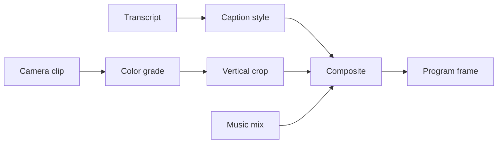
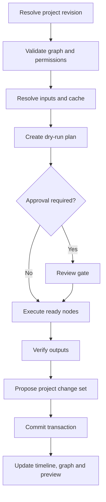
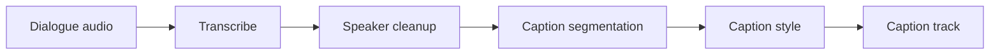
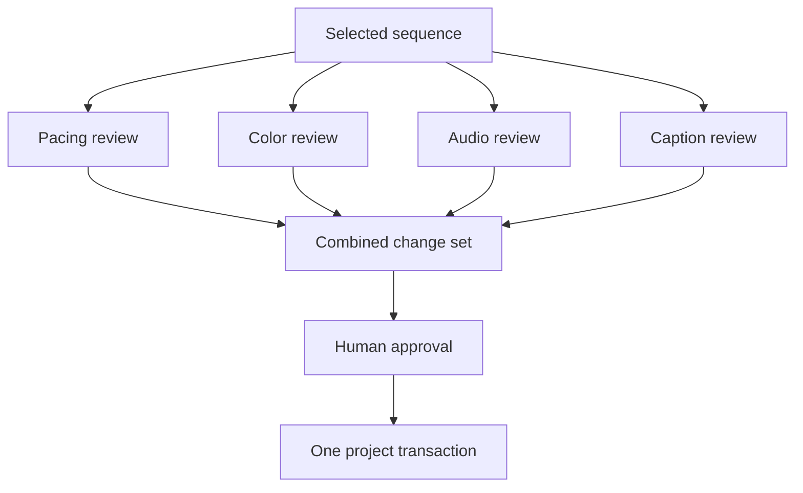
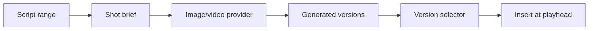

# JOY Media — Unified Data Timeline, Flow Graph, and Specialist Agent Plan

**Working product name:** JOY Dual-Lens Editing  
**Signature interaction:** Frame-to-Flow Trace  
**Target:** JOY Media web editor and future Tauri desktop shell  
**Status:** Next major architecture and UX phase  
**Prerequisite:** The first agentic vertical slice must already complete `query → plan → dry-run → approval → transaction → verification → one-step undo`

---

## 0. Direct instruction for the implementation agent

Extend JOY Media so video, audio, images, text, scripts, transcripts, subtitles, HTML scenes, analysis data, AI-generation requests, generated outputs, agent change sets, and exports can participate in one versioned creative document and one shared time coordinate.

Add a visual workflow graph as a second synchronized view of the same project. Do not create a separate graph project, a second timeline engine, a second undo stack, or a second source of truth.

The existing professional timeline remains the default interface. A Premiere Pro or After Effects user must be able to import media, edit tracks, trim clips, add captions, use keyframes, mix audio, and export without opening or understanding the graph.

The graph is progressive disclosure:

1. **Time View** — the existing familiar track-based editor;
2. **Flow View** — a visual graph showing sources, transformations, agents, approvals, generated artifacts, and outputs;
3. **Split View** — synchronized timeline and graph for advanced workflows.

The same selection, playhead, project revision, commands, artifacts, jobs, permissions, transactions, and undo history must drive every view.

Build on the existing JOY Media foundations:

- `project-schema`;
- `commands`;
- `timeline-engine`;
- `workflow-engine`;
- `agent-tools`;
- `provider-sdk`;
- `job-protocol`;
- `render-ir`;
- `audio-core`;
- `captions-core`;
- `motion-core`;
- local Worker and VPS control-plane boundaries.

Do not rebuild these systems under new names.

All persistent mutations must pass through the existing validated command layer. The UI, specialist agents, workflow nodes, plugins, and automation clients must consume the same typed creative API.

Implement this phase behind a feature flag until migration, undo, graph validation, performance, accessibility, and compatibility tests pass.

---

## 1. Product thesis

Most editing applications primarily show **what exists at a time**. JOY Media should additionally show:

- where an item came from;
- which data was used to create it;
- which transformations affected it;
- which model or provider generated it;
- which specialist agent proposed a change;
- which approval allowed it;
- which output versions depend on it;
- what will be invalidated if it changes.

The core idea is:

> The timeline shows creative time. The flow graph shows creative causality. Both are lenses over the same editable project.

JOY Media is not differentiated merely because it has a node graph. Node graphs already exist in professional creative software. JOY Media’s differentiation target is the combination of:

1. one unified creative document;
2. one professional temporal timeline;
3. one typed dependency and workflow graph;
4. provider-independent AI generation;
5. inspectable specialist-agent participation;
6. reversible commands and transactions;
7. local-first execution;
8. bidirectional tracing between a visible frame and the process that produced it.

The result should feel like a professional editor with a transparent creative operating system underneath it.

---

## 2. Flagship UX: JOY Dual-Lens Editing

### 2.1 The three views

The timeline area receives a compact view switch:

| View      | Purpose                            | Default audience            |
| --------- | ---------------------------------- | --------------------------- |
| **Time**  | Familiar track-based editing       | Every editor                |
| **Flow**  | Full dependency and workflow graph | Automation and AI workflows |
| **Split** | Timeline and graph synchronized    | Advanced users              |

Use familiar labels. Do not rename clips, tracks, sequences, bins, markers, keyframes, effects, or nested sequences with artificial AI terminology.

The default remains **Time**.

### 2.2 Shared state

Switching views must preserve:

- active project and sequence;
- selected clip, item, node, or artifact;
- playhead time;
- In/Out range;
- active track targeting;
- timeline zoom and scroll;
- graph zoom and scroll;
- Program Monitor frame;
- Inspector content;
- open transaction or proposed change set;
- undo and redo history.

The switch changes presentation, not project state.

### 2.3 Reveal commands

Add predictable bridge actions:

- `Reveal in Flow`;
- `Reveal on Timeline`;
- `Show Inputs`;
- `Show Outputs`;
- `Show Agent Changes`;
- `Show Generation History`;
- `Create Workflow from Selection`;
- `Insert Output at Playhead`;
- `Replace Selected Clip with Output`;
- `Open Artifact Versions`.

These belong in context menus, the Inspector, Command Palette, and remappable shortcuts.

### 2.4 Progressive disclosure

Graph concepts must never block normal editing.

#### Level 1 — Standard editing

The user sees normal video, audio, text, and caption tracks. Advanced data lanes and graph badges remain collapsed.

#### Level 2 — Flow Trace

Selecting an item reveals a compact one-line provenance ribbon:

`Camera A → Transcript → Caption Style v3 → Sequence`

The user can inspect or reveal any step without opening the full graph.

#### Level 3 — Full Flow

The user opens Flow or Split View to edit connections, configure nodes, assign specialist capabilities, add review gates, run partial workflows, or inspect versions.

---

## 3. Signature visual idea: Frame-to-Flow Trace

### 3.1 Concept

When the user scrubs the playhead in Flow or Split View, JOY Media highlights only the nodes and edges that contribute to the current frame and current audio sample range.

This creates a direct visual answer to:

> “What produced what I am seeing and hearing right now?”

Example:



As the playhead moves:

- active nodes receive a restrained highlight;
- active edges illuminate in causal order;
- inactive branches remain visible but subdued;
- the Program Monitor stays synchronized;
- the provenance ribbon updates;
- selected time-bound nodes show their active range;
- cached, running, stale, failed, or approval-blocked nodes retain clear status indicators.

This must be informative rather than decorative. Avoid constant neon animation.

### 3.2 Time View representation

Time View should remain clean. Flow relationships appear through:

- a small `Flow` badge on items with dependencies;
- a thin optional provenance strip inside the selected item;
- the one-line provenance ribbon above the timeline;
- subtle upstream/downstream focus when `Flow Trace` is enabled;
- no permanent web of connecting lines over normal tracks.

### 3.3 Flow View representation

Flow View uses compact professional nodes, not oversized no-code cards.

Each node has:

- category icon;
- concise name;
- typed input and output ports;
- current status;
- cache/dirty state;
- time or selection binding;
- optional specialist-agent badge;
- optional provider badge;
- approval state;
- cost indicator only when relevant;
- progress only while executing.

At distant zoom levels, nodes collapse into readable pills. Details progressively appear while zooming in.

### 3.4 Transition between lenses

When reduced motion is not enabled, switching Time ↔ Flow may use a short 160–220 ms continuity animation:

- the selected timeline item visually anchors the transition;
- the matching node gains focus in Flow View;
- surrounding content fades or moves minimally;
- the Program Monitor does not flash or reset.

This animation should communicate that the two views represent the same object. It must not delay work.

### 3.5 Visual system

Use JOY Media’s existing dark professional visual language.

Recommended semantic accents:

| Semantic type                      | Visual treatment         |
| ---------------------------------- | ------------------------ |
| Source media                       | Neutral blue-gray        |
| Text, script, transcript, captions | Violet                   |
| Audio                              | Green                    |
| Deterministic transform            | Blue                     |
| Analysis                           | Amber                    |
| Generative provider                | Magenta                  |
| Specialist agent                   | Cyan outline/badge       |
| Review or approval gate            | Gold                     |
| Output/export                      | Bright neutral           |
| Error                              | Existing destructive red |

Color must never be the only status signal. Use icons, labels, patterns, and accessible contrast.

---

## 4. Adobe-familiar interaction contract

### 4.1 The default editing experience must remain familiar

A professional Adobe user should immediately recognize:

- sequences;
- video and audio tracks;
- captions;
- source and Program Monitor concepts;
- playhead and In/Out points;
- snapping;
- linked selection;
- track targeting;
- razor/split;
- trim, ripple, roll, slip, and slide;
- nested sequences/compositions;
- effects and effect stacks;
- keyframes and graph curves;
- markers;
- bins and assets;
- Inspector/Effect Controls behavior;
- keyboard-driven editing;
- workspace layouts.

The graph adds power; it does not replace these concepts.

### 4.2 Familiar actions gain optional graph meaning

| Familiar action    | Unified-data behavior                                             |
| ------------------ | ----------------------------------------------------------------- |
| Import media       | Creates a source artifact and timeline item                       |
| Add captions       | Creates caption artifacts linked to transcript/source timing      |
| Apply effect       | Creates or updates a transform relationship                       |
| Nest sequence      | Creates a reusable composition boundary                           |
| Render and replace | Creates a versioned derived artifact with provenance              |
| Replace footage    | Rebinds the source while preserving allowed downstream operations |
| Duplicate sequence | Offers linked workflow or independent workflow copy               |
| Add marker         | Marker may carry semantic data or workflow trigger metadata       |
| Export             | Creates an output job and version record                          |

Users should not need to know these internal details during ordinary editing.

### 4.3 Graph entry points

The simplest graph entry should be:

1. select a timeline item;
2. right-click;
3. choose `Reveal in Flow`.

The simplest automation entry should be:

1. select clips or an In/Out range;
2. choose `Create Workflow from Selection`;
3. choose a template such as Auto Captions, Podcast Cleanup, Reel Finish, or Generate B-roll;
4. review the dry-run;
5. run it.

### 4.4 Avoid graph-first friction

Do not require users to:

- connect nodes before they can import or edit;
- understand typed ports for simple edits;
- manually create source nodes for every clip;
- manually synchronize the graph and timeline;
- choose an AI provider before using manual features;
- expose local filesystem paths;
- understand the Worker/VPS topology;
- open provider settings from the creative workspace.

---

## 5. Unified creative data model

### 5.1 “Unified” does not mean “everything is the same clip”

All creative information belongs to one document, but different artifact types retain different semantics.

A video is renderable media. A script is structured narrative data. A transcript has word-level time. A caption has text, timing, styling, and layout. An analysis result may be invisible. A generation request is a job specification. A color-agent result may be an editable parameter change set rather than a flattened video.

The unification occurs through:

- stable IDs;
- project ownership;
- time bindings;
- typed relationships;
- version history;
- provenance;
- shared commands;
- query APIs;
- workflow inputs and outputs.

### 5.2 Core entities

```ts
type CreativeArtifactKind =
  | 'video'
  | 'audio'
  | 'image'
  | 'text'
  | 'script'
  | 'transcript'
  | 'captionDocument'
  | 'htmlScene'
  | 'analysis'
  | 'prompt'
  | 'generatedMedia'
  | 'changeSet'
  | 'renderOutput'
  | 'metadata';

interface CreativeArtifact {
  id: string;
  kind: CreativeArtifactKind;
  schemaVersion: number;
  revision: number;
  label: string;
  contentRef: ArtifactContentRef;
  provenance: ArtifactProvenance;
  createdAt: string;
  updatedAt: string;
}

type TemporalBinding =
  | { type: 'global' }
  | { type: 'point'; timeUs: number }
  | { type: 'range'; startUs: number; durationUs: number }
  | { type: 'track'; trackId: string }
  | { type: 'item'; itemId: string }
  | { type: 'selection'; selectionId: string }
  | { type: 'none' };

interface ArtifactProvenance {
  sourceArtifactIds: string[];
  workflowNodeId?: string;
  jobId?: string;
  providerId?: string;
  modelId?: string;
  modelVersion?: string;
  promptArtifactId?: string;
  seed?: number;
  inputHashes: string[];
  createdBy: ActorRef;
}
```

Use the project’s existing integer time and rational frame-rate conventions. Do not store durable floating-point seconds.

### 5.3 Artifact versions

AI outputs and derived artifacts must be versioned non-destructively.

The user can:

- compare versions;
- pin a version;
- promote a version to the timeline;
- replace a timeline reference;
- fork from a previous version;
- rerun only downstream nodes;
- remove a version from the project without claiming that spent provider credits were refunded.

### 5.4 Renderability

Only renderable or compositable artifacts enter Render IR directly.

Non-renderable data—scripts, analysis, prompts, agent plans, review notes—can influence renderable artifacts through typed relationships and commands but must not be forced into fake video clips.

---

## 6. Timeline information architecture

### 6.1 Track families

The Add Track menu should support families:

1. **Media**
   - Video
   - Audio
   - Image/Graphic
   - Text
   - HTML Scene

2. **Language**
   - Script
   - Transcript
   - Captions/Subtitles
   - Translation

3. **Data**
   - Markers/Events
   - Analysis
   - Metadata
   - Prompts

4. **Automation**
   - Workflow
   - Agent Change Sets
   - Generation Jobs
   - Review Gates

Time View initially exposes the common media and caption tracks. Data and automation lanes remain collapsible.

### 6.2 Data Lane Drawer

Add a compact `Data Lanes` control in the timeline header.

When collapsed:

- standard editing remains visually unchanged;
- only important status badges appear;
- running jobs may show a compact progress chip.

When expanded:

- script and transcript alignment becomes visible;
- prompt ranges and generated alternatives can be inspected;
- agent proposals appear as pending change-set ranges;
- workflow runs and review gates align with affected time;
- analysis results may display confidence, scene, speaker, beat, silence, or shot boundaries.

### 6.3 Recommended item treatments

| Data item        | Timeline representation                       |
| ---------------- | --------------------------------------------- |
| Script segment   | Paragraph block with scene/section label      |
| Transcript       | Word or phrase segments with speaker metadata |
| Caption          | Familiar subtitle blocks                      |
| Prompt           | Compact prompt chip bound to range/selection  |
| Generated output | Version stack with thumbnail or waveform      |
| Analysis         | Thin semantic overlay or collapsible lane     |
| Agent change set | Dashed proposal range until committed         |
| Workflow run     | Compact execution bar with node progress      |
| Approval gate    | Gold gate marker with status                  |

Do not show every internal node as a full timeline block.

### 6.4 Selection synchronization

Selecting a timeline item:

- focuses its artifact;
- highlights its graph node or reference;
- updates the Inspector;
- updates the provenance ribbon;
- shows related versions and agent changes;
- does not change the project.

Selecting a graph node:

- highlights bound timeline items/ranges;
- moves the timeline viewport only when `Follow Selection` is enabled;
- never moves the playhead unless the user requests it.

---

## 7. Workflow graph model

### 7.1 Graph purpose

The graph represents:

- data dependencies;
- deterministic processing;
- AI generation;
- specialist-agent proposals;
- review and approval;
- branching versions;
- export and delivery.

It is not merely a compositing graph and not merely a chatbot visualization.

### 7.2 Node categories

| Category         | Examples                                                         |
| ---------------- | ---------------------------------------------------------------- |
| Source           | Camera media, audio recording, script, brand kit                 |
| Selection        | Sequence, track, clip group, time range                          |
| Analysis         | Transcription, silence detection, beat detection, shot detection |
| Transform        | Trim plan, color stack, crop, denoise, caption style             |
| Generative       | Image, video, voice, music, HTML motion generation               |
| Specialist Agent | Color, audio, caption, pacing, continuity, brand review          |
| Review           | Human approval, budget approval, quality gate                    |
| Composition      | Merge, version selector, nested workflow                         |
| Output           | Timeline insertion, sequence update, render, export              |

### 7.3 Typed ports

Connections must be schema-validated.

Examples:

- `VideoArtifact → ShotAnalysis`;
- `AudioArtifact → Transcript`;
- `Transcript → CaptionDocument`;
- `ScriptRange → VideoGenerationRequest`;
- `GeneratedVideo → VersionSelector`;
- `ChangeSet → ApprovalGate`;
- `ApprovedChangeSet → ProjectTransaction`;
- `Sequence → RenderOutput`.

Invalid connections fail before execution with a useful explanation.

### 7.4 DAG rules

The normal workflow graph is a directed acyclic graph.

- cycles must be rejected;
- iterative behavior must use an explicit bounded iteration node in a later phase;
- every node publishes input and output schemas;
- every graph has a schema version;
- migrations are explicit;
- graph validation runs on load, edit, import, and execution.

### 7.5 Node state

```ts
type WorkflowNodeStatus =
  | 'idle'
  | 'ready'
  | 'blocked'
  | 'awaitingApproval'
  | 'queued'
  | 'running'
  | 'succeeded'
  | 'failed'
  | 'cancelled'
  | 'stale';

interface WorkflowNode {
  id: string;
  type: string;
  schemaVersion: number;
  label: string;
  inputs: WorkflowPort[];
  outputs: WorkflowPort[];
  config: Record<string, unknown>;
  temporalBinding?: TemporalBinding;
  agentAssignment?: AgentAssignment;
  executionPolicy: NodeExecutionPolicy;
  ui: {
    position: { x: number; y: number };
    collapsed?: boolean;
    colorTag?: string;
  };
}
```

UI position is graph-view state. Creative meaning and execution configuration must not depend on pixel coordinates.

### 7.6 Caching and invalidation

Each node execution computes a cache key from:

- node type and version;
- normalized configuration;
- input artifact versions and hashes;
- provider/model version where relevant;
- deterministic environment version where relevant.

When an upstream artifact changes:

- affected downstream nodes become `stale`;
- unaffected branches remain cached;
- the user can inspect the invalidation reason;
- rerunning does not silently overwrite pinned outputs.

---

## 8. Specialist-agent nodes

### 8.1 Agent roles

Initial specialist roles may include:

- Edit/Pacing Agent;
- Color Agent;
- Audio Cleanup Agent;
- Audio Mix Agent;
- Caption Agent;
- Translation Agent;
- Motion Agent;
- B-roll Agent;
- Brand Consistency Agent;
- Continuity/Quality Agent;
- Export QC Agent.

These are capabilities and policy bundles, not mandatory permanently running model processes.

### 8.2 Avoid uncontrolled multi-agent architecture

Do not give every node an independent unrestricted agent session.

Use:

- one orchestrating task/session;
- scoped specialist invocations;
- typed inputs and outputs;
- least-privilege tools;
- per-node context;
- explicit budgets;
- a single project transaction authority;
- parallel read/analysis/generation where safe;
- serialized or revision-checked project writes.

Specialists may propose change sets concurrently. They may not race to mutate the project directly.

### 8.3 Capability-based assignment

Bind nodes to capabilities rather than hard-coded vendor names:

```ts
interface AgentAssignment {
  roleId: string;
  capability: string;
  adapterPreference?: string;
  modelPreference?: string;
  permissionProfileId: string;
  budgetPolicyId?: string;
  approvalPolicyId: string;
  contextPolicyId: string;
}
```

Examples:

- `video.color.review`;
- `audio.cleanup.propose`;
- `captions.generate`;
- `captions.style.apply`;
- `timeline.pacing.analyze`;
- `timeline.pacing.propose`;
- `brand.validate`;
- `render.qc`.

Hermes, KiloCode, a native JOY agent, or future adapters may fulfill compatible roles without changing the project schema.

### 8.4 Agent node UX

An agent node shows:

- friendly role name;
- scope, such as `Selected clips` or `00:12–00:28`;
- current model/adapter only in expanded details;
- permission summary;
- estimated cost;
- plan;
- proposed changes;
- confidence and warnings where meaningful;
- Run, Dry Run, Approve, Reject, Retry, and Compare actions.

The graph should not display raw chain-of-thought. Show concise plans, tool activity, evidence, results, and decisions.

### 8.5 Review gates

Review gates can require:

- manual approval;
- budget approval;
- brand approval;
- technical validation;
- duration/aspect-ratio validation;
- loudness validation;
- caption-overflow validation;
- export QC.

High-impact and paid actions must respect global and node-level policy.

---

## 9. Creative API extensions

### 9.1 One facade

The UI, graph, agents, plugins, and automation should consume a typed editing facade. The implementation may use an in-process TypeScript adapter, Worker RPC, or control-plane transport without changing domain semantics.

```ts
interface CreativeEditingFacade {
  query<T>(request: CreativeQuery): Promise<QueryResult<T>>;
  execute(command: CreativeCommand): Promise<CommandResult>;
  dryRun(batch: CreativeCommandBatch): Promise<ChangeSetPreview>;
  commit(transaction: CreativeTransaction): Promise<TransactionResult>;
  startJob(request: CreativeJobRequest): Promise<JobHandle>;
  subscribe(listener: CreativeEventListener): Unsubscribe;
}
```

Do not force every local UI interaction through HTTP.

### 9.2 Query families

- `artifact.get`;
- `artifact.getVersions`;
- `artifact.getProvenance`;
- `timeline.getRange`;
- `timeline.getItems`;
- `timeline.getDataLanes`;
- `graph.get`;
- `graph.getUpstream`;
- `graph.getDownstream`;
- `graph.getActiveAtTime`;
- `workflow.validate`;
- `workflow.estimate`;
- `agent.getCapabilities`;
- `provider.getCapabilities`;
- `job.getStatus`;
- `project.getRevision`.

### 9.3 Command families

- `artifact.create`;
- `artifact.bindTime`;
- `artifact.promoteVersion`;
- `artifact.pinVersion`;
- `timeline.dataLane.create`;
- `timeline.item.linkArtifact`;
- `graph.node.create`;
- `graph.node.update`;
- `graph.node.delete`;
- `graph.edge.connect`;
- `graph.edge.disconnect`;
- `graph.node.assignAgent`;
- `graph.node.bindTime`;
- `workflow.createFromSelection`;
- `workflow.run`;
- `workflow.cancel`;
- `workflow.retryNode`;
- `workflow.approveGate`;
- `workflow.rejectGate`;
- `workflow.insertOutput`;
- `workflow.replaceSelection`;

All durable commands use the hardened command envelope, including:

- `schemaVersion`;
- `commandId`;
- `idempotencyKey`;
- `projectId`;
- `baseRevision`;
- `transactionId`;
- `actor`;
- target IDs;
- preconditions;
- typed parameters.

### 9.4 Events

Views update from domain events:

- `ArtifactCreated`;
- `ArtifactVersionCreated`;
- `ArtifactBindingChanged`;
- `WorkflowNodeChanged`;
- `WorkflowExecutionStarted`;
- `WorkflowNodeStatusChanged`;
- `WorkflowOutputReady`;
- `ApprovalRequested`;
- `ChangeSetProposed`;
- `TransactionCommitted`;
- `ProjectRevisionChanged`;
- `JobProgressChanged`.

React components must not manually patch independent graph and timeline stores.

---

## 10. Execution lifecycle

### 10.1 Workflow run



### 10.2 Project mutation boundary

Analysis and generation nodes may create artifact versions without immediately altering the timeline.

Timeline mutation occurs only through:

- an approved command;
- an approved transaction;
- a configured low-risk automatic policy.

### 10.3 Stale revision handling

If the project changed after a plan was created:

- fail the stale write clearly;
- preserve completed generated artifacts;
- re-query affected state;
- offer to rebase or rerun the plan;
- never silently overwrite newer human work.

### 10.4 Undo

One committed workflow change set should be one undoable project transaction.

Undo may:

- restore timeline state;
- restore effects and parameters;
- restore artifact bindings;
- restore graph configuration;
- unreference generated outputs.

Undo cannot:

- refund provider credits;
- erase an already delivered external file;
- reverse an external side effect without a supported compensating operation.

Communicate these boundaries before execution.

---

## 11. Example creative workflows

### 11.1 Auto captions with editable provenance



User experience:

1. select dialogue clips;
2. choose `Create Captions`;
3. JOY creates or reuses the workflow;
4. transcript and caption data lanes appear;
5. the user edits words normally;
6. downstream caption layout becomes stale only where required;
7. applying the final result creates one caption-track transaction.

### 11.2 Specialist finishing chain



The specialists analyze in parallel. Only the combined, validated transaction writes to the project.

### 11.3 Generate B-roll from a script range



Generated versions stay in a version tray until the user or an allowed policy promotes one.

### 11.4 Podcast cleanup template

The template can include:

- transcription;
- silence analysis;
- filler-word review;
- suggested ripple edits;
- voice cleanup;
- loudness normalization;
- caption generation;
- chapter markers;
- review gate;
- export QC.

The user may interact only through the standard timeline while the graph remains available for inspection.

---

## 12. Workspace and panel design

### 12.1 Edit workspace

Preserve the current professional layout and large vertical Program Monitor.

- Timeline remains the dominant temporal editor.
- Graph is available as a dockable tab and through `Reveal in Flow`.
- Data Lanes are collapsed by default.
- The Program Monitor must not move merely because Flow Trace is enabled.

### 12.2 Flow workspace

The Flow workspace may:

- use the central and left-center area for the graph;
- keep the Program Monitor visible on the right;
- retain a compact time navigator beneath the graph;
- show Inspector and execution details in a dockable panel;
- support maximize/restore for the graph;
- preserve the previous Edit workspace layout.

### 12.3 Split workspace

Split View should support:

- graph above timeline in the left/center editing region;
- synchronized horizontal time focus;
- adjustable divider;
- compact nodes;
- Program Monitor unchanged on the right;
- one-click return to Time View.

### 12.4 Inspector

The same Inspector edits:

- timeline item properties;
- artifact metadata;
- workflow node configuration;
- specialist-agent scope and policy;
- generation parameters;
- review-gate conditions;
- output/export configuration.

Use schema-driven property sections. Do not create a separate settings language for graph nodes.

### 12.5 Minimap and navigation

Graph navigation includes:

- zoom to fit;
- focus selection;
- upstream/downstream focus;
- breadcrumb for groups/subgraphs;
- minimap for large graphs;
- Command Palette actions;
- keyboard traversal between connected nodes;
- accessible non-canvas alternatives for connection management.

---

## 13. Architecture integration

| Existing JOY area | Required extension                                                               |
| ----------------- | -------------------------------------------------------------------------------- |
| `project-schema`  | Artifacts, temporal bindings, provenance, graph references, versions, migrations |
| `timeline-engine` | Data lanes, artifact-linked items, selection synchronization                     |
| `workflow-engine` | Typed DAG, validation, caching, node execution, gates                            |
| `commands`        | Graph/artifact commands, inversion, transactions, stale revision checks          |
| `agent-tools`     | Queries and safe graph/artifact tools generated from commands                    |
| `provider-sdk`    | Capability-based generative and analysis node adapters                           |
| `job-protocol`    | Node progress, cancellation, retries, local/remote execution                     |
| `render-ir`       | Accept only evaluated renderable artifacts                                       |
| `captions-core`   | Transcript/caption artifact linkage and partial invalidation                     |
| `audio-core`      | Analysis/mix artifacts and editable parameter change sets                        |
| `motion-core`     | Motion artifacts, time bindings, and graph-driven parameters                     |
| `editor-web`      | Time/Flow/Split views, Flow Trace, Data Lane Drawer                              |
| Local Worker      | Heavy node execution, hashes, caches, model/provider adapters                    |
| JOY VPS           | Coordination, metadata, audit, permissions, optional sync—not heavy rendering    |

### 13.1 Dependency direction

UI graph components depend on the creative facade and view models.

They must not become dependencies of:

- project schema;
- workflow validation;
- command execution;
- Worker jobs;
- renderer contracts.

### 13.2 Graph library choice

Select a graph UI library only after evaluating:

- React compatibility;
- virtualization;
- accessibility strategy;
- typed port customization;
- minimap and grouping;
- large-graph performance;
- license;
- maintenance;
- keyboard control;
- serialization independence.

The UI library’s node format must not become the persisted workflow schema.

---

## 14. Security and trust boundaries

### 14.1 Treat creative content as untrusted data

Scripts, captions, transcripts, prompts, filenames, imported metadata, web content, and model outputs may contain instruction-like text.

Agent runtimes must treat this content as project data, not privileged system instructions.

### 14.2 Node permissions

Each executable node declares required capabilities:

- project read;
- timeline write;
- artifact creation;
- local file read/write;
- provider generation;
- provider spend;
- network;
- export;
- plugin invocation.

Permissions are validated before running.

### 14.3 Secrets

Provider keys remain in the configured secret store.

Never place raw secrets in:

- project files;
- graph configuration;
- agent context;
- browser logs;
- audit event payloads;
- plugin-visible state;
- generated artifact metadata.

### 14.4 Arbitrary code

Workflow nodes must not construct arbitrary shell commands from user, plugin, project, or agent input.

HTML/JS scene execution remains in the existing sandbox boundary.

---

## 15. Performance requirements

The implementation should:

- virtualize offscreen timeline items and graph elements;
- avoid recomputing the full graph on each playhead tick;
- maintain an index from time ranges to participating artifacts/nodes;
- update Flow Trace from evaluated dependencies;
- batch progress events;
- keep heavy thumbnails and waveforms cached;
- avoid rerendering the Program Monitor when only graph selection changes;
- run layout computation off the interaction-critical path where possible;
- preserve usable editing when the Worker is offline;
- degrade Flow Trace detail gracefully on very large projects.

Measure:

- timeline scroll and zoom responsiveness;
- graph pan and zoom responsiveness;
- selection synchronization latency;
- playhead-to-trace highlight latency;
- node validation time;
- cache-hit behavior;
- memory use with large artifact/version histories.

Do not claim a performance target without a repeatable benchmark fixture.

---

## 16. Implementation sequence

### Gate 0 — Finish the existing agentic vertical slice

Before this phase begins, demonstrate:

- project query;
- agent plan;
- dry-run change set;
- approval;
- atomic command transaction;
- verification;
- one-step undo;
- stale revision rejection.

Do not build graph UI on top of an unproven command loop.

### Phase 1 — ADR and schema extension

Deliver:

- an ADR for Dual-Lens Editing;
- artifact and provenance schema;
- temporal binding schema;
- workflow node/edge contracts;
- migration strategy;
- capability and permission contracts;
- feature flag.

Exit criteria:

- old projects migrate without visible changes;
- graph-disabled behavior remains identical;
- schemas have validation and round-trip tests.

### Phase 2 — Read-only Flow View

Generate a read-only graph projection from an existing project.

Deliver:

- Time/Flow view switch;
- `Reveal in Flow`;
- `Reveal on Timeline`;
- synchronized selection;
- provenance ribbon;
- read-only Frame-to-Flow Trace;
- graph status/minimap basics.

Exit criteria:

- no graph action can mutate the project;
- selected timeline items resolve to correct nodes;
- active-frame trace matches evaluation dependencies;
- Program Monitor and timeline behavior do not regress.

### Phase 3 — Editable workflow graph

Deliver:

- typed node creation;
- typed edge connection;
- validation;
- commands and undo;
- grouping/subgraphs;
- dry-run;
- deterministic nodes;
- caching and stale-state display.

Exit criteria:

- every graph mutation uses commands;
- one undo reverses one graph transaction;
- cycles and invalid ports are rejected;
- graph UI serialization is separate from domain schema.

### Phase 4 — Unified Data Lanes

Deliver:

- Data Lane Drawer;
- script, transcript, prompt, analysis, generation, and change-set representations;
- artifact version tray;
- time/range binding;
- partial invalidation display.

Exit criteria:

- normal projects remain uncluttered by default;
- data edits update the same document;
- graph and timeline remain synchronized;
- non-renderable data does not leak into Render IR.

### Phase 5 — Specialist-agent execution

Deliver:

- capability-based specialist nodes;
- scoped context;
- permissions;
- budgets;
- approval gates;
- combined change sets;
- single project transaction authority;
- audit records.

Start with three specialists:

1. Caption Agent;
2. Audio Cleanup Agent;
3. Color Review Agent.

Exit criteria:

- specialists can analyze in parallel;
- specialists cannot mutate the project directly;
- proposed changes are inspectable;
- one approved combined transaction is undoable;
- stale project state fails safely.

### Phase 6 — Templates and signature polish

Deliver:

- Auto Captions template;
- Podcast Cleanup template;
- Reel Finish template;
- Generate B-roll template;
- polished Flow Trace;
- Time ↔ Flow continuity animation;
- workspace persistence;
- keyboard and accessibility refinement;
- onboarding hints that disappear after use.

Exit criteria:

- an Adobe-experienced editor completes normal editing without graph training;
- the same editor can reveal and modify a workflow without leaving the project;
- a demo clearly communicates JOY Media’s differentiation in under one minute.

---

## 17. Recommended one-minute differentiation demo

The product demo should avoid beginning with settings or a chatbot.

1. Open a normal vertical-reel sequence in familiar Time View.
2. Scrub a frame containing dialogue and animated captions.
3. Click `Flow Trace`.
4. The synchronized Flow View reveals:
   - source camera clip;
   - dialogue audio;
   - local transcription;
   - edited transcript;
   - caption segmentation;
   - caption style;
   - color adjustment;
   - audio mix;
   - current output.
5. Select the Caption Agent node and change a caption rule.
6. JOY shows the affected ranges before applying.
7. Approve one transaction.
8. The timeline, captions, graph, Inspector, and Program Monitor update together.
9. Press Undo once.
10. Everything returns to the previous state.

The message is immediately understandable:

> JOY Media edits like a professional timeline, but every creative and AI operation remains visible, connected, editable, and reversible.

---

## 18. Testing strategy

### 18.1 Schema and migration

- old project migration;
- new project round trip;
- artifact version round trip;
- temporal binding validation;
- unknown node preservation or safe rejection;
- schema version migration;
- graph-disabled compatibility.

### 18.2 Graph correctness

- DAG cycle rejection;
- port-type validation;
- missing-input detection;
- deterministic topological order where required;
- cache-key correctness;
- downstream invalidation;
- pinned-version protection;
- partial rerun;
- cancellation and retry.

### 18.3 Timeline/graph synchronization

- timeline selection reveals correct node;
- node selection reveals correct item/range;
- playhead trace selects only active dependencies;
- view switching preserves selection and time;
- Inspector shows the same underlying entity;
- graph edits appear in timeline only after a committed command;
- no duplicate source of truth.

### 18.4 Commands and transactions

- UI and SDK command parity;
- command envelope validation;
- idempotency;
- stale revision failure;
- permission denial;
- one-step undo;
- redo;
- transaction rollback;
- audit-event creation.

### 18.5 Agents and providers

- specialist scope isolation;
- read/write permission separation;
- budget enforcement;
- paid-action approval;
- provider failure;
- local Worker offline behavior;
- provenance completeness;
- project content prompt-injection resistance;
- no secret leakage.

### 18.6 UX and accessibility

- full keyboard navigation;
- focus visibility;
- remappable commands;
- screen-reader-accessible alternative to canvas-only edge manipulation;
- reduced-motion support;
- color-independent status;
- high-DPI display behavior;
- narrow Dockview panel behavior;
- workspace persistence;
- Time View remains usable with the graph feature disabled.

---

## 19. Acceptance criteria

This phase is complete only when:

1. A standard Adobe-style timeline remains the default.
2. Existing manual editing workflows remain functional without opening Flow View.
3. Timeline, graph, Inspector, Program Monitor, and agent panel read one project state.
4. A timeline item can be revealed in the graph and returned to the timeline.
5. The active frame can be traced to its contributing artifacts and operations.
6. Script, transcript, captions, prompts, generation outputs, and agent change sets can use explicit time/range bindings.
7. Non-renderable data never becomes a fake render layer.
8. Workflow edges are typed and validated.
9. Graph cycles are rejected.
10. Graph and data-lane mutations use the same command system as manual editing.
11. Specialist agents produce scoped, inspectable change sets.
12. Specialist agents cannot race to write project state.
13. Generated outputs preserve provider and input provenance.
14. Re-running a node does not destroy pinned versions.
15. A committed multi-node edit can be undone once as one project transaction.
16. External generation cost is not falsely represented as undoable.
17. Old projects load through explicit migrations.
18. The graph UI library is not the persisted graph schema.
19. Provider keys never enter project or agent-visible data.
20. The one-minute differentiation demo works reliably.

---

## 20. Explicit non-goals for this phase

Do not:

- replace the professional timeline with a graph;
- require graph editing for ordinary projects;
- build a second project document;
- build a second undo/redo system;
- build unrestricted autonomous multi-agent swarms;
- let every node launch an unbounded chat session;
- implement arbitrary cyclic graphs;
- expose raw chain-of-thought;
- execute arbitrary shell commands;
- move heavy processing onto the VPS;
- flatten all agent results into rendered media;
- promise full Premiere, After Effects, Resolve, Nuke, or Fusion compatibility;
- implement real-time multi-user graph editing before single-user revision safety is proven;
- build a public workflow marketplace before node contracts stabilize.

---

## 21. Final product principle

JOY Media should offer two equally truthful ways to understand a project:

- **Time:** what happens and when;
- **Flow:** where it came from, what transformed it, and what depends on it.

The professional editor remains in control. Agents, models, plugins, workflows, and UI panels operate through the same creative API and produce visible, versioned, reversible results.

The graph is not a separate technical playground.

It is the transparent creative structure underneath the timeline the editor already knows.

**Product line:**

> Edit in time. Understand in flow.
