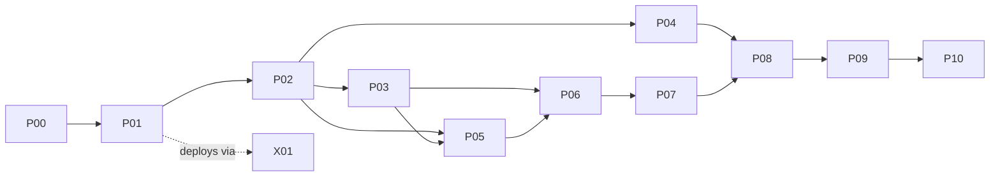

# JOY Media — Orchestration Map

**This is the execution front door.** The architecture contract lives in [`JOY_MEDIA_MASTER_PLAN.md`](JOY_MEDIA_MASTER_PLAN.md) (v1.1). This file partitions that plan into **parts** sized so that one agent session can make a complete, reviewable increment inside exactly one part. Live progress is tracked in [`STATE.md`](STATE.md); open product decisions in [`plan/DECISIONS.md`](plan/DECISIONS.md).

---

## 1. The parts

Phase parts (dependency-ordered, from master plan §36) and cross-cutting parts (X-prefixed):

| Part    | File                                                               | Goal in one line                                                     | Depends on                              |
| ------- | ------------------------------------------------------------------ | -------------------------------------------------------------------- | --------------------------------------- |
| **P00** | [plan/P00-architecture-proofs.md](plan/P00-architecture-proofs.md) | Seven spikes that retire the hardest risks before UI investment      | —                                       |
| **P01** | [plan/P01-platform-foundation.md](plan/P01-platform-foundation.md) | Creative core, editor shell, minimal control plane + Worker skeleton | P00 gate                                |
| **P02** | [plan/P02-editing-slice.md](plan/P02-editing-slice.md)             | Usable manual editor with reliable deterministic 1080p export        | P01 gate                                |
| **P03** | [plan/P03-captions.md](plan/P03-captions.md)                       | Captions + transcript-first editing, Persian/RTL first-class         | P02 gate                                |
| **P04** | [plan/P04-motion-html-scenes.md](plan/P04-motion-html-scenes.md)   | Keyframe motion system + sandboxed HTML scenes                       | P02 gate (P03 parallel-safe)            |
| **P05** | [plan/P05-audio-providers.md](plan/P05-audio-providers.md)         | Audio studio + full provider system (ComfyUI, TTS, consent)          | P02 gate; provider-SDK minimum from P03 |
| **P06** | [plan/P06-agent.md](plan/P06-agent.md)                             | Agent-assisted editing through the command bus                       | P02+P03 gates; benefits from P04/P05    |
| **P07** | [plan/P07-workflows.md](plan/P07-workflows.md)                     | Deterministic workflow automation engine                             | P06 partial (commands/jobs stable)      |
| **P08** | [plan/P08-plugin-sdk.md](plan/P08-plugin-sdk.md)                   | Public plugin SDK + team/private template catalog                    | P04–P07 contracts stable                |
| **P09** | [plan/P09-marketplace.md](plan/P09-marketplace.md)                 | Marketplace, collaboration, scale — **gated, not automatic scope**   | P08 gate + owner approval               |
| **P10** | [plan/P10-advanced.md](plan/P10-advanced.md)                       | Advanced pro systems (3D, expressions, multicam…) — optional         | P09-era                                 |
| **X01** | [plan/X01-vps-control-plane.md](plan/X01-vps-control-plane.md)     | Live-VPS deployment plan: isolation, ports, Postgres, health checks  | activates with P01                      |

Each part file contains **work packages (WPs)** — checkbox units sized for roughly one focused session. WPs inside a part may run in any order that respects their listed prerequisites.

## 2. Session protocol (for me-later or any agent)

Every implementation session follows this loop:

1. **Orient.** Read this file, [`STATE.md`](STATE.md), and the one part file you will work in. Read the master plan sections that the part references — not the whole plan. Read any ADRs the part lists.
2. **Check the gate.** A part may only move to `in-progress` when every dependency's exit criteria are checked off in its part file. Phase gates are exit-criteria-driven, never calendar-driven (§36).
3. **Pick ONE work package.** Do not span parts. If the WP turns out to need a core-invariant change, stop and record the question in `plan/DECISIONS.md` (stop conditions: master plan §46.3).
4. **Implement** following §45 (engineering standards) and §46.1 (required agent behavior). Tests and fixtures ship in the same change (§45.1). Respect §44 anti-patterns as review-blockers.
5. **Record.** Tick the WP checkbox in the part file, update the part's row in `STATE.md` (status, date, next action), add an ADR if an invariant was decided, and commit with a message prefixed `joy-media(<part>):`.
6. **Report** per the §46.2 delivery-report shape: files changed, behavior, tests run, deviations, remaining blockers.

Rules that override enthusiasm:

- **No sideways expansion.** Build one end-to-end workflow on the foundations before widening (§50).
- **Nothing ships to the live VPS except through X01.** Other parts produce locally-runnable code; X01 owns deployment, isolation, and rollback.
- **Decisions beat assumptions.** If a WP hits an open question in `plan/DECISIONS.md` that is still `OPEN`, ask the owner; a `DEFAULT` answer may be used but must be flagged in the session report.
- **Repo boundary.** This repository (`joy-media`) is the isolated boundary §5.3 asks for (DECIDED Q16, 2026-07-19). The `joy-vps` repo keeps only a pointer; VPS operational work still happens from `joy-vps`, JOY Media product work happens here.

## 3. Status legend (used in STATE.md and part files)

`not-started` · `in-progress` · `blocked(<reason>)` · `gate-review` (WPs done, exit criteria being verified) · `done` (exit criteria evidenced)

## 4. What was already fixed in the plan (v1.0 → v1.1)

Recorded here so no session re-litigates them:

1. **§27.2 stale VPS facts** — the "no AVX/SSE4.2" claim was measured false on 2026-07-19 (AVX/AVX2/SSE4.2 present; Node v22; no Postgres yet; ~4.6 GB RAM available, ~43 GB disk free). Conservative-baseline + health-check rules retained because the virtual CPU model is provider-controlled.
2. **§10.5 clip duration** — clips now explicitly require `durationUs > 0`; `>= 0` applies only to non-clip ranges.
3. **§26.5 job lifecycle** — added missing `uploading --> failed` and `verifying --> failed` transitions.
4. **§26.7 namespace collision** — `speech.transcribe` removed from Worker job types; provider-backed capabilities always ride `provider.invoke`.
5. **§5.1 vs §38.1 scope conflict** — the ten-item vertical slice is the architecture-proof objective (spans P0–P6), not the first-release bar; clarified in place.
6. **§26.12 vs §48-Q1** — Windows-first recorded as the working default, final answer owed as an ADR.

## 5. Standing facts (measured 2026-07-19)

- **VPS:** `ssh sweden` · QEMU Virtual CPU 2.5+ with avx/avx2/sse4_2 · 8 GB RAM · 99 GB disk (43 free) · Node v22.23.1 · no PostgreSQL/Redis installed yet · Docker/containerd present.
- **Ports in use on VPS:** 22, 53, 80, 443, 5355, 8008, 8080–8083, 8766–8767, 9090, 9222, 10001–10005, 19825. **Reserved for JOY Media: 8790 (API/WS), 8791 (object gateway, optional).** Recorded in X01; re-verify before first bind.
- **VPS skeleton:** `/opt/joy-media/` exists with a copy of the X01 plan; nothing runs there yet.
- **VPS budget (DECIDED Q2):** ≤3 GB RAM, ≤2 CPU cores for JOY Media, flexible; owner re-evaluates after real usage.
- **Owner decision round 1 (2026-07-19):** all §48 questions answered — see `plan/DECISIONS.md` and ADR-0001. Highlights: both surfaces together (desktop-only launch acceptable), Chrome-first, shared JOY login with per-user admin activation, English-only UI with excellent Persian speech/captions, OpenRouter + Windows-local models, Hermes authors scene templates, everything trends agentic (D-AGENT).
