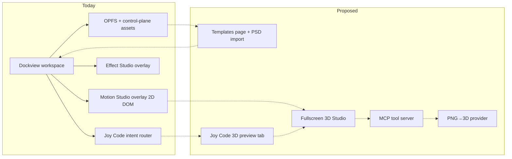
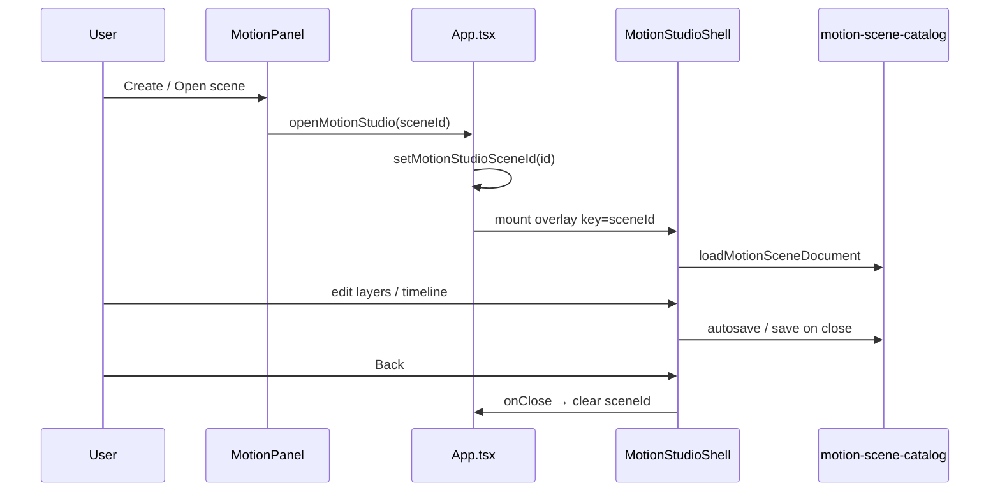
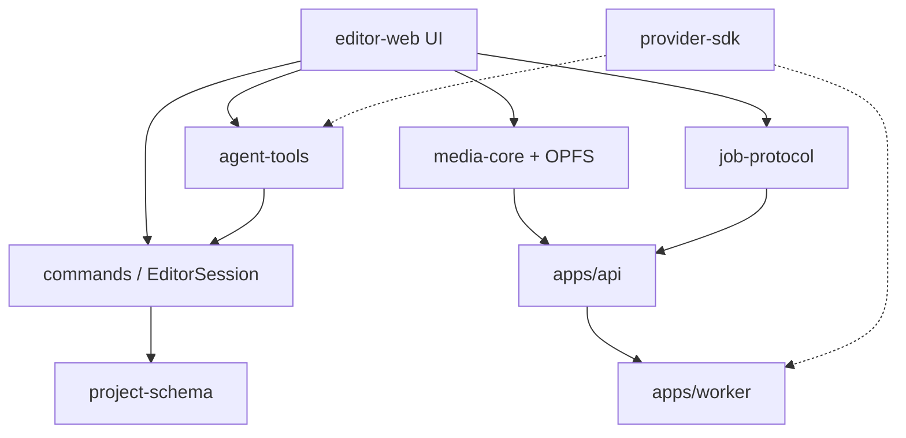
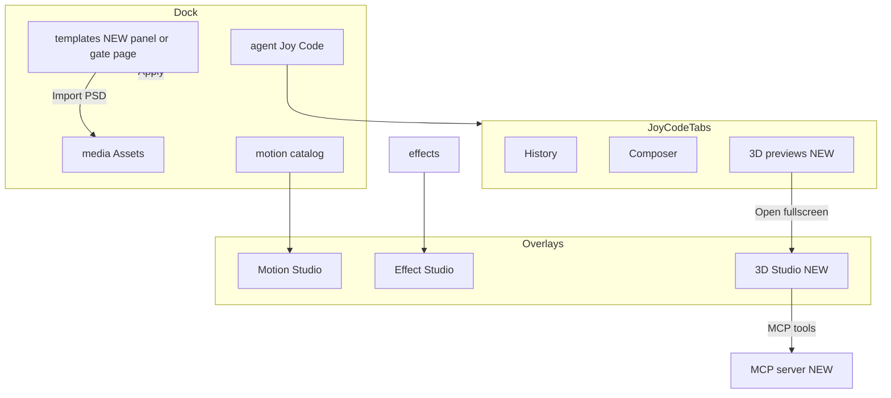
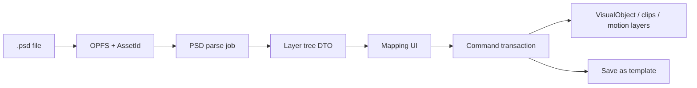
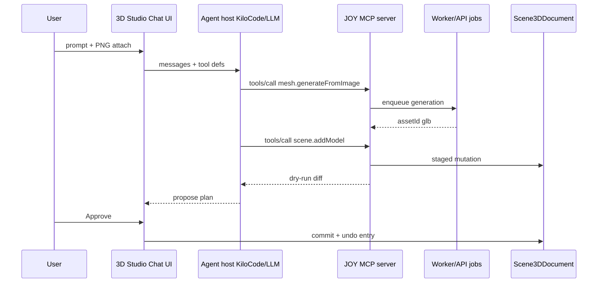

# JOY Studio — Product & Expansion Brief

> **Audience:** local product/architecture AI + human implementers  
> **Repo root:** `/opt/joy-media/repo`  
> **Live domain:** `https://joyst.ir`  
> **Date of snapshot:** 2026-07-30  
> **Scope of this document:** accurate **Today** architecture + forward **Proposed** specs for Templates (+ PSD), Joy Code 3D tab, fullscreen 3D Studio + MCP, PNG→3D  
> **Non-scope:** this file is a brief only — do not treat it as an implementation PR

---

## 1. Executive summary

**JOY Studio** (product brand) is the CapCut-like browser editor shipped as **JOY Media** (repo/API/deploy names). The live surface is `editor-web` behind an independent OTP login gate, docked panels via Dockview, short-form default composition **1080×1920**, plus two fullscreen studio overlays (Motion Studio, Effect Studio).

**Joy Code** (`AgentPanel`, dock id `agent`) looks like a chat composer but is **not** a live LLM today. It routes slash/keyword intents into `@joy-media/agent-tools` plans, dry-runs them, and applies via `runPlanAtomically` on the same timeline command bus as human edits. Free-form NL, KiloCode transport, and **MCP are unwired** (zero MCP references in the repo).

**Expansion intent (user):**

1. A first-class **Templates** surface with **Import PSD**.
2. A **3D tab with previews** inside the Joy Code area.
3. A **fullscreen 3D Studio** (Motion-Studio-like): 3D canvas + chat composer, LLM tools over **MCP**, including **PNG still → 3D model**.

**Honest seam for implementers:** reuse the Motion/Effect Studio overlay pattern in `App.tsx`, the Joy Code composer chrome, `provider-sdk` capability contracts, Worker/`image.comfy` job path for GPU work, and `motion-core` transform fields that already reserve `z` / `rotationXDeg` / `rotationYDeg` / `perspective` but are not driven by a real 3D engine. Do **not** assume Three.js, glTF, PSD parsers, or MCP servers exist — they do not.



---

## 2. Product today (what exists)

### 2.1 Positioning & surfaces

| Layer | Reality |
| ----- | ------- |
| Brand in UI | **Joy Studio** / **JOY Studio** (login lockup, menubar, Joy Code logos) |
| Repo / API / systemd | Still **joy-media** (`/opt/joy-media/repo`, `/etc/joy-media/api.env`) |
| Domain | Canonical **`joyst.ir`** / `www.joyst.ir`; `media.joyteam.ir` → 301 to joyst.ir |
| First paint | Project library gate (`ProjectLibrary.tsx`) then CapCut-tile Dockview workspace |
| Auth | Independent allow-list OTP (Gmail / Telegram / Token) — ADR-0017 login |
| Composition default | `DEFAULT_COMPOSITION_SIZE = { width: 1080, height: 1920 }` in `editor-project.ts` |
| Design system | `DESIGN.md` — neutral gray CapCut shell, Modam Pro, amber accent scarcity |

Product docs that matter: `DESIGN.md`, `STATE.md`, `ARCHITECTURE_SUMMARY.md`, `docs/adr/*`, `AGENTIC_EDITING_NEXT_AGENT.md`, `JOY_MEDIA_UNIFIED_DATA_TIMELINE_AND_AGENT_FLOW_PLAN.md`.

### 2.2 Editor shell & layouts (Vertical / Widescreen)

**Source of truth:** `apps/editor-web/src/dock-layout.ts`

- Modes: `EditorViewMode = 'vertical' | 'widescreen'`
- Persistence: `joy-media.view-mode.v1`; dock JSON `joy-media.dockview.${mode}.v9`
- Default mode: **vertical** (`loadViewMode`)
- Toggle: app header icons (`VerticalViewIcon` / `WideViewIcon`)
- Composition size is **unchanged** by view mode (panel placement only)

**Vertical (default — short-form):** Monitor full-height right; left stack = browser tabs (Assets/Effects/…) ‖ context (Inspector/Motion/…) ‖ Agent; bottom Timeline · Dual Lens.

**Widescreen:** Monitor top-center; bottom Timeline · Dual Lens ‖ Agent (Joy Code).

```
Vertical                          Widescreen
┌─────┬─────┬─────┬──────┐       ┌─────┬───────────┬─────┐
│Assets│Insp │Agent│ Mon  │       │Assets│  Monitor  │Motion│
│Effects│Motion│   │      │       │ …   │           │ …   │
├─────┴─────┴─────┤      │       ├─────┴─────┬─────┴─────┤
│ Timeline·Dual   │      │       │ Timeline  │ Joy Code  │
└─────────────────┴──────┘       └───────────┴───────────┘
```

Panel shell contract (`DESIGN.md` §3a): every dock panel is `.joy-panel-root` + header / optional search / tabs / body. Joy Code uses `article.joy-panel-root.joy-code-panel` with aria-label **"Joy Code"**.

### 2.3 Core panels map

Registered in `apps/editor-web/src/workspace.ts` `PANEL_IDS`:

| Panel id | Surface (typical) | Primary file(s) |
| -------- | ----------------- | --------------- |
| `media` | Assets library | `AssetLibraryPanel.tsx` |
| `monitor` | Program preview (Pixi) | Monitor path via `renderer-pixi` |
| `timeline` | NLE timeline | `TimelinePanel.tsx` |
| `flow` | Dual Lens / creative projections | Dual Lens (ADR-0022; flag may be off in prod) |
| `captions` | Captions + style templates | `CaptionsPanel.tsx` |
| `inspector` | Property inspector | Inspector panels |
| `motion` | Motion catalog / entry to Motion Studio | `MotionPanel.tsx` |
| `camera` | Camera (2.5D ADR-0015) | Camera panel |
| `audio` | Audio | Audio panel |
| `effects` | Effects + Effect Studio entry | `EffectsPanel.tsx` |
| `transitions` | Transitions | Transitions panel |
| `color` | Color | Color panel |
| `history` | Photoshop-style history list | `HistoryPanel.tsx` |
| `diagnostics` | Diagnostics | Diagnostics panel |
| `jobs` | Worker / generation jobs | `JobsPanel.tsx` |
| `agent` | **Joy Code** | `AgentPanel.tsx` |
| `workflows` | Workflow graphs + templates-as-transactions | `WorkflowsPanel.tsx` |
| `plugins` | Plugins | Plugins panel |

**Not a dock panel today:** Templates gallery page, 3D Studio, PSD importer.

**Fullscreen overlays (siblings of Dockview, not panels):** Motion Studio, Effect Studio — mounted from `App.tsx`.

### 2.4 Joy Code (Agent) — current capabilities

**Mount:** dock panel id `agent` → `AgentPanel` in `App.tsx`.  
**UI chrome:** History | Composer tabs; compose dock (“What should we edit?”); Persian help copy stating plans apply only when policy + execution mode allow.

#### Today — what works

1. User prompt → `matchJoyCodeIntentId` (`joy-code-history.ts`) maps slash/keywords → intent id.
2. Intent → `AGENT_INTENTS` (`agent-panel-intents.ts`) builds `AgentPlanStep`(s).
3. `createPlan` → `dryRunPlan` → `ApprovalEngine.evaluatePlan` → pending plan card (+ `AgentTimelineCanvas` preview).
4. Approve → `runPlanAtomically` → `createAgentCommandBus` → `EditorSession.dispatchTimeline` (same bus as human UI).
5. Post-run: Undo, Save as workflow (`workflow-recorder.ts` / localStorage).
6. Thread history in `localStorage` key `joy-media.joy-code-history.v1`.
7. Attachments: images + `.md` to OPFS via `joycode-opfs-assets.ts` (intents do **not** consume attachments for edits yet).
8. Approval modes from `AgentSettings` (`suggest-only` … `full-auto-limited`).

**Intents wired in UI:**

| Intent id | Tool(s) | Slash hints |
| --------- | ------- | ----------- |
| `split-at-playhead` | `splitClip` | `/split` |
| `recipe-split-trim` | `splitClip` → `trimClip` | `/recipe` |
| `shorten-intro` | multi-step via `analyseShortenIntro` | `/shorten` |
| `move-to-playhead` | `moveClip` | `/move` |
| `remove-selected` | `removeClip` | `/remove`, `/delete` |
| `join-with-next` | `joinClips` | `/join` |
| `insert-test-clip` | `insertClip` | `/insert` |

Unmatched free-form text → decline message (Persian): timeline intents only; free-form KiloCode after server adapter — **not connected**.

#### Library exists, panel does not drive

- Edit tools also registered: `setGain`, `setPan`, `setMute`, `setFade`, `addEffect` — no Joy Code intents.
- Specialists (`CAPTION_AGENT`, `AUDIO_CLEANUP_AGENT`, `COLOR_REVIEW_AGENT`, `PACING_AGENT`) via `SpecialistReviewPanel`, not Composer.
- `AgentWorkerJobClient` for `image.comfy` / `audio.ml-denoise` — not used by `AgentPanel`.
- `createKiloCodeAgentHostManifest` — declarative host; `reasoningModels` empty by default; transport `'code-server-extension'`.

#### Explicit stubs / gaps

- Most **query** tools return `warnings: ['not implemented: …']`.
- **No OpenAI/Anthropic/LLM HTTP client** in the panel.
- Capability id `llm.complete` exists in `provider-sdk` types only.
- **No MCP** (Model Context Protocol) anywhere in the repo.
- ADR-0020 names **KiloCode** as sole editing-agent host — boundary defined; live chat adapter not finished in browser.

### 2.5 Motion Studio & Effect Studio overlays (fullscreen pattern)

Both are **fixed fullscreen overlays** rendered as siblings of `DockviewReact` in `App.tsx`, not dock panels.

#### Motion Studio

| Item | Detail |
| ---- | ------ |
| Shell | `MotionStudioShell` (`motion-studio/MotionStudioShell.tsx`) |
| Props | `{ sceneId: string; onClose: () => void }` |
| Open state | `motionStudioSceneId: string \| undefined` |
| Opener | `EditorPanelContext.openMotionStudio(sceneId)` |
| Entry | `MotionPanel` — Create / open My Motions → `openMotionStudio` |
| Overlay class | `motion-studio-overlay` — `position: fixed; inset: 0; z-index: 1000` |
| Layout | TopBar + body: Layers ‖ Canvas (+ Timeline under) ‖ Inspector; resizable sashes |
| Domain | `MotionSceneDocument` via `useSceneEditor` |
| Persist | `motion-scene-catalog` / localStorage; autosave ~800 ms |
| Canvas | **DOM stage** (`MotionStudioCanvas`) — not Pixi/WebGL; CSS rotate/scale only |
| Close | TopBar back → save → `setMotionStudioSceneId(undefined)` (Escape clears selection only) |

#### Effect Studio

| Item | Detail |
| ---- | ------ |
| Shell | `EffectStudioShell` (`effect-studio/EffectStudioShell.tsx`) |
| Open state | `effectStudioSession: { recipeId; objectId? }` |
| Opener | `openEffectStudio(recipeId, objectId?)` from `EffectsPanel` |
| Overlay class | `effect-studio-overlay` — **z-index 1010** (above Motion) |
| Domain | `EffectRecipeDocument` + `reduceEffectRecipeEditor` |
| Extra | Compare split; **Apply** writes effects onto timeline object then can close |
| Persist | `effect-recipe-catalog`; autosave ~700 ms |



**3D reality today:** no Three.js / R3F / Babylon / glTF in either studio. `MotionTransform` already has `z`, `rotationXDeg`, `rotationYDeg`, `perspective` (`motion-core/src/scene.ts`) but Motion Studio paint path does not drive them. ADR-0015 / `camera-core` is **depth-only 2.5D**. HTML first-party scenes can use CSS perspective/rotateX/Y outside the Motion Studio shell.

### 2.6 Media / assets / image pipeline

| Concern | Today |
| ------- | ----- |
| Identity | `AssetId` ≠ path; opaque locations — ADR-0008 |
| Local cache | OPFS `joy-media-assets/<id>.bin` (`opfs-original-asset-cache.ts`) |
| Cloud | Hybrid OPFS + private object store — ADR-0017 hybrid (note: **same ADR number** as login ADR; two files) |
| Register | `BrowserControlPlaneClient.registerAsset` / `uploadAssetOriginal` |
| DnD | `JOY_MEDIA_ASSET_DND` onto timeline |
| Stickers (P15) | `addStickerFromAsset` in `App.tsx` + `sticker-bindings.ts` + `StickerImageCache`; Assets UI currently renames `onAddSticker` to `_onAddSticker` and **does not call it** (pipeline alive, button dead) |
| RemBG | Queues Worker `image.comfy` when capability advertised |
| Joy Code attach | OPFS `joy-media-assets/joycode/` — images + markdown |
| Generation jobs | Worker path for `image.comfy`, `audio.ml-denoise` (ADR-0018) — not image→mesh |

**Templates today (not a Templates page):**

- `templates/first-party/README.md` — planned placeholder
- First-party HTML scenes in `html-scene-runtime` (`joy.firstparty.*`, often 1080×1920)
- Caption style templates in `CaptionsPanel`
- Workflow templates-as-transactions (ADR-0027) in `workflow-templates.ts`

**PSD:** no importer, no `.psd` parser package. Master plan treats deep PSD round-trip as deferred / optional flattening only.

### 2.7 Identity, auth, deploy

| Piece | Detail |
| ----- | ------ |
| Login ADR | `docs/adr/0017-independent-media-login.md` — Accepted 2026-07-29 |
| Tables | `media_allowed_users`, `media_otp_codes`, `media_sessions` |
| API | `apps/api/src/media-auth.ts`, mailer, Telegram bot |
| UI | `LoginGate.tsx` — editor mounted, blurred until OTP; title **Joy Studio** |
| Admin allow-list | joy-vps admin → direct Postgres role (see `docs/JOY-MEDIA-ADMIN-DB-ROLE.md`) |
| Nginx | `deploy/joy-media.nginx.conf` → `/opt/joy-media/web`, API `:8790` |
| Secrets | `/etc/joy-media/api.env` (not in repo) |
| Agent host policy | ADR-0020 KiloCode sole editing host; credentials stay server-side |

---

## 3. Architecture snapshot (for implementers)

### 3.1 Repo layout

```
/opt/joy-media/repo
├── apps/
│   ├── api/              # Control plane /v1 + OTP auth + Postgres
│   ├── editor-web/       # React/Vite editor (primary product surface)
│   ├── worker/           # Local/GPU worker daemon
│   ├── desktop/          # Planned (README)
│   ├── docs/             # Planned docs site
│   └── render-host/      # Planned headless Chromium
├── packages/             # Domain libraries (project-schema innermost)
├── docs/adr/             # Architecture Decision Records
├── deploy/               # Nginx / systemd snippets
├── templates/            # first-party placeholder (no Templates UI)
├── plan/                 # Phase plans (do not edit for this brief)
├── DESIGN.md, STATE.md, …
└── plugins/
```

**Key packages for expansions:** `project-schema`, `commands`, `media-core`, `motion-core`, `camera-core`, `agent-tools`, `provider-sdk`, `job-protocol`, `workflow-engine`, `html-scene-runtime`, `plugin-sdk`, `adapter-comfyui`, `visual-object-renderer`, `renderer-pixi`.

### 3.2 Key packages & seams



| Seam | Role for expansions |
| ---- | ------------------- |
| `EditorPanelContext` openers | Pattern for `open3DStudio(sceneId)` |
| `createToolRegistry` / envelopes | Pattern for MCP-exposed tools with approval |
| `runPlanAtomically` + ADR-0019 | Safe multi-step commits |
| `CapabilityId` / Worker caps | Advertise `mesh.from-image` etc. |
| OPFS + `AssetId` | Store PSD bytes, glTF, preview thumbnails |
| `MotionSceneDocument` vs new `Scene3DDocument` | Decide extend vs new artifact type |

### 3.3 How a fullscreen studio opens (sequence)

**Canonical pattern (Today — Motion):**

1. Panel action creates or selects an artifact id.
2. Context call: `openMotionStudio(id)` / `openEffectStudio(id, objectId?)`.
3. `App.tsx` sets React state → conditional mount of shell overlay.
4. Shell loads document from catalog / blank factory.
5. Close saves (Motion) or optionally Apply (Effect) then clears state.
6. Source panel may refresh catalog on open→closed edge.

**Proposed 3D Studio should copy this exact App-level contract**, with its own `z-index` (suggest **1020** above Effect’s 1010 if stacked, or mutual exclusion with Motion/Effect).

### 3.4 Agent / LLM / tools / MCP reality check (what exists vs gaps)

| Capability | Today | Gap for expansion |
| ---------- | ----- | ----------------- |
| Chat UI chrome | Yes (`AgentPanel` Composer) | Needs real LLM backend |
| Intent → timeline tools | Yes (7 intents) | No 3D / template / PSD tools |
| Atomic plan apply + undo | Yes | Reuse for 3D mutations if command-bus modeled |
| Approval / execution modes | Yes | Keep for MCP-driven writes |
| KiloCode host manifest | Declarative only | Transport + models empty |
| `llm.complete` | Type enum only | No provider adapter |
| MCP server/client | **Absent** | Greenfield |
| PNG→3D | **Absent** | Need provider + job type |
| 3D viewport | **Absent** (2.5D fields only) | Engine choice + scene schema |
| PSD import | **Absent** | Parser + layer mapping |
| Templates page | **Absent** | IA + catalog + apply |

---

## 4. Expansion vision (user intent)

### 4.1 Template page + Import PSD

**Intent:** Templates become a **first-class product surface** (not only HTML scenes / caption presets / workflow starters). Users browse pre-ready templates, apply into a project/composition, and optionally **Import PSD** to seed a layered starting point.

**Why it matters:** Short-form creators expect CapCut-like template entry; designers expect Photoshop handoff. Today both are missing as product surfaces.

### 4.2 Joy Code → 3D tab with previews

**Intent:** Inside the existing Joy Code dock panel (`joy-code-panel`), add a tab alongside History / Composer that shows **3D asset/scene previews** (thumbnails or live mini-viewports) tied to the current task/attachments.

**Why it matters:** Keeps AI + 3D discovery in the same mental “Joy Code” place without always forcing fullscreen.

### 4.3 Fullscreen 3D Studio (Motion-Studio-like) + chat composer + MCP

**Intent:** Open a fullscreen overlay like Motion Studio with:

- Left/center: **3D preview canvas** (orbit, select, gizmo-light)
- Side: **Chat AI + composer** (Joy Code–class UX)
- Tool loop via **MCP** so the LLM can call structured studio tools (add mesh, set transform, import asset, bake, etc.)

### 4.4 PNG → 3D model via LLM/MCP

**Intent:** User attaches or selects a PNG still; the LLM (through MCP tools) invokes a provider that returns a 3D model (glTF/GLB preferred), registers it as an asset, and places/previews it in 3D Studio / Joy Code 3D tab.

**Honest constraint:** Image→3D is probabilistic, slow, and provider-dependent; product must show job progress, provenance, and failure states — same discipline as `image.comfy` RemBG jobs.

---

## 5. Proposed product model

### 5.1 Information architecture (tabs, panels, overlays)



**Recommended IA (Proposed):**

| Surface | Placement | Notes |
| ------- | --------- | ----- |
| Templates | New dock panel id `templates` **or** project-library sub-route before editor | Prefer dock panel for CapCut parity; register in `PANEL_IDS` + `panel-tab-icons.ts` |
| Import PSD | Primary CTA on Templates + secondary on Assets | Produces draft template or layered motion/HTML/visual objects |
| Joy Code tabs | `history` \| `composer` \| **`3d`** | Keep `PanelShell` contract |
| 3D Studio | Fullscreen overlay `ThreeDStudioShell` | Mirror `MotionStudioShell` props: `{ sceneId, onClose }` |
| Mutual exclusion | Opening 3D Studio closes Motion/Effect or stacks with higher z-index | Prefer exclusive to reduce WebGL context cost |

### 5.2 User journeys (step-by-step)

#### A — Browse & apply template

1. Open Templates surface.
2. Filter by aspect (default 1080×1920), category, language.
3. Preview → **Use template** → creates/opens project composition with seeded clips/objects/scenes.
4. Land in Vertical layout Monitor + Timeline.

#### B — Import PSD

1. Templates → **Import PSD** (or Assets).
2. Select `.psd` → upload to OPFS + register asset (bytes immutable).
3. Parse job (browser WASM and/or Worker) → layer tree preview.
4. User maps: which layers → image stickers / text / ignore / flatten.
5. Confirm → command-bus transaction creates objects; optional save as reusable template.

#### C — Joy Code 3D tab (scoped)

1. In Joy Code, open **3D** tab.
2. See grid of project 3D assets / recent generations / attached PNGs.
3. Select item → mini preview; **Open in 3D Studio** for fullscreen.

#### D — Fullscreen 3D Studio + MCP chat

1. From Joy Code 3D / Assets / menu → `open3DStudio(sceneId)`.
2. Overlay: canvas + composer.
3. User: “Turn this product PNG into a model and put it on a turntable.”
4. LLM (host) calls MCP tools: `assets.get`, `mesh.generateFromImage`, `scene.addModel`, `scene.setCamera`.
5. Jobs panel shows progress; on success preview updates; Approve if policy requires.

#### E — PNG → 3D only

1. Attach PNG in composer or pick from Assets.
2. Tool `mesh.generateFromImage` enqueued like `image.comfy`.
3. Result GLB registered as asset with provenance metadata.
4. Auto-open preview in 3D tab; optional place on timeline as future “3D layer” (phase-gated).

### 5.3 UX principles (align with DESIGN.md CapCut-like shell)

- **One shell language:** dock panels keep `.joy-panel-root` contract; overlays keep top bar + body regions like Motion Studio.
- **Neutral gray + amber scarcity:** no purple AI chrome; status uses `--joy-ok` / `--joy-danger`; generation progress as status dots, not accent floods.
- **Icon-first actions:** Import PSD, Open 3D Studio = `icon-button` + tooltip; Modam Pro for FA/EN.
- **Honest empty states:** if MCP/LLM offline, say so (Joy Code already declines free-form honestly).
- **Approve before mutate:** MCP write tools should produce plans / change sets compatible with ADR-0019 / ADR-0026 spirit (propose → approve → apply), especially for timeline placement.
- **Portrait-first:** template thumbs and 3D studio default framing assume 1080×1920 unless user picks landscape.
- **Fullscreen studios are exclusive focus modes:** hide dock; clear Back affordance; autosave.

---

## 6. Technical proposal

### 6.1 Template gallery + PSD import pipeline (parse, layers, mapping to Joy objects)

#### Template gallery (Proposed)

- **Catalog model:** `TemplateManifest` — id, title, aspect, locale, tags, preview asset id, payload ref (`SpikeProject` fragment | `MotionSceneDocument` | HTML scene id | workflow template id).
- **Storage v1:** localStorage / OPFS catalog (mirror `motion-scene-catalog`); v2: API + private object store.
- **Apply path:** single command-bus transaction (ADR-0027 spirit) so Undo works.
- **UI:** new panel `TemplatesPanel.tsx` using PanelShell tabs: Library | Mine | Import.

#### PSD import pipeline (Proposed)



| Stage | Proposal | Notes |
| ----- | -------- | ----- |
| Ingest | Reuse Assets register + OPFS | Treat PSD as opaque `AssetLocation` |
| Parse | ag-psd / PSD.js WASM in Worker **or** server job | Keep main thread free; golden fixtures required |
| Layer DTO | `{ id, name, bounds, opacity, visible, type, imageBlobId?, text? }` | Do not claim full smart-object/vector fidelity |
| Mapping | image → sticker/`VisualObjectV1` kind image; text → text object or caption; groups → flatten or container | Align with P15 sticker bindings |
| Non-goals v1 | Smart objects, layer styles round-trip, editable Photoshop text engine, AEP/PRPROJ | Master plan already deferred deep PSD |

**MVP success:** import a simple 1080×1920 PSD with 3–8 raster layers → matching stacked images on timeline/composition, Undoable.

### 6.2 3D preview tab inside Joy Code (scoped vs fullscreen)

**Today:** `TABS = history | composer` in `AgentPanel.tsx`.

**Proposed:**

```ts
type JoyCodeTab = 'history' | 'composer' | '3d';
```

| Mode | Behavior |
| ---- | -------- |
| Scoped tab | CSS/WebGL mini-canvas or static orbit poster frames; list `Project3DItem[]` |
| Fullscreen | Button → `open3DStudio(id)` (App context) |
| Data | Reads assets with `kind: 'model'` / `contentType: model/gltf-binary`; generation jobs in progress |

Keep Composer as the NL/intent surface; 3D tab is **library + preview**, not a second competing chat (chat stays in Composer or moves into fullscreen studio side panel).

### 6.3 3D Studio shell (mirror MotionStudioShell)

**Proposed files (mirror layout):**

```
apps/editor-web/src/three-d-studio/
  ThreeDStudioShell.tsx
  ThreeDStudioTopBar.tsx
  ThreeDStudioCanvas.tsx      # WebGL/Three root
  ThreeDStudioHierarchy.tsx   # left: objects
  ThreeDStudioInspector.tsx   # right: transform/material
  ThreeDStudioChat.tsx        # composer + MCP loop
  ThreeDStudioBottomBar.tsx   # optional timeline / turntable
  state/useThreeDSceneEditor.ts
  index.ts
```

**App.tsx contract (Proposed):**

```ts
const [threeDStudioSceneId, setThreeDStudioSceneId] = useState<string | undefined>();
// context:
open3DStudio: (sceneId: string) => setThreeDStudioSceneId(sceneId),
threeDStudioOpen: threeDStudioSceneId !== undefined,
// mount:
{threeDStudioSceneId !== undefined && (
  <ThreeDStudioShell
    key={threeDStudioSceneId}
    sceneId={threeDStudioSceneId}
    onClose={() => setThreeDStudioSceneId(undefined)}
  />
)}
```

**Layout suggestion:** left hierarchy | center canvas | right inspector; **chat composer as left-or-right column toggle** (user asked: canvas + chat on the other side). Bottom optional animation scrubber.

**Engine choice (decision needed):** Three.js + glTF loader is the path of least resistance for web; keep Pixi Monitor separate (2D program out). Do not overload `MotionStudioCanvas` DOM stage.

**Schema choice:**

- **Option A:** Extend `MotionSceneDocument` with `kind: 'model3d'` layers — reuses catalogs, fights 2D assumptions.
- **Option B (recommended):** New `Scene3DDocument` in `packages/scene3d-core` (or under `motion-core` sibling) with nodes, meshes, cameras, lights; reference `AssetId` for GLB.

Reuse `MotionTransform`-like fields for familiarity (`x,y,z,rotation*,scale*`).

### 6.4 MCP server surface (tools the LLM should have)

**Today:** no MCP. ADR-0020 still applies: editing host is KiloCode; MCP should be framed as **tool transport for that host** (or a thin JOY MCP bridge the host calls), not a second rogue agent that bypasses approval.



**Proposed MCP tool groups:**

| Tool | Side effects | Approval |
| ---- | ------------ | -------- |
| `project.getSummary` | read | no |
| `assets.list` / `assets.getThumb` | read | no |
| `scene3d.getGraph` | read | no |
| `scene3d.addModel` | write | yes |
| `scene3d.setTransform` | write | yes |
| `scene3d.removeNode` | write | yes |
| `scene3d.setCamera` | write | soft |
| `mesh.generateFromImage` | async job | yes (cost/GPU) |
| `mesh.importGltf` | write asset | yes |
| `timeline.placeAsClip` | write timeline | yes (phase 4+) |
| `templates.apply` / `psd.import` | write | yes |

Implement MCP tools as thin adapters over **the same** `agent-tools` / command-bus primitives so policy, audit, and undo stay consistent.

### 6.5 PNG→3D provider options & honest constraints

| Option | Pros | Cons |
| ------ | ---- | ---- |
| External API (Tripo/Meshy/Luma/etc.) | Fastest product path | Cost, ToS, privacy, network dependency |
| Local Comfy / custom Worker node | Fits ADR-0018 locality | Heavy GPU, ops burden, quality variance |
| Hybrid: cloud default + Worker override | Flexible | Two code paths |

**Recommended productization pattern (mirror RemBG):**

1. New Worker capability e.g. `mesh.from-image`.
2. API enqueue like `image.comfy` via `enqueueWorkerGeneration`.
3. Result stored as asset (`model/gltf-binary`) + provenance (prompt, source PNG hash, provider, model version) — ADR-0021 spirit.
4. UI: Jobs panel + Joy Code 3D tab + 3D Studio canvas bind on completion.
5. Failures: honest errors; never fake a mesh.

**Constraints to state in UI copy:**

- Not photogrammetry-accurate; product shots / simple objects work best.
- Minutes of latency possible.
- Licensing of generated meshes may restrict commercial use depending on provider.
- Multi-view / video→3D out of scope for MVP.

### 6.6 Data model / project schema extensions (sketch)

```ts
// Sketch only — not implemented

interface TemplateManifestV1 {
  id: string;
  title: string;
  aspect: { width: number; height: number }; // default 1080x1920
  tags: string[];
  previewAssetId?: string;
  payload:
    | { kind: 'project-fragment'; projectJson: unknown }
    | { kind: 'motion-scene'; sceneId: string }
    | { kind: 'html-scene'; firstPartyId: string }
    | { kind: 'workflow'; workflowTemplateId: string }
    | { kind: 'psd-derived'; sourceAssetId: string; mapping: PsdLayerMapping[] };
}

interface PsdLayerMapping {
  psdLayerId: string;
  target: 'image-object' | 'text-object' | 'ignore' | 'flatten-into';
  flattenGroupId?: string;
}

interface Scene3DDocumentV1 {
  id: string;
  title: string;
  durationMs: number;
  nodes: Scene3DNode[];
  activeCameraId: string;
  environment?: { hdrAssetId?: string; background: 'color' | 'hdri' | 'transparent' };
}

interface Scene3DNode {
  id: string;
  name: string;
  parentId?: string;
  transform: {
    x: number; y: number; z: number;
    scaleX: number; scaleY: number; scaleZ: number;
    rotationXDeg: number; rotationYDeg: number; rotationZDeg: number;
  };
  visible: boolean;
  payload:
    | { kind: 'model'; assetId: string }
    | { kind: 'mesh-primitive'; primitive: 'box' | 'sphere' | 'plane' }
    | { kind: 'light'; lightType: 'directional' | 'point' | 'ambient' }
    | { kind: 'camera'; fov: number };
}

// Asset registry extension
// contentType: 'model/gltf-binary' | 'model/gltf+json' | 'image/vnd.adobe.photoshop'
// pluginData['joy.generation'] = { type: 'mesh.from-image', sourceAssetId, provider, jobId }
```

Wire generation into existing Jobs UX rather than a parallel progress system.

---

## 7. Phased roadmap

### Phase 0 — discovery / spikes

- [ ] Spike PSD parse in Worker (simple raster PSD fixture) — measure time/memory.
- [ ] Spike Three.js glTF viewer in a throwaway overlay (do not merge) — WebGL + Dockview coexistence.
- [ ] Spike MCP server exposing 2–3 **read-only** tools against a fake scene.
- [ ] Provider survey for PNG→3D (quality, price, API shape, commercial ToS).
- [ ] Decide Scene3DDocument vs MotionScene extension (ADR draft).
- [ ] Clarify KiloCode↔MCP transport vs in-browser LLM bridge under ADR-0020.

**Exit:** written spike notes + ADR stubs; no user-facing feature required.

### Phase 1 — templates + PSD (MVP)

- [ ] `templates` panel or library page; seed 5–10 first-party templates (can wrap existing HTML scenes / blank portrait projects).
- [ ] Apply template via undoable transaction.
- [ ] Import PSD → layer preview → map rasters to image objects → commit.
- [ ] Document fidelity limits in UI.

**Exit:** user can start from template or simple PSD without engineering help.

### Phase 2 — 3D preview in Joy Code

- [ ] Add `3d` tab to `AgentPanel`.
- [ ] Asset list filter for models + placeholder empty state.
- [ ] Static/mini preview for imported GLB (manual import first).
- [ ] “Open in 3D Studio” gated behind Phase 3 flag if shell not ready.

**Exit:** Joy Code shows 3D artifacts even if generation is manual import only.

### Phase 3 — fullscreen 3D Studio + MCP chat

- [ ] `ThreeDStudioShell` overlay wired like Motion Studio.
- [ ] Hierarchy + transform inspector + orbit canvas.
- [ ] Chat side panel reusing Joy Code composer patterns.
- [ ] MCP server with read tools + approved write tools → scene commands.
- [ ] Policy: dry-run / approve / atomic apply.

**Exit:** user can converse to add/move a primitive or imported GLB with undo.

### Phase 4 — PNG→3D productionization

- [ ] `mesh.from-image` job capability + provider adapter.
- [ ] Provenance on assets; Jobs panel integration.
- [ ] One-click from Joy Code attach / Assets / 3D Studio chat.
- [ ] Optional: place result as future timeline-friendly preview layer (even if export is flat render first).
- [ ] Cost/rate limits + allow-list for who can burn GPU/API quota.

**Exit:** PNG→GLB→preview works on joyst.ir for allow-listed users with honest failure modes.

---

## 8. Risks, non-goals, open questions

### Risks

- **WebGL + Pixi Monitor + Dockview:** multiple GPU contexts; memory on low-end laptops.
- **PSD fidelity expectations:** users assume Illustrator/Ae-level round-trip; must under-promise.
- **MCP security:** tools that mutate projects are RCE-adjacent if mis-scoped; keep host-side allow-lists, never expose raw FS.
- **ADR-0020 conflict:** shipping a second in-app LLM that bypasses KiloCode needs an explicit ADR amendment.
- **Provider IP / privacy:** user PNGs leaving the machine; align with OPFS-first / opt-in cloud stance (ADR-0017 hybrid).
- **Duplicate ADR-0017 numbers** already confuse humans; don’t add a third “0017”.

### Non-goals (near term)

- Full Photoshop / After Effects / Premiere project round-trip.
- Real-time multiplayer 3D co-editing.
- Replacing Motion Studio 2D DOM canvas with Three.js.
- Hermes as editing agent (explicitly out per ADR-0020).
- Photogrammetry pipelines / NeRF viewing as MVP.
- Auto-applying MCP writes without approval in default mode.

### Open questions

1. Templates as **dock panel** vs **pre-editor library gate** (CapCut home) vs both?
2. Scene3DDocument package home: new package vs `motion-core`?
3. Is MCP served from `apps/api`, from code-server beside KiloCode, or in-browser mock for dev?
4. Which PNG→3D provider is default for joyst.ir (Iran network constraints matter)?
5. Should 3D results ever hit the **program Monitor / export** in v1, or stay studio-only previews?
6. Does PSD import target **timeline stickers**, **Motion Scene layers**, or **HTML scene**?
7. Persian-first copy parity for all new surfaces?

---

## 9. Prompt pack for local AI (copy-paste prompts to expand each area)

Use these against this brief + the cited files. Ask the local AI to output implementable specs (schemas, API, UI states, test plan) — not marketing.

### Prompt A — Templates page

```
You are expanding JOY Studio. Read docs/JOY-STUDIO-EXPANSION-BRIEF.md §4.1, §5, §6.1 and DESIGN.md §3a–3b.
Produce a product spec for a first-class Templates surface:
- IA (dock panel vs library gate)
- TemplateManifest schema
- Apply transaction steps against SpikeProject / existing first-party HTML scenes
- Empty/loading/error states per DESIGN.md tokens
- Acceptance tests
Cite real files to touch (workspace.ts PANEL_IDS, panel-tab-icons, App.tsx).
```

### Prompt B — Import PSD

```
Using JOY-STUDIO-EXPANSION-BRIEF.md §6.1 and asset pipeline files (AssetLibraryPanel, opfs-original-asset-cache, media-core, sticker-bindings),
write a technical design for Import PSD MVP:
- parse locus (Worker vs WASM)
- layer DTO
- mapping UI wireframes as ASCII
- command-bus transaction list
- fidelity non-goals
- fixture strategy
Do not claim features the repo already has unless cited.
```

### Prompt C — Joy Code 3D tab

```
Read AgentPanel.tsx, joy-code-history.ts, agent-panel-intents.ts.
Design the new Joy Code tab `3d`:
- tab state model
- preview component boundaries (scoped vs opening fullscreen)
- how attachments and generated assets appear
- what remains deterministic vs needs LLM
Keep History/Composer behavior intact.
```

### Prompt D — 3D Studio shell

```
Mirror MotionStudioShell.tsx / App.tsx openMotionStudio pattern.
Specify ThreeDStudioShell:
- props, App state keys, z-index, layout regions
- Scene3DDocument sketch
- open/close/autosave sequence mermaid
- file/folder layout under apps/editor-web/src/three-d-studio/
Compare explicitly to EffectStudioShell differences.
```

### Prompt E — MCP tool API

```
Repo has ZERO MCP today. ADR-0020 makes KiloCode the sole editing host.
Design a JOY MCP server tool list for 3D Studio + assets + mesh.generateFromImage
with read/write classification, approval rules, and mapping onto agent-tools envelopes (ADR-0019).
Include JSON Schema for each tool and a sample tool-call transcript for PNG→model→add to scene.
```

### Prompt F — PNG→3D provider

```
Compare provider options for mesh.from-image aligned with ADR-0018 Worker jobs and ADR-0021 provenance.
Propose capability name, job payload, asset contentType, JobsPanel UX copy, and failure modes.
Call out Iran/network and privacy constraints for joyst.ir.
```

### Prompt G — End-to-end epic breakdown

```
Turn Phases 0–4 in JOY-STUDIO-EXPANSION-BRIEF.md into GitHub-ready issues:
title, description, files likely touched, dependencies, demo script, risks.
Mark which issues are blocked on ADR decisions.
```

---

## 10. Appendix — key file paths & symbols

### Product / docs

| Path | Why |
| ---- | --- |
| `/opt/joy-media/repo/DESIGN.md` | CapCut shell, panel contract, tokens |
| `/opt/joy-media/repo/STATE.md` | Live residuals, domain, deploy notes |
| `/opt/joy-media/repo/docs/adr/0017-independent-media-login.md` | Independent OTP login |
| `/opt/joy-media/repo/docs/adr/0017-hybrid-opfs-private-object-storage.md` | OPFS + cloud assets (**number collision**) |
| `/opt/joy-media/repo/docs/adr/0018-local-gpu-worker.md` | Local GPU Worker |
| `/opt/joy-media/repo/docs/adr/0019-agent-command-envelope-and-atomic-runs.md` | Atomic agent runs |
| `/opt/joy-media/repo/docs/adr/0020-kilocode-as-sole-editing-agent-host.md` | Sole agent host |
| `/opt/joy-media/repo/docs/adr/0021-agent-generation-jobs-and-provenance.md` | Generation provenance |
| `/opt/joy-media/repo/docs/adr/0027-workflow-templates.md` | Templates as transactions |
| `/opt/joy-media/repo/deploy/joy-media.nginx.conf` | joyst.ir routing |

### Editor shell / layouts

| Path / symbol | Why |
| ------------- | --- |
| `apps/editor-web/src/App.tsx` | Panel factory; `motionStudioSceneId`; `effectStudioSession`; context openers |
| `apps/editor-web/src/workspace.ts` → `PANEL_IDS` | Panel registry |
| `apps/editor-web/src/dock-layout.ts` → `EditorViewMode`, `verticalDockLayout`, `widescreenDockLayout` | Layout seeds |
| `apps/editor-web/src/editor-project.ts` → `DEFAULT_COMPOSITION_SIZE` | 1080×1920 |
| `apps/editor-web/src/LoginGate.tsx` | Joy Studio login gate |
| `apps/editor-web/src/ProjectLibrary.tsx` | First-paint library |

### Joy Code / agent

| Path / symbol | Why |
| ------------- | --- |
| `apps/editor-web/src/AgentPanel.tsx` → `AgentPanel` | Joy Code UI |
| `apps/editor-web/src/agent-panel-intents.ts` → `AGENT_INTENTS` | Deterministic intents |
| `apps/editor-web/src/joy-code-history.ts` → `matchJoyCodeIntentId` | Intent routing |
| `apps/editor-web/src/agent-command-bus.ts` → `createAgentCommandBus` | Agent → timeline |
| `apps/editor-web/src/joycode-opfs-assets.ts` | Attachments |
| `packages/agent-tools/src/registry.ts` → `createToolRegistry` | Tool map |
| `packages/agent-tools/src/atomic.ts` → `runPlanAtomically` | Apply path |
| `packages/agent-tools/src/kilocode-host.ts` → `createKiloCodeAgentHostManifest` | Host manifest |
| `packages/provider-sdk/src/types.ts` → `CapabilityId` incl. `llm.complete` | Capability enum |
| `apps/editor-web/src/SpecialistReviewPanel.tsx` | Specialist agents UI |

### Motion / Effect studios

| Path / symbol | Why |
| ------------- | --- |
| `apps/editor-web/src/motion-studio/MotionStudioShell.tsx` | Fullscreen overlay pattern |
| `MotionStudioCanvas` / `LayersPanel` / `Timeline` / `Inspector` / `TopBar` | Regions |
| `apps/editor-web/src/motion-studio/state/useSceneEditor.ts` | Scene editor state |
| `apps/editor-web/src/MotionPanel.tsx` → `openMotionStudio` callers | Entry |
| `apps/editor-web/src/effect-studio/EffectStudioShell.tsx` | Second overlay pattern |
| `apps/editor-web/src/EffectsPanel.tsx` → `openEffectStudio` | Entry |
| `packages/motion-core/src/scene.ts` → `MotionTransform` | Reserved 3D-ish fields |
| `packages/camera-core` | ADR-0015 2.5D camera |

### Assets / stickers / jobs

| Path / symbol | Why |
| ------------- | --- |
| `apps/editor-web/src/AssetLibraryPanel.tsx` | Import UI |
| `apps/editor-web/src/opfs-original-asset-cache.ts` | OPFS originals |
| `apps/editor-web/src/control-plane-client.ts` | `registerAsset`, `image.comfy` |
| `apps/editor-web/src/sticker-bindings.ts` | Sticker ↔ clip bind |
| `apps/editor-web/src/JobsPanel.tsx` | Job UX |
| `templates/first-party/README.md` | Templates placeholder |
| `apps/editor-web/src/workflow-templates.ts` | Workflow template starters |

### Deploy / API

| Path / symbol | Why |
| ------------- | --- |
| `apps/api/src/media-auth.ts` | OTP auth |
| `apps/api/src/postgres-schema.ts` | Auth tables |
| `deploy/README.md` | Release layout |

---

*End of brief. Generated for local AI expansion; grounded in repo snapshot 2026-07-30. Prefer forward-only implementation on the live tree at `/opt/joy-media/repo` — do not restore from backups unless explicitly requested.*
