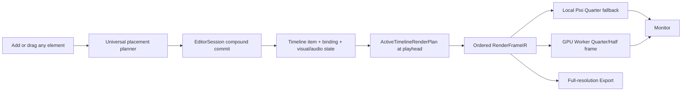

# WP-35 — Universal Timeline Compatibility, Multi-Element Layering, and GPU Preview

**Status:** In progress — universal timeline, multi-layer preview, and local quality controls implemented; GPU Worker transport remains gated  
**Owner:** Luna  
**Repository:** `/opt/joy-media/repo` (local checkout: `joy-media-fix`)  
**Plan date:** 2026-08-16  
**Production domain:** `https://joyst.ir/`

## 1. User outcome

The Timeline must behave like a professional layer-based editor:

- every supported element can be placed on every unlocked normal Timeline track;
- `Main Video`, `B-roll`, `Text`, `Script`, and similar labels are not type gates;
- several elements can be active at the same time and all appear in the Timeline;
- every active visual element is composited in Monitor and Export;
- moving a clip vertically to another track changes its visual layer order;
- the top visible Timeline track is always the top visual layer;
- a pure vertical pointer drag works without requiring horizontal movement;
- adding an element is one atomic operation and one Undo step;
- Monitor supports GPU-rendered current frames and multi-element preview;
- Preview quality defaults to **Quarter**, not Full; Half and Full remain selectable;
- JOY's paired GPU Worker is preferred when it honestly advertises the preview-render capability;
- losing the Worker never destroys edits and never leaves a false "GPU" status.

The Persian product intent is: «ترک‌ها ظرف عمومی المان‌ها باشند؛ چند المان هم‌زمان دیده شوند؛ بالا/پایین بردن در تایملاین واقعاً ترتیب لایه‌ی مانیتور را عوض کند؛ Preview پیش‌فرض سبک باشد و رندر فریم از GPU Worker خودمان استفاده کند.»

## 2. Locked product decisions

These are requirements, not implementation suggestions.

1. **Universal is the default.** New projects and newly created tracks use Universal Compatibility Mode. A track may have a user-facing name or role, but that metadata must never reject an element.
2. **Legacy documents open without destructive rewrite.** Existing schema-0 timelines, `joy.clipObjects`, seeded IDs, `V1/A1/S1`, and old track IDs remain readable. Migration is copy-on-write after validation, not an unconditional open-time rewrite.
3. **Element capability follows the element, not the track.** Audio controls are enabled for audio elements, visual effects for renderable elements, caption tools for caption elements, etc. Track identity does not decide capability.
4. **Visual order invariant:** the first/top row shown in Timeline renders above every row below it. Reordering tracks or moving an item between tracks must produce the same ordering in Monitor and Export.
5. **One source of render truth.** Monitor, GPU Worker preview, and Export consume the same normalized active-element render plan and the same `RenderFrameIR` ordering.
6. **Default Preview resolution is Quarter.** Quarter means `0.25 × width` and `0.25 × height` (one sixteenth of Full pixel count). Half is `0.5 × width/height`; Full is `1.0` and is never the new-project default.
7. **Full Export stays Full.** Monitor quality must not alter authored composition size, asset descriptors, or final export resolution.
8. **Auto renderer preference:** paired hardware GPU Worker → local browser Pixi/WebGL fallback. The UI must show the actual renderer and resolution in use.
9. **No fake GPU success.** A Worker using SwiftShader/software rendering must not advertise the hardware GPU preview capability.
10. **Atomic placement:** asset record, Timeline item, visual/audio object, clip binding, selection, and history bookkeeping either commit together or do not commit.

## 3. Current-state audit and confirmed causes

The focused baseline is green: 6 test files / 42 tests pass for Timeline interaction, track-kind inference, media import, Timeline markup, visual-object rendering, and video-frame node behavior. That baseline does **not** prove the requested behavior.

### 3.1 Track presentation is type-personalized

- `apps/editor-web/src/timeline-track-kind.ts` infers `video`, `audio`, or `script` by regular expressions over track, clip, and asset IDs.
- The same file hardcodes `Main Video`, `B-roll`, `Voice`, and `Script` display names.
- `apps/editor-web/src/timeline-media-import.ts` looks for a derived matching kind before placing media.
- The active editor Timeline still consumes the schema-0 `SpikeProject`, where every durable `Track.kind` is literally `video`.

Result: the visible type model is heuristic and can disagree with the actual element. It is unsuitable as a compatibility rule.

### 3.2 Pure vertical dragging is not detected

In `apps/editor-web/src/TimelinePanel.tsx`, clip drag activation uses only:

```ts
const deltaPx = event.clientX - drag.originX;
if (Math.abs(deltaPx) > DRAG_THRESHOLD_PX) drag.moved = true;
```

No `originY` is stored. A vertical move with nearly unchanged X remains a click, so the cross-track commit code never runs.

Cross-track transaction support already exists in `timeline-clip-interaction.ts`, and the old reference-fixture E2E case claims it passes. That does not cover pure vertical drag, real mixed elements, locked/virtual lanes, or render-order change.

### 3.3 Ordinary Add to Timeline can create a non-rendering object

`App.tsx` currently creates `kind: 'null'` media controllers for ordinary image/video/audio placement. `visual-object-renderer` intentionally emits no node for `null` and `camera` objects. Image “Add as sticker” uses a different path that creates a real `kind: 'image'` object.

Result: insertion behavior depends on which button/path created the item. An item may enter persistence without acquiring a renderable Monitor representation.

### 3.4 Placement is split across documents and history entries

Several add paths call `replaceVisualProject`, `dispatchVisualObjects`, and `dispatchTimeline` separately. A failure between those calls can leave an orphan visual object/binding or a Timeline clip with no visual target. Undo may require more than one user action.

`EditorSession.dispatchCompound()` already provides the correct journaled multi-document persistence boundary and must be used rather than inventing another partial-write mechanism.

### 3.5 Monitor decodes only one active video

`App.tsx::activeVideoClipAt()` gathers active clips but returns one preferred/first clip. Monitor then appends only one `previewVideoFrame` to the visual IR. Multiple simultaneously active video/image/text/HTML-scene elements are not resolved from one ordered Timeline projection.

### 3.6 Timeline time and visual object visibility are disconnected

Monitor builds `ResolvedObject[]` from every object in `visualProject.visualObjects`. The visual-object renderer does not filter objects through active Timeline bindings. Therefore a bound object can be invisible because it is `null`, while other visual objects may render outside their intended clip interval.

### 3.7 Layer ordering is not wired to tracks

- Timeline tracks already carry `order` and the evaluator documents ascending order as bottom-to-top.
- `videoClipSpec()` currently hardcodes `zIndex: 0`.
- most visual objects emit `zIndex: 0`; images emit `zIndex: 10` based on kind, not Timeline position.
- there is no durable track reorder command.

Result: moving a clip to a higher/lower Timeline track does not reliably change compositing order.

### 3.8 GPU Worker cannot render Monitor frames yet

The current Worker capabilities cover thumbnail, Comfy image work, ML denoise, and external generation adapters. There is no `render.preview.gpu` capability or low-latency current-frame contract. The existing durable job queue is appropriate for bounded jobs but must not accumulate one persistent job per pointer move.

## 4. Target architecture



Introduce one normalized runtime projection that isolates legacy storage details from editor behavior:

```ts
type TimelineElementKind =
  | 'video'
  | 'audio'
  | 'image'
  | 'text'
  | 'shape'
  | 'caption'
  | 'html-scene'
  | 'composition'
  | 'camera'
  | 'controller';

interface UniversalTimelineItem {
  id: string;
  trackId: string;
  elementKind: TimelineElementKind;
  startUs: number;
  durationUs: number;
  source: { kind: 'asset' | 'object' | 'caption' | 'composition'; id: string };
  sourceInUs?: number;
}

interface ActiveTimelineRenderItem extends UniversalTimelineItem {
  trackOrder: number;
  withinTrackOrder: number;
  zIndex: number;
  objectId?: string;
  assetId?: string;
}
```

Do not expose this normalized type as another independent project document. It is a projection of the persisted Timeline plus creative document and is rebuilt deterministically.

## 5. Execution sequence for Luna

Luna must execute in the following order. Do not begin production deployment before every local and CI gate in sections 11–13 is green.

### Phase 0 — Reproduce and preserve evidence

1. Create a disposable project containing at least:
   - two overlapping videos;
   - one image with alpha;
   - one text object;
   - one shape;
   - one HTML scene;
   - one audio element;
   - one caption item.
2. Record the current failures:
   - ordinary image Add to Timeline does not produce the expected Monitor pixels;
   - two active videos do not both composite;
   - pure vertical drag does not move the clip;
   - cross-track move does not alter pixel ordering;
   - Preview has no Quarter/Half render-quality contract;
   - Worker advertises no GPU preview capability.
3. Add failing tests first. Keep evidence under a new `docs/qa/wp35-*` folder; never reuse personal projects or assets.
4. Record the exact starting commit and keep the current 42 focused baseline tests green throughout.

**Gate 0:** reproducible red tests exist for each user-visible defect. No product code has been changed merely to make the repro pass.

### Phase 1 — ADR and compatibility contract

Add one ADR under `docs/adr/` that fixes these decisions:

- normal Timeline tracks use Universal Compatibility Mode;
- semantic role/name is presentation metadata only;
- top visible track means highest visual layer;
- active item filtering happens before Render IR creation;
- legacy schema-0 and `joy.clipObjects` are read through an adapter;
- Preview resolution is a monitor preference, not an authored project dimension;
- Worker preview is optional capability-negotiated acceleration with local fallback;
- Worker preview results are ephemeral, private, non-cacheable outside the bounded local/browser caches;
- Full Export remains deterministic and independent from preview-quality selection.

Add a compatibility matrix to the ADR:

| Element                | Any normal track | Timeline block | Monitor              | Audio graph                | Export          |
| ---------------------- | ---------------- | -------------- | -------------------- | -------------------------- | --------------- |
| Video                  | yes              | yes            | decoded frame        | embedded/replacement audio | yes             |
| Audio                  | yes              | yes            | no visual node       | yes                        | yes             |
| Image/GIF/WebP         | yes              | yes            | alpha-aware frame    | no                         | yes             |
| Text                   | yes              | yes            | text node            | no                         | yes             |
| Shape                  | yes              | yes            | shape node           | no                         | yes             |
| Caption                | yes              | yes            | burn-in when enabled | no                         | burn-in/sidecar |
| HTML scene             | yes              | yes            | captured surface     | optional scene audio later | yes             |
| Composition            | yes              | yes            | nested render plan   | nested audio               | yes             |
| Camera/null controller | yes              | yes            | controller only      | no                         | controller only |

**Gate 1:** ADR reviewed; no unresolved definition of “higher track,” “Quarter,” or “GPU available.”

### Phase 2 — Universal project projection and migration

1. Add a versioned universal Timeline item/binding schema to `packages/project-schema`.
2. Add a pure `normalizeUniversalTimeline()` adapter that reads:
   - legacy schema-0 video/composition clips;
   - `joy.clipObjects` mappings;
   - seeded `TIMELINE_OBJECT_IDS`;
   - caption and audio state already present in the creative project;
   - the new versioned universal binding format.
3. New objects must use explicit element kinds. Do not infer capability from IDs, filenames, or display labels.
4. Retain a one-release read fallback for `joy.clipObjects`. New writes use the new versioned binding and may dual-write the old flat map only where an older supported build needs it.
5. Add optional durable track presentation metadata:
   - stable track ID;
   - editable display name;
   - Universal mode marker;
   - order;
   - lock/visibility/solo.
6. Existing tracks with no mode marker normalize to Universal. Do not relabel or rewrite them until the user edits the project.
7. Remove `timelineTrackKind()` from placement decisions. It may temporarily remain only as legacy-display fallback until Phase 5 deletes the personalized headers.
8. Validation must reject duplicate item IDs, dangling source references, invalid time ranges, and duplicate track orders after normalization.

**Gate 2:** old fixtures reopen byte-for-byte before edit; after one edit they migrate once, survive refresh, and preserve Undo/Redo and output pixels.

### Phase 3 — One atomic placement service

Create a single editor service, for example `place-timeline-element.ts`, used by every add path.

It must:

1. accept `{ elementKind, source, requestedTrackId?, requestedStartUs, durationUs, placementPolicy }`;
2. accept every supported element on every unlocked normal track;
3. use track type only as a soft suggestion when no target is supplied;
4. find a legal gap or create a Universal track atomically;
5. create the correct render/audio object:
   - image creates `kind: 'image'`, never `null`;
   - text creates `kind: 'text'`;
   - shape creates `kind: 'shape'`;
   - HTML scene creates `kind: 'html-scene'`;
   - video creates a media render controller whose active decoded node is renderable;
   - audio creates audio state and no fake visual node;
   - caption binds the caption document;
6. create the Timeline item and binding in the same plan;
7. validate the entire result before writing;
8. commit through `EditorSession.dispatchCompound()` as one journaled history entry;
9. select the new item, seek to its start, and invalidate Monitor only after commit;
10. return a typed success/error result; UI callbacks must not silently swallow malformed payloads.

Replace all separate placement implementations:

- Assets `Add to timeline`;
- Asset drag/drop to existing and virtual lanes;
- file import/drop;
- `Add as sticker`;
- text/shape/HTML-scene creation;
- captions placement;
- Worker-generated asset insertion;
- any template or agent path that places an item.

**Gate 3:** every element kind creates one Timeline block, one valid binding, correct Monitor behavior, and exactly one Undo entry. Injected persistence failure leaves neither half behind.

### Phase 4 — Reliable 2D clip dragging and layer movement

Refactor clip drag state out of the individual clip render function into a tested controller/hook.

Required behavior:

1. store `originX`, `originY`, source track, source start, pointer ID, and original order;
2. activate drag when `hypot(dx, dy) >= 4px`, not from X alone;
3. keep the original item immutable while showing a drag ghost/preview;
4. resolve targets only from `.timeline-lane[data-track-id]`, not from a header or any ancestor that happens to carry `data-track-id`;
5. highlight the actual target lane and proposed time;
6. support vertical-only moves, diagonal moves, horizontal time moves, pointer capture, touch, and pen;
7. autoscroll horizontally and vertically near viewport edges;
8. reject locked targets visibly before pointer-up;
9. reject overlap with a red preview and a concise reason; do not silently do nothing;
10. drop on a virtual lane creates a Universal track at that vertical position and places the item in one transaction;
11. Escape/pointer-cancel snaps back without a history entry;
12. moving between real tracks uses one semantic command with a correct inverse, rather than exposing remove+insert as two independent user operations;
13. preserve binding/object IDs when moving; only track/time/layer membership changes;
14. add keyboard and context-menu equivalents:
    - `Alt+ArrowUp` / `Alt+ArrowDown`: move selected items one layer;
    - `Move layer up`, `Move layer down`, `Move to top`, `Move to bottom`;
    - actions disable with a reason on lock/collision/boundary.

Add a durable `timeline.reorderTrack` command for track-header reorder. Normalize orders to a unique contiguous sequence after add/remove/reorder.

**Gate 4:** a pure vertical drag moves an item; Undo returns it; redo reapplies it; refresh preserves it; Monitor pixel ordering changes with the move.

### Phase 5 — Universal Timeline UI

1. Replace kind-coded track headers (`V1`, `A1`, `S1`) with generic layer headers (`T1`, `T2`, …) and editable names such as `Layer 1`.
2. Remove hardcoded `Main Video`, `B-roll`, `Voice`, and `Script` naming from the Universal UI.
3. Put the element-kind icon and optional kind label on each item block, not on the track.
4. A track containing video, text, image, and audio remains visually coherent and never changes identity because its contents changed.
5. Preserve lock, visibility, solo, rename, add, remove, and reorder controls.
6. Make the vertical stacking semantics obvious: top row = front/top layer.
7. Show multiple simultaneous elements as independent blocks. Never merge them into one synthetic clip merely to simplify rendering.
8. Track height, virtualization, ruler, markers, zoom, Fit, property lanes, and compound drill-in must continue to work.
9. Accessibility:
   - announce source track, target track, time, and validity during keyboard drag/move;
   - expose kind in the item accessible name;
   - keep focus on the moved item after commit;
   - do not encode kind/order only by color.

**Gate 5:** a mixed-element project remains understandable at desktop and touch widths, and no track label implies a placement restriction.

### Phase 6 — Active multi-element render plan

Create a pure `buildActiveTimelineRenderPlan()` in a package that can be used by editor, Worker, and export code.

For a composition/time it must:

1. normalize legacy and new items;
2. apply clip intervals, enabled/visible/solo flags, nested composition time, and source time;
3. include every simultaneously active item;
4. sort by the locked invariant: lower visible tracks first, top visible tracks last;
5. assign stable `zIndex` values from track order plus within-track ordering;
6. resolve item → object/asset/caption/composition without regex inference;
7. produce diagnostics for dangling/unavailable sources without dropping unrelated layers;
8. distinguish visual-only, audio-only, controller-only, and combined media items;
9. expose the same result to Monitor and Export.

Update `visual-object-renderer` so object nodes receive plan-derived `zIndex`; delete kind-derived magic ordering such as “all images are 10.” Keep editor selection overlays outside export IR.

Filter bound visual objects by active Timeline intervals. Define legacy unbound objects explicitly:

- camera/null controllers required by an active object remain available for transform evaluation;
- legacy unbound visual objects remain global for compatibility and emit one diagnostic;
- new unbound renderable objects are invalid and must not be created by UI paths.

**Gate 6:** pinned pixel tests prove that moving the same red/blue elements between tracks swaps the visible top color in both Monitor and headless/export rendering.

### Phase 7 — Multi-source decode and compositing

Replace the single `previewVideoFrame` model with a keyed active-frame set.

1. Build a bounded decoder pool keyed by clip/item ID.
2. Decode all active video/animated-image sources needed by the render plan.
3. Reuse decoders and object URLs; release them when items leave the active window or project closes.
4. Use latest-request tokens so a stale seek cannot overwrite a newer playhead frame.
5. Retain transition partner behavior, but transitions must consume the same frame map.
6. Static images, animated GIF/WebP, text, shape, captions, and HTML scenes enter the same ordered IR.
7. Audio-only items enter the audio graph without a blank video dependency.
8. Missing media shows one diagnostic placeholder for that item while other layers render normally.
9. Monitor and Export must use identical transforms, opacity, crop, effects, color grade, timing, and z-order.

**Gate 7:** at least two overlapping videos plus image/text/shape composite correctly while scrubbing, playing, pausing, exporting, refreshing, and moving layers.

### Phase 8 — Preview quality model

Add a persisted user preference, not project content:

```ts
type PreviewQuality = 'quarter' | 'half' | 'full';
type PreviewRendererPreference = 'auto' | 'gpu-worker' | 'local';
```

Requirements:

1. new/default quality is `quarter`;
2. selector is visible in Monitor transport/settings: `Quarter · Half · Full`;
3. `Full` is an explicit user choice and is not silently restored as default for new profiles;
4. renderer internal target dimensions are scaled and rounded to at least 1 pixel;
5. Monitor CSS size/aspect remains based on authored composition dimensions;
6. changing quality invalidates preview caches but does not mutate project revision/history;
7. quality preference survives reload per user/browser profile;
8. Export ignores the Monitor preference and uses its selected export preset/full authored dimensions;
9. Monitor metadata shows actual dimensions, for example `Quarter · 270×480 · GPU Worker`;
10. add `Render current frame` next to the quality selector; paused/scrub-settled frames may auto-request after a short debounce.

**Gate 8:** a 1080×1920 project opens at 270×480 internal preview, Half yields 540×960, Full yields 1080×1920, and all three keep the same visible composition/order.

### Phase 9 — Hardware GPU Worker preview

Do not overload `image.comfy`; add a dedicated additive capability such as `render.preview.gpu`.

#### 9.1 Worker capability and renderer

1. Extend `packages/job-protocol` and Worker hello with `render.preview.gpu`.
2. Advertise it only when a real hardware-accelerated renderer starts and passes a probe.
3. Recommended implementation: a long-lived Worker-side Chromium/Pixi render host using the same committed `renderer-pixi` bundle and `RenderFrameIR` contract. On Windows, verify the actual ANGLE/D3D renderer; reject SwiftShader/software.
4. Expose opaque local assets to the render host through a loopback-only, token-scoped asset broker. Never put filesystem paths in project, API, browser, logs, or frame requests.
5. Cache the normalized project/render snapshot by `{projectId, projectRevisionId, compositionId}`. Subsequent frame requests should send time/quality/request ID plus changed inputs, not the entire document on every seek.
6. Render the final composite at Quarter/Half/Full and encode the ephemeral Monitor result efficiently. The result is a final preview frame; it does not become a project asset.

#### 9.2 Low-latency transport

The existing durable job queue must not accumulate one job for every pointer move.

Add a bounded preview-session channel through the control plane:

- browser opens an authenticated project-scoped preview session;
- Worker retains its outbound authenticated connection; the server never initiates a connection into the owner machine;
- only the most recent unstarted frame request is retained (`latest wins`);
- one request per session is in flight initially; add bounded pipelining only after measurement;
- every request carries monotonic ID, project revision, time, quality, and deadline;
- stale results are dropped by browser, API, and Worker;
- frame payload and dimensions have hard limits;
- responses are private/no-store and are not written to the durable derivative catalog;
- disconnect, timeout, cancellation, revocation, and project revision changes terminate the session safely;
- authorization reuses the owner/project/Worker pairing boundary; no browser assertion or Worker token crosses to the other party.

If a streaming channel cannot meet the security/performance gate in this WP, use GPU Worker for paused/current-frame refinement and keep playing preview on local Pixi Quarter. Do not claim Worker playback rendering until measured evidence proves it.

#### 9.3 Browser renderer selection

1. `auto` prefers a healthy `render.preview.gpu` Worker.
2. `gpu-worker` explicitly requests it and shows an actionable unavailable state if absent.
3. `local` always uses browser Pixi/WebGL.
4. During Worker startup or a missed deadline, keep the last valid frame and render the current frame locally; never blank Monitor.
5. Show actual state: `GPU Worker`, `Local GPU`, `Local fallback`, `Connecting`, or `Unavailable`.
6. A late Worker frame must never replace a newer local/Worker frame.
7. Do not route final Export through the ephemeral preview channel in this WP. Export remains its existing deterministic path unless separately approved and gated.

**Gate 9:** paired hardware Worker renders a real mixed-element current frame at Quarter and Half; capability disappears on software renderer; revocation/disconnect falls back locally with no lost edit and no stale-frame flash.

### Phase 10 — Integration cleanup

After all new paths are green:

1. delete filename/ID regex inference from active placement and rendering;
2. delete duplicated Add/Drop placement helpers superseded by the atomic service;
3. replace single-frame Monitor state with the frame map/render-plan state;
4. remove hardcoded Timeline `zIndex: 0` and image-kind ordering;
5. keep explicitly documented legacy readers for the compatibility window;
6. update `DESIGN.md`, `STATE.md`, the project schema docs, and Worker/deploy README;
7. do not mark WP-35 complete while old paths can still create orphan/null image items.

## 6. Expected file areas

This is a routing map, not permission to rewrite unrelated modules.

| Concern                    | Primary files/packages                                                                               |
| -------------------------- | ---------------------------------------------------------------------------------------------------- |
| Universal schema/migration | `packages/project-schema/src/*`, schema validators/migrations/tests                                  |
| Timeline commands/history  | `packages/commands/src/commands.ts`, `packages/timeline-engine/src/index.ts`, random invariant tests |
| Normalized render plan     | new focused module under `packages/evaluator` or a small dedicated package                           |
| Atomic placement           | new `apps/editor-web/src/place-timeline-element.ts`, `editor-session.ts`, `App.tsx` call sites       |
| Timeline UI and DnD        | `TimelinePanel.tsx`, extracted drag controller, `timeline-clip-interaction.ts`, Timeline CSS         |
| Track presentation         | replace `timeline-track-kind.ts` use; generic header/name component                                  |
| Monitor/decode             | `App.tsx::MonitorPanel`, `timeline-playback.ts`, `timeline-nested-playback.ts`, playback engine      |
| Render ordering            | `packages/visual-object-renderer`, `render-ir`, Pixi/headless tests                                  |
| Preview preferences        | `ui-preferences.ts`, Monitor controls/tests                                                          |
| Worker GPU renderer        | `apps/worker/src/*`, `packages/job-protocol`, renderer host/bundle                                   |
| Preview transport          | `apps/api/src/control-plane.ts`, PostgreSQL/in-memory parity, HTTP/WS server, browser client         |
| E2E/visual proof           | `tests/e2e/wp35-*`, `docs/qa/wp35-*`                                                                 |

Keep `App.tsx` from growing further: extract placement, render-plan, renderer-selection, and decoder-pool logic into focused tested modules.

## 7. Command and history requirements

Add or normalize semantic operations for:

- `timeline.placeElement`;
- `timeline.moveElement` with source/target track and start time;
- `timeline.reorderTrack`;
- `timeline.renameTrack`;
- `timeline.removeElement` with binding/object/audio cleanup policy;
- compound project placement using the existing journal.

Every command must:

- validate before mutation;
- return a complete inverse from pre-state;
- preserve stable IDs;
- refuse dangling bindings and duplicate orders;
- remain deterministic under replay;
- participate in randomized invariant coverage;
- create one user-visible history entry per gesture.

Do not implement cross-track move as two separately recorded actions. An internal remove+insert may be used by a pure reducer only if it is wrapped in one semantic command/transaction with one inverse.

## 8. Drop and collision policy

To keep behavior professional and predictable:

- same-track horizontal drag snaps to the existing 100 ms grid plus magnetic clip/marker candidates;
- vertical-only drag preserves start time;
- diagonal drag changes both track and time;
- no overlap is allowed within one track in this WP;
- an invalid overlap displays the reason before drop and snaps back on release;
- dropping on an empty virtual lane creates a track at that lane's visual position;
- locked source allows selection but not move/trim;
- locked target is never a valid drop target;
- hidden target remains targetable only from its visible header/list representation; do not create invisible drop zones;
- visibility affects output, lock affects editing, solo affects active evaluation; these states must not be conflated.

## 9. GPU and privacy constraints

- The Worker continues to initiate outbound communication.
- The browser never receives Worker credentials, local paths, pairing secrets, or raw capability probes.
- The Worker never receives browser session assertions.
- Preview frames are ephemeral and project/owner scoped.
- Asset IDs are opaque; local path resolution stays inside Worker.
- Enforce frame dimension, byte-size, request-rate, deadline, and concurrent-session limits.
- Clear session caches on revoke, project close, revision mismatch, and bounded idle timeout.
- Redact prompt/media metadata from ordinary logs; log request IDs, dimensions, timing, renderer identity, and coded failures only.
- GPU capability is fail-closed. Software fallback belongs to the browser/local renderer path, not a mislabeled Worker GPU path.

## 10. Performance budgets

Measure on the owner's target Windows GPU Worker and in the supported production browsers.

Initial acceptance budgets:

- Quarter 1080×1920 mixed 5-layer current-frame render: p50 ≤ 100 ms and p95 ≤ 250 ms after warmup;
- Half current-frame render: p50 ≤ 180 ms and p95 ≤ 400 ms after warmup;
- scrub latest-wins queue depth: ≤ 1 pending + bounded in-flight requests;
- stale result display: zero;
- dropped/late requests do not grow memory over a 10-minute scrub/play session;
- local Quarter fallback remains interactive when Worker is absent;
- no full-resolution default allocation on initial Monitor open;
- decoder pool and bitmap caches have explicit count/byte limits and release tests.

If the Worker cannot sustain real-time playback at the chosen frame rate, keep the claim scoped to current-frame/paused refinement and retain local Quarter playback. Record measured numbers; do not weaken or silently rename the gate.

## 11. Required tests

### Unit/property tests

- legacy → universal normalization for every element kind;
- explicit kind beats filename/ID tokens;
- top-track → highest-z invariant;
- active interval filtering at start/end boundaries;
- multi-active plan ordering;
- move/reorder inverse and replay determinism;
- pure vertical drag threshold;
- target lane resolution and locked/overlap rejection;
- Quarter/Half/Full dimension calculation;
- latest-wins request/result sequencing;
- Worker hardware capability probe fail-closed;
- atomic placement rollback on each injected persistence failure.

### Integration tests

- one operation writes Timeline + visual/audio state + binding;
- old `joy.clipObjects` project reopens and migrates only after edit;
- two video decoders plus image/text/HTML surface feed one ordered IR;
- Monitor and Export render the same ordering and transforms;
- Worker request authorization, project isolation, revoke, timeout, payload limits, and no-store behavior;
- in-memory and PostgreSQL control-plane parity for any new durable session metadata (prefer no durable frame metadata).

### Browser E2E

At desktop-primary, desktop-compact, and touch-width viewports:

1. add each supported element through the public UI;
2. assert each has exactly one visible Timeline block;
3. assert several overlap at the playhead;
4. compare Monitor pixel probes before/after moving a colored item up/down;
5. drag vertically with less than 2 px horizontal movement;
6. drag diagonally to another track/time;
7. reject a locked/occupied target with visible feedback;
8. undo/redo/reload and verify item IDs/order;
9. default Monitor says Quarter and has scaled backing dimensions;
10. switch Quarter/Half/Full without changing project revision or export preset;
11. render current frame with paired GPU Worker;
12. disconnect/revoke Worker and verify local fallback, no blank frame, no stale flash;
13. export Full and compare pinned pixels/order with Monitor within the existing parity tolerance;
14. assert no console warnings/errors and no secret/path/provider URL in network responses.

### Compatibility fixtures

Keep pinned fixtures for:

- untouched pre-WP-35 project;
- old sticker binding;
- old Main Video/B-roll track IDs;
- audio inferred by legacy ID;
- caption track;
- nested composition;
- animated GIF/WebP;
- project saved by WP-35 and reopened after browser restart.

## 12. Acceptance gate

WP-35 is complete only when all statements are demonstrated, not inferred:

1. Text, image, shape, video, audio, caption, HTML scene, controller, and nested composition can be placed on any unlocked normal track.
2. At least five overlapping elements are visible as separate Timeline blocks.
3. Every active visual element appears in Monitor and Full Export.
4. A pure vertical drag moves an element to the previous/next track.
5. Moving up makes the element visually cover the one below; moving down reverses it.
6. One Undo reverses the entire add or move; redo and reload preserve it.
7. No ordinary image/text/shape path creates a non-rendering `null` object.
8. New Monitor default is Quarter; Half/Full work; Export stays Full.
9. A real paired hardware GPU Worker renders the current mixed-element frame through an honestly advertised capability.
10. Worker loss/revocation visibly falls back to local rendering without data loss or stale frame replacement.
11. Legacy projects reopen with unchanged output and migrate safely on first edit.
12. Targeted tests, full `pnpm check`, build, audit, GitHub CI, and signed-in production browser gates pass.

## 13. Verification and deployment sequence

Luna must use small reviewable commits and keep the worktree clean between deployment steps.

Recommended commit sequence:

1. `test(timeline): capture universal placement and layering failures`
2. `docs(adr): fix universal timeline and gpu preview contracts`
3. `feat(schema): add universal timeline projection and migration`
4. `feat(editor): make element placement atomic`
5. `fix(timeline): support two-dimensional cross-track drag`
6. `feat(timeline): add universal tracks and layer ordering`
7. `feat(render): composite all active timeline elements`
8. `feat(preview): add quarter/half/full quality controls`
9. `feat(worker): add hardware gpu preview frames`
10. `test(wp35): close compatibility performance and browser gates`
11. `docs(wp35): record live evidence and rollback state`

Local gate:

```bash
pnpm typecheck
pnpm lint
pnpm format:check
pnpm test
pnpm build
pnpm audit --prod --audit-level=moderate
```

Then push and wait for the GitHub workflow. Do not deploy a red or unpushed commit.

Production deployment must follow `deploy/README.md` and current `STATE.md`:

1. capture source SHA, active API/web symlinks, service health, and Worker version/capabilities;
2. back up the `joymedia` database and retain the prior immutable API/web releases;
3. deploy additive API/protocol changes before enabling the matching editor feature;
4. upgrade/pair the Worker and verify the hardware GPU capability before editor cutover;
5. build immutable API and web releases from the pushed clean commit;
6. switch symlinks only after local origin health checks;
7. run authenticated public browser tests on `joyst.ir` with a disposable project;
8. verify release/live/public asset hashes and service restart counts;
9. purge only the disposable test project/assets/sessions; retain evidence and rollback releases;
10. if the API, Worker, or browser gate fails, restore the prior symlinks/version and re-run health; do not use `--allow-live-drift` or an equivalent override without explicit review.

## 14. Out of scope

- changing final Export to a remote/cloud render farm;
- allowing overlaps inside the same single track;
- arbitrary 3D track compositing beyond the existing camera/object model;
- collaborative multi-user conflict resolution for simultaneous drags;
- promising real-time GPU Worker playback before the measured frame-stream gate passes;
- deleting legacy readers in the same release that introduces migration;
- editing production files directly instead of immutable deployment.

## 15. Luna stop conditions

Luna must stop and report rather than improvise if:

- old project output changes before the user edits it;
- one add gesture requires multiple Undo operations;
- any path or secret reaches browser/API responses;
- Worker GPU detection reports software rendering as hardware;
- Monitor and Export disagree on active items or z-order;
- frame requests accumulate rather than coalesce;
- a schema/protocol change requires destructive database migration;
- production live bytes drift from their immutable source release;
- the GPU Worker cannot meet the current-frame budget. In that case, ship no false real-time claim; retain local Quarter playback and report measured paused-frame capability.
