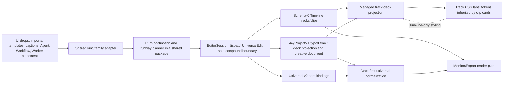

# WP-36 — Managed Universal Track Deck, Placement Parity, and Track Color Labels

- **Owner:** Luna
- **Status:** **IMPLEMENTED, TESTED, AND DEPLOYED**
- **Prepared:** 2026-08-17
- **Local repository:** `C:\Users\HadiMoti\joy-vps\joy-media-fix`
- **VPS repository:** `/opt/joy-media/repo`
- **Production root:** `/opt/joy-media`
- **User-specified reference URL:** `https://joyst.ir/?deploy=9996c0e`
- **Immutable reference artifact:** `9996c0e` / `/opt/joy-media/web-releases/editor-web-20260816T221547Z-9996c0e-wp35-transparent-gutter`
- **Implementation base when this plan was prepared:** `c2b9e334752e952496ff6e6a50967290a9561eac`
- **Final implementation commit:** `733f584f18b45ae789ca8360e7e4b3637fe3e3f1`
- **Active immutable release:** `/opt/joy-media/web-releases/editor-web-20260816T233403Z-733f584-wp36-color-render-final`
- **Verification:** full Vitest `336 passed files, 2268 passed tests, 2 skipped`; typecheck, lint, Prettier, build, nginx config, public API health, and authenticated browser smoke passed.
- **GBrain:** page `joy-media-wp36-managed-universal-track-deck-color-labels-2026-08-17` created through the live GBrain API and visible in the Admin GBrain Pages view (73 pages).

## 1. Mission

Replace JOY's manual Add/Delete Track lifecycle and generic bottom `+` lanes with an adaptive, professional two-family track deck:

- visual rows are always above audio rows;
- every supported non-audio element can use every compatible visual row;
- audio can use every compatible audio row and never interleave with visual rows;
- one immediately usable runway row is always visible for each family, so users never need an Add Track command;
- materialized empty rows remain stable, so users never need a Delete Track command;
- visual rows can be reordered above or below other visual rows, and audio rows can be reordered only among audio rows;
- clicking the left track-kind icon opens an accessible label-color palette;
- the selected track color is durable, undoable, and inherited by every timeline clip card on that track;
- UI, schema-0 Timeline, JoyProjectV1, universal bindings, Agent/Workflow routes, reload, Undo/Redo, Monitor, and Export stay consistent.

This is a model-and-interaction correction, not a cosmetic patch. Luna must not implement the reserve rows or colors only in React while leaving insertion routes and persisted project state divergent.

## 2. Baseline rule — honor `9996c0e` without mistaking the query string for a release pin

The user explicitly selected `https://joyst.ir/?deploy=9996c0e`. JOY currently uses `?deploy=` as a cache-buster; it does **not** pin nginx to an old immutable release. The public URL may therefore serve whatever `/opt/joy-media/web` currently targets. The real immutable `9996c0e` baseline is the retained release directory and its recorded hashes. It is the visual/behavioral reference, not the Git commit to check out for implementation.

Luna must:

1. open and record the user-specified public URL, including the actual asset names/hashes it serves at that moment;
2. inspect the retained `9996c0e` artifact directly from `/opt/joy-media/web-releases/editor-web-20260816T221547Z-9996c0e-wp35-transparent-gutter`, served through an isolated local/staging origin when interactive evidence is needed;
3. implement forward from the current canonical branch;
4. preserve the transparent `.timeline-scrub-gutter` behavior introduced by `9996c0e`;
5. preserve the later `52e4619` removal of the per-header trash button;
6. remove the still-present context-menu and toolbar Add/Remove actions as part of WP-36;
7. never reset, force-checkout, or overwrite the current branch with `9996c0e`;
8. record the actual starting HEAD and dirty state at execution time because it may be newer than this plan's `c2b9e33` audit.

The known reference hash is:

- release/public `index.html` SHA-256: `f9b6f36cd26c06530f669046774541983b89e414ddc1ca2e4c1aa20a52299161`.

## 3. Evidence-based starting point

### 3.1 Public URL audit plus immutable-artifact requirement

A signed-in, read-only browser inspection of the user-specified public URL on 2026-08-17 found the following rendered state. This proves the state visible at that URL on that date; it does not by itself prove nginx served historical `9996c0e` bytes:

| Signal               | Observed state                                           |
| -------------------- | -------------------------------------------------------- |
| Real rows            | Two visual legacy rows: `V1 track-1`, `V2 track-0`       |
| Audio availability   | No real or reserve audio row                             |
| Generic virtual rows | Nine bottom rows whose only header content is `+`        |
| Manual controls      | Visible `Add visual track` and `Add audio track` buttons |
| Track icon           | Passive `SPAN`, no button role, no color interaction     |
| Timeline clips       | Six rendered timeline items                              |
| Scrub gutter         | `rgba(0, 0, 0, 0)` as required                           |

The required historical before fixture must be reproduced from the retained immutable `9996c0e` release or verified archived screenshots/assets with matching hashes. Do not use the query parameter as the only proof, and do not silently substitute `5273e34`, `52e4619`, or the unversioned live root.

### 3.2 Current source audit

The current source already provides useful primitives, but not one coherent lifecycle:

- `apps/editor-web/src/timeline-track-family.ts` classifies only audio as `audio`, treats all other editor element kinds as `visual`, sorts visual above audio, and builds atomic within-family reorder transactions.
- `apps/editor-web/src/TimelinePanel.tsx` still contains manual add callbacks, two toolbar buttons, overflow-menu add actions, track-context Add/Remove actions, and presentation-only generic virtual lanes.
- generic virtual lanes accept new asset drops only. Existing timeline clips cannot be moved into them because there is no durable destination track.
- dropping visual media on a generic bottom lane creates a max-order track that sorts to the top, causing a visible spatial jump.
- `packages/commands/src/commands.ts` already has reversible `timeline.addTrack`, `timeline.removeTrack`, `timeline.reorderTrack`, and `timeline.renameTrack` primitives. Keep add/remove internally for automatic materialization and inverse history; remove only user-facing exposure.
- schema-0 `Track` persists family/name/order/enabled but has no lock or label color; `TrackV1` has `locked` but no label color. Current lock/solo/height view flags are otherwise ephemeral.
- schema-0 track arrays and `TrackV1[]` are not reliably one-to-one; creative V1 rows such as caption tracks may have no schema-0 deck counterpart.
- `apps/editor-web/src/universal-placement.ts` mirrors several timeline commands into JoyProjectV1/universal state, sometimes by casting a schema-0 `Track` to `TrackV1`. That cast is unsafe because V1 requires additional fields and has different kind semantics.
- normal human `dispatchTimeline` does not consistently pass through the same synchronizer used by the Agent command bus.
- schema-0 clips and JoyProjectV1/universal bindings are related representations. WP-36 must choose one row-deck owner and update its typed projection and item bindings through one atomic boundary.

### 3.3 Insertion routes that currently choose/create tracks independently

All of these must converge on one placement allocator:

- real-row and virtual-row asset drop in `TimelinePanel.tsx`;
- media import in `timeline-media-import.ts`;
- sticker placement and HTML-scene placement in `App.tsx`;
- text templates in `text-template-transaction.ts`;
- content templates in `content-template-transaction.ts`;
- caption layers in `caption-layer.ts`;
- effects, filters, and adjustments in `adjustment-layer.ts`;
- 3D layers in `three-d-render-layer.ts`;
- Agent explicit insertion in `packages/agent-tools/src/edit-tools.ts`;
- Workflow insertion in `packages/agent-tools/src/workflow-runner.ts`;
- Worker-generated media when the imported result is later placed on the Timeline.

Known defect to close: the sticker route can choose the first `kind === 'video'` row without excluding `family: 'audio'`. Low-level insertion also lacks complete element-kind/family validation, so non-UI callers can currently create incompatible placements.

## 4. Adobe-informed design, with an intentional JOY difference

Adobe is a behavioral reference, not a screen to copy blindly:

- Premiere keeps visual/video and audio track stacks distinct, creates new video tracks above existing video tracks and audio tracks below existing audio tracks, and exposes track targeting.
- Premiere supports lock, visibility/output, and other track-level switches.
- After Effects treats rows as ordered layers and supports durable color labels as an organizational aid.
- Adobe still exposes Add Tracks and Delete Tracks through commands/dialogs. JOY intentionally diverges here because the user explicitly requires managed availability with no user-facing Add/Delete Track lifecycle.

Primary references:

- [Premiere — Add tracks](https://helpx.adobe.com/premiere/desktop/edit-projects/change-clip-sequence/add-tracks.html)
- [Premiere — Delete tracks](https://helpx.adobe.com/premiere/desktop/edit-projects/change-clip-sequence/delete-tracks.html)
- [Premiere — Source patching and track targeting](https://helpx.adobe.com/mena_en/premiere-pro/using/source-patching-track-targeting.html)
- [Premiere — Work with clips using track targeting](https://helpx.adobe.com/uk/premiere/desktop/edit-projects/intro-to-editing/work-with-clips-on-the-timeline-using-track-targeting.html)
- [Premiere — Track appearance](https://helpx.adobe.com/premiere/desktop/edit-projects/change-clip-sequence/edit-track-appearance.html)
- [Premiere — Lock tracks](https://helpx.adobe.com/premiere/desktop/edit-projects/change-clip-sequence/track-lock-to-prevent-changes.html)
- [After Effects — Layers and switches](https://helpx.adobe.com/after-effects/desktop/work-with-layers/manage-layers/layers.html)
- [After Effects — Select and arrange layers](https://helpx.adobe.com/after-effects/using/selecting-arranging-layers.html)

## 5. Locked product contract

Luna must implement this contract unless a concrete architectural blocker is documented before changing it.

### 5.1 Two universal families, not kind-specific rows

- The only placement families are `visual` and `audio`.
- `audio` elements belong to audio rows.
- Every other supported Timeline element belongs to visual rows: video, image, text, shape/overlay/sticker, caption, motion, effect, filter, adjustment, 3D scene, HTML scene, nested composition, camera, and controller elements.
- Define one exported `TimelinePlacementKind` in `@joy-media/project-schema` as the closed canonical superset: `video`, `audio`, `image`, `text`, `shape`, `overlay`, `sticker`, `caption`, `motion`, `effect`, `filter`, `adjustment`, `scene3d`, `html-scene`, `composition`, `camera`, and `controller`.
- Replace editor-only and universal-item taxonomy drift with explicit adapters to this superset. Legacy `adjust` maps to `adjustment` when its provenance is explicit.
- Upgrade the versioned universal Timeline document so new item writes can persist the canonical kind. Migration precedence is: valid rich editor kind metadata, then valid universal v1 value, then validated creative source/object metadata. When historical routes collapsed a richer kind (for example 3D stored as `image`) and no authoritative provenance remains, preserve the conservative legacy value and emit a migration diagnostic; never guess a richer kind from names/IDs.
- V1-to-v2 migration must be deterministic and non-destructive, not falsely “lossless”: preserve item IDs/source/timing/order exactly, retain ambiguous legacy semantics, and add focused conflict/missing-provenance fixtures.
- A row's name, icon, existing clip type, or legacy ID never defines compatibility.
- New and first-mutated tracks persist an explicit family.
- Legacy family-less rows remain readable through deterministic copy-on-write inference; opening an old project alone must not rewrite it.
- The first mutation of a legacy family-less row prepends an invertible `timeline.setTrackFamily` command to the same transaction; Undo restores the exact prior `undefined` state.
- UI and non-UI insertion commands use the same family classifier. Filename/ID token inference is legacy-read fallback only and is forbidden for new placements.

### 5.2 Managed track deck — no visible Add/Delete lifecycle

Remove every user-facing way to add or remove tracks:

- toolbar Add Visual Track;
- toolbar Add Audio Track;
- overflow-menu Add Visual/Add Audio actions;
- track-header/context-menu Add Track;
- track-header/context-menu Remove Track;
- command-palette `track.addVideo` and its `T` shortcut;
- generic virtual-lane `+` headers and “Drop media to add a track here” copy;
- any empty-state button that performs the same operation.

Keep `timeline.addTrack` and `timeline.removeTrack` as internal reversible primitives. They are required for runway materialization, transaction rollback, Undo, migration, tests, and future maintenance. Mark them with explicit registry visibility such as `internalOnly`; command palette, menus, shortcuts, guides, Agent tool enumeration, and plugin command discovery must filter them. String-searching buttons alone is not proof that direct invocation is unavailable.

### 5.3 Always-available family runways

The rendered deck always contains all real visual rows followed by all real audio rows. It then guarantees **at least one visible, unlocked, usable destination per family**:

1. an existing real, visible, unlocked, empty row satisfies the runway invariant and is reused;
2. only when no such real row exists, render one presentation-only reserve visual row at the **tail of the visual stack, immediately above audio**;
3. only when no such real row exists, render one presentation-only reserve audio row at the **bottom edge of the audio stack**.

This avoids showing four rows in a blank project merely to provide two families: the seeded empty `V1` and `A1` are already usable runways. JOY deliberately keeps its existing top-to-bottom `V1…Vn` display convention. A synthetic reserve appears only after every real row in that family is occupied, locked, or hidden. Putting it at the family's tail gives it the next positional code and ensures a direct drop materializes exactly where the user dropped it. For commands that semantically require a new top composite layer, the placement planner carries an explicit `top-of-visual-stack` intent and assigns the correct order atomically; it must not overload the reserve row's screen position.

Reserve-row rules:

- A real empty runway remains a normal durable track with its backend name, controls, color, and stable ID.
- A synthetic reserve looks like a normal, available track card—not a generic blank lane and not a `+` button.
- A synthetic reserve shows the next positional code (`Vn` or `An`) and the localized secondary label `Available visual layer` or `Available audio layer`.
- A synthetic reserve has presentation identity only; it is never persisted until used.
- Represent destinations as a discriminated union such as `{ kind: 'track', trackId } | { kind: 'runway', family, position: 'tail' }`. Never pass a sentinel/fake track ID into existing commands.
- Generated durable IDs are opaque, collision-safe values from the injected allocator and can never equal a presentation/runway identity.
- Dropping a new asset, an existing compatible clip, a template/control element, or an automated placement on a synthetic reserve materializes a durable track and performs the requested operation in one transaction.
- Choosing a label color on a synthetic reserve materializes a real empty row and applies that color in the same transaction; because that real row is still usable, no duplicate reserve is shown yet.
- After successful keyboard color materialization, focus moves to the newly materialized real row's color button. On failure, focus returns to the original still-mounted reserve control. Do not restore focus through a stale ref.
- After a runway becomes occupied/locked/hidden, a synthetic reserve appears only if no other real empty eligible row can satisfy the invariant.
- If materialization, persistence, creative-document synchronization, or placement fails, neither an empty real track nor a partial binding may remain.
- A materialized track remains after its final item leaves. Do not auto-delete it; its ID, name, order, durable lock, visibility, and color are user-authored organization.
- Runway identities never enter selection, target preferences, command payload track IDs, persistence, or universal items.
- Viewport-fill rows beyond the family runways may remain as non-interactive grid presentation only. They must not impersonate tracks, expose icons/codes, accept drops, or enter accessibility navigation.

### 5.4 Stable identity, professional display, and backend truth

- Durable `track.id` is identity and is never derived again from the displayed `Vn`/`An` code.
- `Vn`/`An` is a positional stack code and may change after row reorder, like an NLE track position.
- The secondary title comes from durable backend `track.name` exactly when present.
- A missing legacy name uses a deterministic `Visual n`/`Audio n` fallback without rewriting on read.
- Track color, name, family, and order are keyed by `{compositionId, trackId}`, never by display index.
- Schema-0 composition tracks are the authoritative editing row deck. Do **not** assume they map one-to-one to creative `TrackV1[]` rows.
- Add a typed, versioned `TimelineTrackDeckDocument` projection to `JoyProjectV1`, keyed by `{compositionId, trackId}`, containing family/name/order/enabled/locked/labelColor. Existing creative `TrackV1[]` remains render/creative structure and is not used as a row-deck metadata mirror.
- Missing track-deck projection is derived from schema-0 on read and persisted copy-on-write on the first valid mutation. Use an explicit validated adapter; remove/forbid schema-0 `Track as TrackV1` casts.
- Update `normalizeUniversalTimeline` and every Monitor/Export consumer of normalized order/enabled/locked state to resolve row metadata from the validated track-deck projection when present. Creative `TrackV1[]` lookup is legacy fallback only; a valid deck item whose ID is absent from creative tracks must not become a dangling/disabled/locked `MAX_SAFE_INTEGER` item.
- Test intentionally nonmatching deck/creative row IDs through normalization, Monitor pixels, and Export ordering.
- Add optional `locked?: boolean` to schema-0 `Track` with legacy default `false`, plus an invertible `timeline.setTrackLocked` command and track-deck synchronization. `TimelineTrackView.locked` becomes a projection of durable state; `solo` may remain an explicitly session-only playback switch.
- New projects start with explicit, empty visual and audio real rows whose **computed display codes** are `V1` and `A1`. Their durable IDs are opaque/collision-safe allocator outputs, never the literal display codes. Those rows satisfy the runway invariant, so do not also show synthetic reserves until needed.
- Existing projects retain their stable IDs. No bulk renumber or name rewrite is allowed.
- Preserve `Track.order` as the composition-wide draw order consumed by existing evaluators/renderers. It remains globally unique, nonnegative, and contiguous across all rows: audio occupies the lower rank segment, visual occupies the higher segment, and the top visual layer has the greatest rank.
- Initial V1/A1 real rows therefore use orders `1` and `0`, respectively. Materialization/reorder computes the complete final global order map while preserving unaffected relative order.
- Add one atomic `timeline.reorderTracks` command carrying the complete changed `{ trackId: newOrder }` map and returning the exact old map as its inverse. Validate uniqueness/contiguity once against the prepared final composition; do not simulate a swap through sequential single-row commands that temporarily collide.
- Keep legacy `timeline.reorderTrack` only for historical replay/internal compatibility, and remove it from new UI/Agent builders. Repeated materialization, reorder, Undo/Redo, and reload may never produce duplicate or negative orders.

### 5.5 Placement and target resolution

Create one pure `planTimelinePlacement`/`resolveUniversalTrackDestination` service. Every insertion route in section 3.3 must call it.

Inputs must include:

- composition and canonical `TimelinePlacementKind`;
- requested start/duration;
- optional active target track for the element family;
- current family/order/name/lock/visibility state;
- current clip intervals;
- stable ID/time providers injected for deterministic tests;
- one discriminated placement intent: `exactTrack`, `familyTailRunway`, `visualTop`, `visualAboveTrack`, `audioBottom`, or `automatic`.

Intent precedence and resolution:

1. Direct row drops and explicit Agent track IDs use `exactTrack`; incompatibility is an error and never falls back.
2. Structural route semantics (`visualAboveTrack`, `visualTop`, `audioBottom`) take precedence over targets/free gaps and create/reorder atomically when required.
3. Direct use of a rendered synthetic row uses `familyTailRunway` and materializes at that exact displayed slot.
4. Only `automatic` uses the active compatible target, then the first compatible enabled real row with a valid interval, then the family runway.
5. Effect/filter/adjustment routes preserve their above-target/top compositing semantics; caption, text, template, 3D, HTML-scene, normal media, and audio routes each receive an explicit reviewed intent in a committed route matrix. Do not infer intent from labels.

Rules:

- An explicit incompatible or locked track is an error; do not silently redirect an Agent/direct-drop request.
- Durable `Track.enabled` is the output-visibility authority; `TimelineTrackView.visible` must derive from it instead of diverging local state.
- Hidden/unlocked rows are excluded from `automatic` resolution and cannot remain active targets. An explicit direct drop/Agent destination may use one only after the UI/API returns an observable warning that the placed item will remain hidden. Locked rows are never editable destinations.
- One track cannot contain overlapping authored intervals unless an existing, documented element type explicitly requires it and has a dedicated tested policy.
- The planner returns commands/data; it does not dispatch or mutate state.
- Add+insert, add+move, or add+set-color is one transaction and one Undo step.
- New insert/move command payloads carry a validated `expectedFamily` derived from the canonical kind. `@joy-media/commands` validates that assertion against an explicit destination family but does not attempt to infer rich kind from a video-shaped schema-0 clip.
- Historical commands without `expectedFamily` replay only through an explicit legacy adapter. All new UI, Agent, Workflow, and plugin command factories reject a missing assertion, and the authoritative cross-document boundary validates kind/family before constructing low-level commands.
- IDs and order are deterministic and collision-safe; `Date.now()` may not be the only uniqueness mechanism in a pure planner.
- Failed validation or persistence leaves Timeline, creative document, universal bindings, history, selection, and target state unchanged.

### 5.6 Track targeting

- Clicking a real row's code/name area sets it as the active insertion target for its family.
- The color icon is not the targeting surface.
- At most one visual target and one audio target exist per composition.
- Target state is ephemeral editor-session preference keyed by `{projectId, compositionId, durableTrackId}`; it is not render semantics, is not persisted, and resets on project close/reload.
- Locking, hiding, Undo-removing, or externally removing a target clears it. Reordering does not. Stale targets may never fall through to a different row with the same positional code.
- Direct drop always has higher priority than target state.
- The target indicator must be distinct from clip selection and from the track label color.
- Targeting a row must not multi-select its clips or change the playhead.

### 5.7 Vertical movement and row ordering

- A clip or a selected compatible group whose members all originate on one source row can move to any real compatible row.
- That same single-source-row group can move to its family runway; the new track and move commit atomically.
- A selection spanning multiple source rows is not flattened into one destination. Reject vertical group movement with an accessible reason while preserving selection; horizontal group movement keeps its existing policy.
- Visual clips never enter audio rows. Audio clips never enter visual rows.
- Dragging a visual header reorders only visual rows; dragging an audio header reorders only audio rows.
- A clear before/after insertion indicator must show the exact reorder result.
- Audio always remains below the visual family after reorder and reload.
- Row reorder uses the atomic `timeline.reorderTracks` map, updates every changed global order in one history entry, and never exposes an intermediate collision.
- Moving a clip changes only its placement/layer; it never duplicates the primary placement.

### 5.8 Durable track label colors

Persist an optional schema token, not a free-form CSS value:

```ts
export type TimelineTrackLabelColor =
  'violet' | 'iris' | 'caribbean' | 'lavender' | 'cerulean' | 'forest' | 'rose' | 'mango';
```

- Add `labelColor?: TimelineTrackLabelColor` to schema-0 `Track` and the typed `TimelineTrackDeckDocument` row projection. Do not copy it onto unrelated creative `TrackV1[]` rows or universal items.
- Missing means neutral/default and keeps every existing project valid.
- Project schema exports/validators/migration must accept only the known tokens and reject arbitrary strings/hex values.
- Palette display names and theme values live in one editor module, not in stored documents.
- Add a pure, invertible `timeline.setTrackLabelColor` command carrying `{ compositionId, trackId, labelColor? }`.
- Its inverse restores the exact prior value, including `undefined`.
- No-op selections dispatch nothing.
- Mirror this track metadata through the authoritative track-deck synchronization boundary, but do not duplicate the color onto each universal item.
- On a legacy first edit, copy-on-write may serialize the missing deck/universal document. The gate is semantic: item ID, track, kind, source, time, and order must remain unchanged by a color-only edit even if container bytes/version metadata are added.

### 5.9 Icon-click color interaction

Convert `.timeline-track-kind-icon` from an inert span into a minimum 24×24 button containing a stable family glyph: layered-visual for visual rows and waveform/audio for audio rows. A universal mixed-kind row must never change identity or compatibility icon because its first clip moved or was deleted.

- Pointer activation opens an anchored palette without starting native header drag, seeking, or changing clip selection.
- The header drag guard already ignores button descendants; retain that behavior and explicitly stop the color button's pointer propagation.
- Use `aria-haspopup="menu"`, `aria-expanded`, and an accessible name containing row code/name and current color.
- Palette options use `menuitemradio` (or an equivalent fully tested single-select pattern), named swatches, visible selected state, and a `Default/None` choice.
- Support Enter/Space, Arrow keys, Home/End, Escape, outside click, focus return, and viewport-edge collision handling.
- Render through a portal/fixed layer so Timeline overflow cannot clip it.
- Color must never be the only state signal; names/checkmarks remain available to non-color perception.

### 5.10 How track color affects clip cards

Set a track-level data attribute/CSS variable on each real row. Every descendant clip inherits it automatically in the main `TimelinePanel` and in `TimelineCanvas`/Dual Lens; both surfaces must project the same durable deck color.

- The kind icon and positional code use the label color.
- Each clip uses the label color at full strength for its 3 px rail.
- Each clip body receives a clearly visible but readable color mix over its existing neutral/type-specific surface.
- Audio waveform peaks use the track color without losing amplitude legibility.
- Filmstrip, caption, effect, 3D, adjustment, and other kind-specific textures remain visible.
- Clip text stays on the accessible neutral text token.
- Selection and keyboard focus remain JOY amber and must be distinguishable from every label token.
- Invalid-drop, locked, muted/hidden, disabled, dragging, and hover states retain higher semantic priority where necessary.
- A new, split, or duplicated clip automatically inherits its row color without a per-clip write.
- Moving a clip to another row immediately adopts the destination color; Undo restores the source color through ancestry.
- Track label color affects Timeline organization only. It must not recolor Monitor frames, exported pixels, source media, generated thumbnails, or creative object properties.

### 5.11 Retained selection and keyboard-delete contract

WP-36 changes row headers, focusable controls, drag targets, and empty-row behavior, so it must explicitly retain the accepted WP-35 interaction contract:

- plain clip click replaces the prior clip selection;
- Ctrl-click on Windows/Linux and Command-click on macOS is the only click gesture that toggles/adds multiple clips;
- marquee replace/additive behavior remains unchanged;
- `Delete` and `Backspace` remove all selected timeline elements in one non-ripple, undoable operation and never remove their now-empty track rows;
- deletion remains all-or-nothing for locked selections;
- shortcuts are ignored while focus is in inputs, editable content, menus, the color palette, or another interactive control;
- a row-target click or color-icon click does not mutate clip selection.

Keep the existing WP-35 selection/Delete browser cases green and add an assertion that deleting the final clip leaves the colored/named real row available as the family runway.

## 6. Required architecture



There must be one dispatch/synchronization boundary for both human and automated operations. Implement one authoritative method, such as `EditorSession.dispatchUniversalEdit(intent)`, that receives the current schema-0 and JoyProjectV1 documents, validates and prepares both next documents plus history before any persistence, then commits or rolls both back. `App.tsx`, Agent, Workflow, templates, captions, and Worker-result placement may submit intents to it; they may not each compose their own synchronization helper. A human drag/color change and the equivalent Agent transaction must produce deep-equal persisted results.

Recommended modules:

- `packages/timeline-engine/src/` — canonical kind/family adapter plus pure destination/materialization planner, consumable by editor and Agent/Workflow without an app-to-package dependency;
- `apps/editor-web/src/timeline-track-deck.ts` — UI projection for real/runway rows and positional codes;
- `apps/editor-web/src/timeline-track-label-color.ts` — palette metadata and CSS-token mapping;
- `apps/editor-web/src/TimelineTrackColorMenu.tsx` — accessible color UI;
- the single `EditorSession.dispatchUniversalEdit` boundary plus pure preparation tests.

Add `@joy-media/timeline-engine` as an Agent-tools dependency only if dependency-graph validation proves there is no cycle; otherwise Agent/Workflow emit the shared intent schema and the editor command bus alone resolves it. Do not put a planner required by packages under `apps/editor-web`. Do not create a second authoritative Timeline model or duplicate label colors per clip.

## 7. Implementation phases and gates

Execute in order. Do not move to a later phase while the current phase's gate is red.

### Phase 0 — Freeze the baseline and test the assumptions

Tasks:

1. Record local branch, full HEAD, remotes, `git status --short`, and VPS deployed symlinks.
2. Capture public-query evidence separately from an exact before screenshot/DOM fixture served from the retained immutable `9996c0e` artifact; record asset hashes for both.
3. Record current focused unit/E2E and static-check results before edits.
4. Inventory any user changes and preserve them; never clean/reset unrelated work.
5. Add a WP-36 QA evidence directory and dated baseline note.

Gate:

- the immutable `9996c0e` artifact evidence is reproducible and the public query is not misreported as a pinned release;
- implementation base is clean or every pre-existing change is attributable;
- no WP-35 ruler/playhead/transparent-gutter regression exists.

### Phase 1 — Lock the pure family, deck, and placement contracts

Tasks:

1. Define/export the canonical placement-kind superset, family adapter, and deterministic non-destructive v1-to-v2 migration with provenance precedence/diagnostics.
2. Put the pure planner in a package consumable by editor and Agent/Workflow without a dependency cycle.
3. Add pure deck projection that reuses eligible real empty rows and renders one synthetic family runway only when required.
4. Add pure deterministic intent resolution, interval checks, contiguous family-order allocation, and opaque durable ID allocation.
5. Add tests before wiring UI.

Gate:

- the full canonical kind matrix maps/serializes correctly; every legacy alias or collapsed value migrates deterministically with provenance or an explicit ambiguity diagnostic;
- the workspace dependency graph has no app-to-package or package cycle;
- blank, legacy, mixed, reordered, locked, hidden, full, and colliding projects have deterministic results;
- direct incompatibility fails rather than falling back;
- direct reserve use materializes at the rendered family-tail slot without a post-drop jump, while an explicit top-layer intent receives top visual order.

### Phase 2 — Add the typed track-deck projection and reversible metadata commands

Tasks:

1. Add/export `TimelineTrackLabelColor`, optional schema-0 `labelColor`/`locked`, and typed versioned `TimelineTrackDeckDocument` on JoyProjectV1.
2. Add explicit schema-0-to-deck adapters, full validation, legacy derivation, and copy-on-write migration; remove unsafe `Track as TrackV1` mirroring.
3. Add invertible `timeline.setTrackFamily`, `timeline.setTrackLocked`, `timeline.setTrackLabelColor`, and atomic batch `timeline.reorderTracks` commands with exact inverse/replay behavior and internal/public registry metadata.
4. Add universal Timeline v2 migration for the canonical kind superset while preserving item semantics and ambiguous legacy values.
5. Make `normalizeUniversalTimeline`, Monitor, and Export resolve order/enabled/locked from the typed deck projection first, with creative tracks as legacy fallback.
6. Add `expectedFamily` to forward insert/move payloads and the explicit legacy replay adapter.
7. Prove persistence failure rolls back state/history exactly.

Gate:

- old projects load byte-equivalently until first valid edit;
- apply/Undo/Redo/reload preserves exact family, lock, and color state;
- invalid tokens and missing tracks are atomic errors;
- nonmatching schema-0 and creative `TrackV1[]` fixtures produce a valid deck projection without casts or accidental creative-row mutation;
- those nonmatching fixtures normalize/render/export in deck order without dangling-track fallback;
- batch reorder validates only a unique contiguous final global order and restores the exact prior map on Undo;
- color-only edits preserve every universal item semantic field even when copy-on-write adds version/container bytes.

### Phase 3 — Establish one compound dispatch boundary

Tasks:

1. Implement one authoritative `EditorSession.dispatchUniversalEdit(intent)` preparation/persistence owner.
2. Make App, Agent, Workflow, template, caption, 3D, treatment, and Worker-result routes submit intents rather than composing separate synchronization paths.
3. Ensure track add/remove/reorder/rename/enable/family/lock/color and clip insert/move/remove update schema-0, typed deck projection, creative document, and universal bindings where required.
4. Add injected persistence-failure tests for add+insert, add+move, add+color, route-owned creative objects, and universal bindings.

Gate:

- human, Agent, and Workflow equivalent intents yield deep-equal prepared and persisted projects;
- one Undo reverts the complete cross-document operation;
- reload never produces an orphan row, ghost clip, missing binding, or wrong family.

### Phase 4 — Converge every placement route

Tasks:

1. Replace route-specific track search/add/order/ID code listed in section 3.3 with the shared planner.
2. Preserve route-specific creative-object/source creation, but place it through the shared compound result.
3. Enforce canonical kind/family at the authoritative boundary and validate forward `expectedFamily` assertions in low-level insert/move commands; keep historical replay explicit.
4. Preserve Worker semantics: `keep` imports only; actual Timeline placement uses the planner. Audio `replace` remains an audio-source operation, not a new placement.

Gate:

- a repository search finds no bespoke app route constructing `timeline.addTrack` except the shared materializer/migration/tests;
- every supported element kind has direct, automatic, locked, collision, rollback, and reload coverage;
- the committed route-intent matrix preserves existing top/above-target/audio placement and Monitor pixel order;
- forged, incompatible, and missing forward family assertions fail before persistence while historical journals still replay;
- the sticker-on-audio defect is impossible through both UI and commands.

### Phase 5 — Replace manual CRUD and generic virtual lanes

Tasks:

1. Remove all user-facing Add/Remove controls enumerated in section 5.2.
2. Replace generic interactive virtual lanes with adaptive family runways and inert grid-fill presentation.
3. Reuse eligible real empty rows; wire asset/clip/control drops and color selection on synthetic runways to atomic materialization with discriminated destinations.
4. Seed new projects with explicit visual/audio rows and normalize legacy display without read-time mutation.
5. Update empty states, tooltips, guide data, command registry, context-menu tests, and E2E selectors.

Gate:

- zero visible or keyboard-discoverable Add Track/Remove Track product actions;
- no `+` track header;
- a blank project offers usable real `V1`/`A1` rows without redundant synthetic rows;
- when no eligible real empty row exists, using a synthetic runway leaves the item where it was dropped and reveals another only when still needed;
- deleting/moving the final clip retains the real empty row.

### Phase 6 — Finish targeting and professional vertical reorder

Tasks:

1. Wire independent V/A active targets to the shared planner.
2. Add exact before/after row-drop indicators.
3. Support one-source-row clip/group move onto a runway with atomic materialization; reject multi-source vertical flattening.
4. Normalize the affected composition's global order map atomically and validate final nonnegative uniqueness/contiguity.
5. Verify target/selection/playhead/color states do not collide and clear stale target IDs.

Gate:

- visual rows reorder anywhere within visual, audio rows anywhere within audio;
- cross-family row and clip drops fail with an accessible reason and no mutation;
- target routing follows the resolution order in section 5.5;
- multi-source vertical rejection preserves selection/state;
- topology and contiguous global order survive repeated materialization, reload, and Undo/Redo.

### Phase 7 — Implement color-label UI and inherited clip styling

Tasks:

1. Convert the passive icon into a stable visual/audio family glyph and accessible palette button.
2. Implement palette focus/keyboard/portal behavior.
3. Handle synthetic-runway success/failure focus transfer without stale refs.
4. Apply track-level CSS variables and label-color styles to main Timeline and `TimelineCanvas`/Dual Lens clip presentations.
5. Add contrast and pixel fixtures for every palette token and special clip surface.

Gate:

- icon click never starts header drag or changes clip selection;
- every clip on the row visibly inherits the color;
- main Timeline and Dual Lens show the same track color;
- cross-row move, split, duplicate, new insertion, Undo/Redo, and reload behave without per-clip color writes;
- selected/focus/invalid/locked states remain identifiable;
- Monitor/export pixels are identical before/after a label-only edit.

### Phase 8 — Full QA, immutable deployment, and GBrain closeout

Tasks:

1. Run focused tests, all test shards, typecheck, lint, format check, production audit, and editor/API builds affected by the dependency graph.
2. Run authenticated desktop browser QA against a disposable mixed-element project.
3. Run responsive QA at the existing 1613×1066 evidence viewport, a narrow supported viewport, 200% zoom, and 400% zoom.
4. Test LTR Timeline geometry while surrounding UI uses both English and Persian/RTL copy.
5. Prove keyboard-only use and screen-reader names for targets, locks, visibility, solo, and color palette.
6. Commit in reviewable phases, push without rewriting history, and fast-forward `/opt/joy-media/repo` to the exact green product SHA.
7. Create immutable editor/API releases only for artifacts affected by the final build graph. Do not edit live release directories.
8. Build and test the mandatory forward-compatible rollback reader described in section 12 against real WP-36 browser-local journals before enabling writes, including `timeline.reorderTracks` and universal-kind ambiguity diagnostics.
9. Retain rollback releases, take the required pre-deploy database/project snapshot, run `nginx -t`, service/API health, public asset/hash parity, and signed-in public QA.
10. Verify a cache-busted public candidate URL before switching the unversioned live pointer, while recording the actual served asset hashes rather than treating the query as a release pin.
11. Update `STATE.md`, WP-36 QA evidence, the GBrain page `joy-media-wp36-universal-track-deck-color-labels-2026-08-17`, and `joy-media-state` only after production evidence is green.
12. Run `gbrain doctor --json --fast` and record link/embedding/health results without hiding pre-existing warnings.

Gate:

- the source SHA, immutable release path, public bytes/hash, rollback pointer, screenshots, tests, and GBrain receipt all identify the same accepted product;
- no claim of completion is made from a cache-busted candidate alone;
- no open WP-36 product or evidence item remains.

## 8. File-level implementation map

Expected core files (adjust only when the architecture proves a better shared location):

| Area               | Files                                                                                                                                             |
| ------------------ | ------------------------------------------------------------------------------------------------------------------------------------------------- |
| Schema/model       | `packages/project-schema/src/model.ts`, `v1.ts`, `migration.ts`, `universal-timeline.ts`, `index.ts`, typed track-deck document + migration tests |
| Commands           | `packages/commands/src/commands.ts`, `index.ts`, registry visibility, forward-family assertion, command/replay tests                              |
| Family/planner     | `packages/timeline-engine/src/` shared kind/family/intent/planner modules, exports, package dependency tests                                      |
| Deck projection    | `apps/editor-web/src/timeline-track-family.ts`, new `timeline-track-deck.ts`, focused tests                                                       |
| Persistence parity | EditorSession authoritative dispatch, `universal-placement.ts` migration/removal, `agent-command-bus.ts`, `App.tsx`, rollback/journal tests       |
| Timeline UI        | `TimelinePanel.tsx`, `TimelineCanvas.tsx`, Dual Lens mapping, `commands/timeline-commands.tsx`, `app.css`                                         |
| Color UI           | new color-token module, new `TimelineTrackColorMenu.tsx`, component/a11y/focus tests                                                              |
| Placement routes   | media, text/content templates, caption, adjustment, 3D, sticker/HTML scene, Agent/Workflow integrations                                           |
| Project seed       | `apps/editor-web/src/project-factory.ts`, opaque-ID fixture/migration tests                                                                       |
| E2E/evidence       | a dedicated WP-36 browser spec (plus retained WP-35 regressions) and `docs/qa/wp36/`                                                              |

Do not rename or rewrite unrelated packages merely to make this diff appear cleaner.

## 9. Acceptance matrix

| ID      | Required proof                                                                                                                                 |
| ------- | ---------------------------------------------------------------------------------------------------------------------------------------------- |
| WP36-01 | No toolbar, overflow, context-menu, command-palette, Agent/plugin enumeration, or header Add/Remove Track action exists.                       |
| WP36-02 | Blank project shows exactly the required usable real visual/audio runways with opaque IDs and no redundant synthetic/`+` lane.                 |
| WP36-03 | When needed, using either synthetic runway materializes and places/moves/colors in one transaction; the invariant is restored without clutter. |
| WP36-04 | Failed runway use creates no row, item, binding, creative object, target, or history entry and restores keyboard focus.                        |
| WP36-05 | Visual stays above audio; family-scoped drag produces one globally unique contiguous order map before/after reload.                            |
| WP36-06 | Existing clips/single-source groups move to compatible rows/runways; cross-family and multi-source vertical flattening reject atomically.      |
| WP36-07 | Every canonical kind follows an explicit route intent through UI, templates, captions, Agent, Workflow, and Worker-result placement.           |
| WP36-08 | Backend deck `track.name` is shown; legacy fallback is deterministic; opaque IDs never change when positional codes reorder.                   |
| WP36-09 | Stable family icon is an accessible color button; activation never starts header drag, seeks, or changes clip selection.                       |
| WP36-10 | All valid palette tokens and None persist, validate, migrate, Undo/Redo, and reload; invalid values fail closed.                               |
| WP36-11 | Every main-Timeline and Dual-Lens clip on a colored row has the correct token/rail/body tint; adjacent rows do not change.                     |
| WP36-12 | Insert, split, duplicate, and cross-row move inherit destination color without per-item persistence.                                           |
| WP36-13 | Label-only changes produce no Monitor/export pixel difference.                                                                                 |
| WP36-14 | Selection/focus amber, locked/hidden/solo, drag validity, text contrast, and palette keyboard behavior pass for all tokens.                    |
| WP36-15 | Human and Agent equivalent intents leave schema-0, typed backend deck projection, creative project, and universal v2 bindings in parity.       |
| WP36-16 | Immutable `9996c0e` artifact evidence and accepted product evidence are archived separately from public-query evidence with hashes.            |
| WP36-17 | Full local gates, signed-in production QA, immutable deploy, rollback proof, `STATE.md`, QA docs, and GBrain receipt are complete.             |
| WP36-18 | Nonmatching deck/creative IDs normalize, Monitor-render, and Export in validated deck order without false dangling-track state.                |
| WP36-19 | Plain-click replacement, Ctrl/Cmd additive selection, marquee, and guarded atomic Delete/Backspace remain green; rows are never key-deleted.   |

## 10. Required regression scenarios

At minimum, automate these end-to-end scenarios:

1. Open a legacy `9996c0e`-era project; confirm deterministic V/A projection and no read-time rewrite.
2. Open a blank new project; see usable real V/A rows, no redundant synthetic runways, and no Add/Delete controls.
3. Occupy every real row, then drop video on the visual synthetic runway and audio on the audio synthetic runway; verify exact-slot materialization and adaptive reappearance.
4. Insert text/caption/3D/effect/HTML scene through their reviewed structural intents; assert resulting layer order and Monitor pixels.
5. Drag an existing visual clip to its runway and confirm it does not jump; Undo restores both placement and automatically created row.
6. Drag an existing audio clip to its runway; attempt audio-to-visual and visual-to-audio, confirming atomic rejection.
7. Attempt a multi-source-row selected vertical move to one runway; verify rejection, unchanged topology, and preserved selection.
8. Reorder top/middle/bottom visual and audio rows repeatedly; verify contiguous nonnegative family orders and fixed family boundary.
9. Set two track colors; move a clip between them; confirm main/Dual-Lens inheritance and correct Undo/Redo.
10. Split and duplicate a clip on a colored track; both results inherit without new color fields on clips/items.
11. Use keyboard-only color selection/None on real and synthetic rows; verify success/failure focus transfer and screen-reader names.
12. Lock/reload/unlock a row; hide it and exercise automatic, target, and explicit placement rules.
13. Inject persistence failure into add+insert, add+move, and add+color; reload and confirm no residue.
14. Run equivalent human and Agent/template/caption intents; compare complete prepared and normalized state.
15. Capture Monitor/export before and after label-only edits and prove pixel equality.
16. Load an actual WP-36 browser journal with every new command/universal version in the compatibility rollback reader.
17. Re-run plain-click replacement, Ctrl/Cmd additive selection, marquee, Delete/Backspace, locked all-or-nothing deletion, and editable/menu shortcut guards; deleting a final clip must retain its row.

## 11. Search/audit gates

Before closeout, record focused repository-search results:

- user-facing strings `Add visual track`, `Add audio track`, `Remove Track`, and virtual-lane `+` occur only in historical documentation or explicit negative tests;
- app-level `timeline.addTrack` construction occurs only in the shared materializer, migration/fixtures, or focused tests;
- internal add/remove commands are filtered from every UI, Agent, plugin, and guide registry surface;
- no placement route chooses a row from `kind === 'video'`, a display label, an ID regex, or a filename token;
- no app-owned planner is imported by a package and the workspace dependency graph is acyclic;
- no `Track as TrackV1` cast or one-to-one track-array assumption remains;
- no synthetic runway ID reaches commands, targets, selection, journals, track-deck projection, or universal items;
- new UI/Agent code uses atomic `timeline.reorderTracks`; singular `timeline.reorderTrack` remains only in legacy replay/internal tests;
- no clip/item schema contains duplicated `trackLabelColor` state;
- no Monitor/Export renderer consumes the Timeline label-color token;
- universal normalization reads deck order/enabled/locked before creative-track legacy fallback;
- no target or color state is keyed by positional `Vn`/`An` code.

## 12. Rollback and compatibility safety

WP-36 introduces new persisted command types, a typed deck projection, and universal Timeline v2. Older bundles cannot be assumed to replay browser-local journals, and a VPS database/project snapshot cannot recover every user's localStorage/OPFS state.

Before enabling WP-36 writes, Luna must build and retain a **forward-compatible rollback reader artifact** from the accepted pre-WP-36 product plus the minimum read/replay support for every new WP-36 command (`setTrackFamily`, `setTrackLocked`, `setTrackLabelColor`, `reorderTracks`, and any final additional command), `expectedFamily`, deck document, and universal v2. Its feature UI/writes remain disabled, but it must open and replay a real journal produced by the final WP-36 build, preserving project content. Test transaction ordering, Undo/Redo history, reload, ambiguous-kind diagnostics, and a project containing runway materialization plus all label tokens.

This compatibility artifact—not `9996c0e`—is the mandatory rollback target after WP-36 writes begin. `9996c0e` remains a visual reference only.

## 13. Explicit non-goals

- No arbitrary user hex/RGB color picker in WP-36.
- No kind-specific Text/Caption/3D/Effect tracks.
- No automatic deletion of empty materialized tracks.
- No interleaving visual and audio rows.
- No color change to source assets, Monitor, Export, thumbnails, or generated media.
- No rewrite of legacy IDs/names on project open.
- No GPU Worker, preview-quality, ruler, playhead, or Monitor-footer redesign.
- No direct edits to `/opt/joy-media/web`, immutable release directories, or other live artifacts.

## 14. Commit and handoff sequence

Recommended reviewable commits:

1. tests/contracts for family, deck projection, and placement planner;
2. canonical kind/deck schema, metadata commands, migration, and persistence parity;
3. route convergence and low-level family validation;
4. managed runway UI, targeting, and reorder behavior;
5. color palette, main/Dual-Lens inherited styling, accessibility, and pixel fixtures;
6. compatibility rollback reader and journal proof;
7. QA evidence, deployment record, `STATE.md`, and GBrain receipt.

Every commit must leave focused tests green. Do not mix unrelated formatting cleanup with the product commits. The final Luna report must distinguish:

- source product SHA;
- documentation-only SHA, if separate;
- immutable API/editor release paths;
- live symlink targets;
- public index and asset hashes;
- rollback target and compatibility proof;
- test counts and expected skips;
- browser screenshots/fixtures;
- GBrain page IDs and doctor result.

WP-36 is complete only when the product no longer asks the user to manage track capacity, all placement routes agree with the persisted backend model, and track colors behave as durable track labels rather than decorative per-clip state.
